# Open Chair — Booking Platform Master Plan

> **Status:** Planning document (no application code changed yet)
> **Project:** `D:\Open Chair\Open-Chair` — Next.js 16.3.1 (App Router, Turbopack), React 19.2, Tailwind CSS v4, `motion` v13
> **Business:** Open Chair Barbershop & Salon — 56 Grand Ave East, Chatham, ON N7L 1V7 · +1 519-351-9193 · Open daily 10 AM – 9 PM
> **Prepared:** 2026-09-20
> **Audience:** Any developer who will implement the booking system. This document is intended to be sufficient without additional product documentation.

---

## Table of Contents

1. [Executive Summary](#1-executive-summary)
2. [Current Project Analysis](#2-current-project-analysis)
3. [Existing Components Analysis](#3-existing-components-analysis)
4. [Feature Breakdown](#4-feature-breakdown)
5. [UI Flow Diagrams and Screen Inventory](#5-ui-flow-diagrams-and-screen-inventory)
6. [User Journey Diagrams](#6-user-journey-diagrams)
7. [Component Tree, Component Specs and Motion System](#7-component-tree-component-specs-and-motion-system)
8. [Storage Architecture](#8-storage-architecture)
9. [Authentication Architecture](#9-authentication-architecture)
10. [Booking Engine Design](#10-booking-engine-design)
11. [Billing System Design](#11-billing-system-design)
12. [Notification System Design](#12-notification-system-design)
13. [Dashboard Design](#13-dashboard-design)
14. [Analytics Design](#14-analytics-design)
15. [Folder Structure](#15-folder-structure)
16. [Data Schema (Frontend Storage)](#16-data-schema-frontend-storage)
17. [API Simulation Layer (Frontend Service Layer)](#17-api-simulation-layer-frontend-service-layer)
18. [Edge Cases](#18-edge-cases)
19. [Accessibility Checklist](#19-accessibility-checklist)
20. [Responsive Checklist](#20-responsive-checklist)
21. [Implementation Order](#21-implementation-order-step-by-step-development-plan)
22. [File-by-File Implementation Plan](#22-estimated-file-by-file-implementation-plan)
23. [Testing Checklist](#23-testing-checklist-for-every-feature)
24. [Future Upgrade Path to Backend](#24-future-upgrade-path-to-a-backend)
- [Appendix A — Proposed service catalog with durations](#appendix-a--proposed-service-catalog-with-durations)
- [Appendix B — Hostinger deployment notes](#appendix-b--hostinger-deployment-notes)
- [Appendix C — Dependency decisions](#appendix-c--dependency-decisions)

**Conventions used in this document**

- `ASSUMPTION` marks a value I could not verify from the codebase. Each one is collected in [§1.5 Decisions needed](#15-decisions-needed-from-the-owner) so it can be confirmed before implementation.
- "Existing" means observed in the repository while preparing this plan. Nothing here was inferred from the brief alone unless labelled as such.
- Money is always **integer cents in CAD**. Dates are **shop-local calendar dates** (`America/Toronto`) plus UTC instants where an exact moment is needed.

---

## 1. Executive Summary

### 1.1 What we are building

A premium, mobile-first appointment platform layered on top of the existing Open Chair marketing site, with three audiences:

| Audience | Access | Core job |
|---|---|---|
| **Customer** | No account, no OTP, no password | Book a haircut in the fewest possible taps; cancel or reschedule; get an instant confirmation |
| **Barber / Stylist** (3 today, unlimited later) | Login | Run the day: today's queue, calendar, availability, customer notes, checkout, earnings, notifications |
| **Admin / Owner** | Secure login | Run the business: all bookings, staff, services, pricing, billing, reports, analytics, settings, backups |

Plus: a navbar **Book Now / Login sliding pill**, a lightweight **POS-lite billing** system, and a **local-first data layer** that can later be swapped for a real backend without touching the UI.

### 1.2 Hard truths the owner must read first

The brief requires a **frontend-only Version 1 on Hostinger shared hosting**. That is achievable and this plan delivers it — but a frontend-only system has properties that change what "V1" can honestly promise. These are not implementation details; they decide whether the product works in the real shop.

| # | Truth | Consequence | Mitigation in this plan |
|---|---|---|---|
| **H1** | `localStorage` and IndexedDB are **per browser, per device**. A booking a customer makes on their phone exists only on that phone. The barber's tablet and the admin's laptop **never see it**. | A pure-frontend V1 cannot function as a shared booking system across devices. Real availability (two customers picking the same slot) cannot be enforced across devices either. | (a) Position V1 as **"Front-Desk Mode"**: the shop's tablet/PC is the system of record; staff enter walk-ins and phone bookings there. (b) Add a **Booking Code bridge** (§10.9): a customer's confirmation produces a signed code + WhatsApp/SMS/email hand-off that staff **import** into the dashboard. (c) **If native online booking is wanted, add V1.5 "Sync Lite"** (§24.2): a managed Postgres database called directly from the browser (**no PHP and no server code**) that holds the one authoritative calendar. The architecture is designed so this is a *swap of one adapter*, not a rewrite. If the owner declines any backend, Setmore stays the public booking path (§24.2, option A). |
| **H2** | Client-side login is a **UX gate, not security**. Any JavaScript shipped to the browser can be read; anyone with access to the device can open DevTools. | Barber/admin login on V1 protects against a casual customer tapping "Login", not against a determined person on the same device. | Nothing secret is ever shipped in the bundle (no seeded passwords). Credentials are created on-device via a first-run setup wizard and stored as PBKDF2 hashes (§9). Documented limits + migration path to server-side sessions (§24). |
| **H3** | **No push notifications without a server.** Web Push requires a push service call from a backend (VAPID). | Barbers only receive alerts **while the dashboard is open** (or installed as a PWA and running). No alert arrives to a closed browser. | In-app notification center + Browser Notification API + title/app-badge + optional sound, driven by timers and `BroadcastChannel` (§12). Real push arrives in V3. |
| **H4** | Safari (iOS/macOS) can **delete script-written storage after 7 days without a visit** (ITP) unless the site is installed to the Home Screen. | A customer's "My bookings" history and — critically — a **shop device's entire database** could disappear. | Request `navigator.storage.persist()`; ship the site as an installable PWA for the shop device; enforce **backup reminders** and one-tap export/restore (§8.7); recommend Chrome/Edge on the shop PC. |
| **H5** | The site currently books through **Setmore** (an external service that already solves H1–H4). | Replacing it with a V1-only system could **lose real bookings**. | A `bookingProvider` feature flag (`"setmore"` or `"native"`) in `src/config/site.ts`. **Keep Setmore as the live provider until V1.5 (Sync Lite) is running.** The native flow can ship behind the flag, on a preview path, or as "Front-Desk Mode" only. |

**Recommended rollout:** ship V1 with `bookingProvider = "setmore"` publicly and the native system live in Front-Desk Mode for staff. Flip customers to native only after Sync Lite (V1.5) is deployed and tested.

### 1.3 Design principles (from the brief, made concrete)

1. **Fewest taps.** Customer path is 3 screens (Service → When → Details & Confirm); Barber defaults to "Any available"; a "First available" shortcut can reduce it to 2 taps + name/phone.
2. **Luxury motion, never flashy.** One easing family, restrained springs, all motion honours `prefers-reduced-motion`.
3. **Fits the existing site.** Same tokens (`oc-*`), fonts (Fraunces + Plus Jakarta Sans), motion library (`motion/react`), icon set (`lucide-react`), file conventions. No rewrite of existing architecture.
4. **Local-first, backend-ready.** All persistence goes through a **service layer with adapters**. UI never touches IndexedDB directly.
5. **Correctness over cleverness.** Money in integer cents, time in shop-local minutes, atomic booking commits, immutable bills, an audit log.
6. **Accessible by default.** WCAG 2.2 AA is a release criterion (§19), including contrast fixes the existing site already needs.

### 1.4 What is in / out of scope

| In scope for V1 | Explicitly out of scope for V1 |
|---|---|
| Customer booking, confirmation, manage/cancel/reschedule (device-local) | Cross-device sync (V1.5) |
| Barber portal, admin portal, role-based routing, on-device auth | Real server auth and password reset by email (V1.5/V2, §9.9) |
| Slot engine, availability, breaks, time off, holidays, walk-ins | Online payment / deposits (V4) |
| POS-lite billing, receipts (print/PDF), refunds, daily close | Push notifications, SMS/email sending (V3) |
| Analytics dashboard from local data | Loyalty, AI recommendations (V5, V6) |
| Backup/restore, data migrations, audit log | Multi-location, multi-language |

### 1.5 Decisions needed from the owner

Each has a recommended default so implementation is not blocked; changing a default later is cheap because it lives in `settings` or seed data.

| # | Question | Recommended default | Why it matters |
|---|---|---|---|
| D1 | Keep Setmore live while native launches? | **Yes** (flag `bookingProvider`) | Avoids losing real bookings (H1, H5) |
| D2 | Shared calendar for online booking: use a managed Postgres database called from the browser (no PHP, no server code), or stay local-only? | **Managed database** if the owner wants native online booking (Supabase in the Canada region is the reference, §24.2). Otherwise **stay local-only** and keep Setmore public | Only way customers' bookings reach staff devices; costs roughly $25 per month and stores customer names and phones with a vendor |
| D3 | Visual theme for app screens | Public/booking pages: **cream + maroon + gold** (matches site). Dashboards: **"night" black + gold + cream** (matches footer and the brief's black/white/gold) | Brief says black/white/gold; the site actually uses maroon/gold/cream (§2.4) |
| D4 | Currency, tax, tips | **CAD**; HST 13 % **configured but disabled** until confirmed; tips enabled; **nickel cash rounding** on cash payments | Shop is in Ontario, Canada. The brief's UPI/wallet options do not apply locally |
| D5 | Service durations and buffers | Proposed table in [Appendix A](#appendix-a--proposed-service-catalog-with-durations) | The site lists prices, not durations. Slot engine cannot work without them |
| D6 | Who performs which services | Barbers: barbershop menu. Megan: salon menu. Editable per staff | Drives "Any available" logic |
| D7 | Cancellation / reschedule cutoff | Free until **2 hours** before; after that "call the shop" | Reduces no-shows without blocking customers |
| D8 | Booking limits | Max **2** upcoming active bookings per phone; **30** days ahead; **30 min** lead time | Duplicate/abuse prevention with no OTP |
| D9 | Walk-in policy | Walk-ins welcome (matches site copy); staff quick-add creates an `arrived` booking | Site promises "Walk-ins welcome" |
| D10 | Admin accounts | Naveed Pasha and Saleem Akhtar as admins; barbers get `staff` accounts linked to their staff profile | Seeded via first-run wizard, never in the bundle |
| D11 | Working hours | Open daily 10:00–21:00 for shop; per-staff overrides; holidays list editable | From the existing contact section |
| D12 | Language | English only in V1; strings centralised so i18n is possible | Chatham-Kent is diverse; low-cost to prepare |

---

## 2. Current Project Analysis

> Everything below was read from the repository on 2026-09-20.

### 2.1 Stack and tooling (observed)

| Area | Observed |
|---|---|
| Framework | **Next.js 16.3.1**, App Router, Turbopack. `AGENTS.md` warns this Next version has breaking changes and instructs reading `node_modules/next/dist/docs/` before writing code — **this rule applies to all implementation work in this plan** |
| Runtime | React **19.2.8**, TypeScript 5 (`strict: true`, `moduleResolution: bundler`), path alias `@/*` → `./src/*` |
| Styling | **Tailwind CSS v4** via `@tailwindcss/postcss`; tokens declared in `@theme inline` inside `src/app/globals.css`; `tw-animate-css` |
| UI kit | shadcn (`components.json`, style **`base-nova`**) built on **`@base-ui/react`**; only `src/components/ui/button.tsx` exists. Helpers: `class-variance-authority`, `clsx`, `tailwind-merge` → `cn()` in `src/lib/utils.ts` |
| Animation | **`motion` ^13** imported as `motion/react` (used in every section). `gsap`, `@gsap/react` and `lenis` are installed but I found **no imports of them** in the components I opened |
| Icons | `lucide-react`; `react-icons` also installed (footer hand-draws brand icons instead) |
| Fonts | `next/font/google`: **Fraunces** → `--font-display`, **Plus Jakarta Sans** → `--font-body` |
| Lint | ESLint 9 flat config: `eslint-config-next/core-web-vitals` + `/typescript`. Next 16's preset includes newer `react-hooks` rules — prefer derived state and `useSyncExternalStore` over `setState` inside effects |
| Tests | **None** (no test runner, no e2e) |
| Deployment today | **Vercel** (a Vercel build log was shared during development). `next.config.ts` is empty (no `output`, no `images` config) |
| Target hosting | **Hostinger shared hosting** (static files only; no PHP, no server code) |

### 2.2 Routing and page structure

- Only **one route**: `/` (`src/app/page.tsx`). No other pages, no route groups, no API routes, no middleware/proxy.
- Section order on the home page: `Hero → About → Advantage → Services → OurStars → Gallery → Reviews → CtaBooking → Footer`.
- `Navbar` is rendered in **`RootLayout`** (`src/app/layout.tsx`) so it appears on every route. Its links are **hash anchors** (`#home`, `#about`, `#services`, `#stars`, `#gallery`, `#contact`) — these will **break on any non-home route** unless prefixed with `/`.
- `RootLayout` uses Next 16's generated `LayoutProps<"/">` helper type.
- Metadata: title `Open Chair | Hair Salon` — the business is a barbershop **and** salon; adjust during Phase 0.

### 2.3 Existing booking flow

- "Book Now" is an **external link** to Setmore: `https://openchairbarbershopchatham.setmore.com/book`, opened in a new tab.
- The URL constant is **duplicated** in: `navbar.tsx` (desktop + mobile), `Herohome.tsx` (inline), `our-service.tsx` (4 featured cards + constant), `cta-booking.tsx`, `our-stars.tsx`, and possibly `footer.tsx`. There is **no central config**.
- Phone booking alternative already exists: `tel:+15193519193` in `our-service.tsx`.
- Marketing copy already promises the target experience: *"Pick a stylist, a time, and a chair — all in a few taps. Instant confirmation, no calls needed"* and *"Walk-ins welcome, but booking ahead saves the wait."*

### 2.4 Styling system and brand palette

Tokens in `globals.css` (`:root`):

| Token | Hex | Used for |
|---|---|---|
| `--oc-maroon-950/900/800/700` | `#2a0f14 / #35121a / #4a1620 / #63212f` | Hero, CTA section, buttons, dark surfaces |
| `--oc-gold-600/500/300/200` | `#a8823a / #c9a24b / #e7cd8a / #f0dfb0` | Accents, eyebrows, CTAs on dark |
| `--oc-cream-50` | `#fbf6ec` | Light section backgrounds, text on dark |
| `--oc-ink-900` | `#2b1219` | Text on light |

Also present: shadcn semantic variables (`--background`, `--primary`, `--card`, …) with a `.dark` block — **currently unused by the marketing sections**, which use `oc-*` tokens directly.

**Important observation:** the brief describes a *black / white / gold* aesthetic, but the site is **maroon / gold / cream**, with only the footer in near-black (`#090909`) + gold. This plan resolves it with decision D3 (§1.5): public and booking pages stay on the existing palette; dashboards use a new **"night"** scope (black + gold + cream) implemented by overriding shadcn semantic variables under a scoped selector (§7.5). No existing token is changed.

### 2.5 Animation and interaction patterns (observed, to be reused)

- Easing constant repeated everywhere: `[0.22, 1, 0.36, 1]` (out-expo-like).
- Scroll reveals: `initial={{ opacity: 0, y: 22 }}`, `whileInView`, `viewport={{ once: true, margin: "-80px" }}`, durations 0.55–0.9 s, stagger 0.07–0.12 s.
- Micro-interactions: `whileHover={{ y: -2 }}`, `whileTap={{ scale: 0.97 }}`, shine-sweep on buttons (`skew-x` gradient sliding across on hover), ambient drifting gold blurs.
- `AnimatePresence` for the mobile menu (height/opacity).
- `our-stars.tsx` (redesigned during this project) adds: `MotionConfig reducedMotion="user"`, a `CountUp` driven by a motion value, a rotating SVG `Seal`, and `useScroll`/`useTransform` parallax.
- **TypeScript lesson already paid for:** standalone motion `Variants` objects containing `ease: [0.22, 1, 0.36, 1]` infer `number[]` and **fail type-checking** on the current motion types (this broke the Vercel build in `about.tsx`). All shared easing must be exported as a typed tuple: `export const EASE: [number, number, number, number] = [0.22, 1, 0.36, 1]`.

### 2.6 State management, forms, authentication

| Concern | Current state | Plan |
|---|---|---|
| Global state | None. Local `useState` only (e.g. navbar `scrolled`/`mobileOpen`, services tab) | Repository layer + `useSyncExternalStore` hooks (no new state library) — §8, §17 |
| Forms | None | Native `<form>` + `zod` validation; no form library (forms are small) — §9.6 |
| Auth | None | On-device accounts + session — §9 |
| Data fetching | None (all data is inline constants) | Service layer with async API — §17 |
| Persistence | None | localStorage (tiny/session) + IndexedDB (records) — §8 |

### 2.7 Coding standards observed (new code must match)

| Topic | Convention in the repo |
|---|---|
| Files | kebab-case (`our-service.tsx`, `cta-booking.tsx`, `scallop-divider.tsx`). Two outliers: `Herohome.tsx`, `Gallery.tsx` — **do not copy the outliers**; new files are kebab-case |
| Components | Named function exports (`export function Navbar()`), PascalCase; default export only for `page.tsx`/`layout.tsx` |
| Client boundary | `"use client"` first line on interactive components; server components for pages/layout |
| Types | `type` aliases, not `interface`; local prop types declared above the component |
| Constants | `UPPER_SNAKE_CASE` module-level (`NAV_LINKS`, `BOOKING_HREF`, `FEATURED_SERVICES`); data arrays typed at declaration |
| Imports | React → next → `motion/react` → `lucide-react` → `@/assets/...` → local |
| Styling | Tailwind utility classes only; brand tokens via `oc-*`; display font via `font-[family-name:var(--font-display)]`; both multi-line template-literal and single-line `className` are used |
| Section shells | `<section id="…" className="relative isolate overflow-hidden bg-… px-6 py-24 sm:px-10 sm:py-28 lg:py-32">` + `mx-auto max-w-7xl` inner container |
| Micro-typography | Eyebrows: `text-[9px] font-semibold uppercase tracking-[0.25em]`; gold hairlines `h-px w-7 bg-oc-gold-500/50` flanking them |
| Buttons | Hand-rolled pill links (`rounded-full`, uppercase, `tracking-[0.11em]`), gold/maroon; `ui/button.tsx` (cva) exists but is barely used |
| A11y basics | `aria-hidden="true"` on decorative layers/icons; `focus-visible:outline-2 outline-offset-2 outline-oc-gold-500` on CTAs |
| Images | Static imports from `@/assets/...`; `next/image` in `navbar.tsx`/`footer.tsx`/`our-stars.tsx`, plain `` elsewhere |

### 2.8 Risks and gaps found during the study

| # | Finding | Severity | Action |
|---|---|---|---|
| G1 | No `output: "export"`. Hostinger shared hosting cannot run the Next server; **static export is required**. Per the Next 16 docs (`01-app/02-guides/static-exports.md`) this forbids: dynamic routes without `generateStaticParams`, Server Actions, cookies, redirects/rewrites/headers in config, Proxy, ISR, and **`next/image` with the default loader** | High | Phase 0: `output: "export"`, `trailingSlash: true`, `images.unoptimized: true`; use **query-string routes** (`/manage?ref=…`) not `[id]` segments; all route protection is client-side |
| G2 | With unoptimized images, `next/image` ships originals. The project statically imports ~50 large JPEG/PNG files (gallery, founders' PNGs) | High | Phase 0 "asset diet": resize/convert to WebP/AVIF at build (`scripts/optimize-images.mjs` with `sharp`) or add a custom loader |
| G3 | Navbar anchors are hash-only and the navbar lives in the root layout | High | Pathname-aware links (`/#about` when not on `/`); hide navbar on dashboard routes (§4.1, §7.1) |
| G4 | "Book Now" URL duplicated in ≥ 6 places; contact facts (address/phone/hours) duplicated in `cta-booking.tsx`, `our-service.tsx`, `footer.tsx` | Medium | Central `src/config/site.ts` (Phase 0) |
| G5 | Service prices/team data are locked inside presentational components (`our-service.tsx`, `our-stars.tsx`) | Medium | Extract to `src/data/` and import back — single source of truth for marketing **and** booking |
| G6 | Low-contrast micro text: `text-oc-gold-600` on cream ≈ 3.3 : 1 and `text-oc-gold-500` on cream ≈ 2.2 : 1 (approximate, computed from the token hex values); many labels are 9 px with `/35–/50` opacity | Medium | Booking/dashboard UI must not copy this; see §19. Fix existing labels opportunistically (includes hint text in `our-stars.tsx`) |
| G7 | Footer lists services ("Color & Balayage", "Bridal Packages", "Treatments") that do not appear in the price menu; footer TikTok link points to a generic `tiktok.com/in/about` page | Low | Content clean-up (owner to confirm real offerings and TikTok handle) |
| G8 | Shop is in Ontario, Canada; brief mentions UPI/Hair Spa which do not match the real menu/locale | Medium | Locale-correct defaults (D4, Appendix A) |
| G9 | No tests, no CI | Medium | Vitest + Playwright introduced in Phase 0/1 (§23) |
| G10 | `public/` still contains default Next SVGs; no `manifest`, no icons for PWA | Low | Phase 9 (PWA) |

---

## 3. Existing Components Analysis

| Component (file) | What it does today | Reuse / change in this plan |
|---|---|---|
| `Navbar` (`navbar.tsx`) | Fixed header; solid/transparent by scroll (>40 px); hash links; desktop CTA = single "BOOK NOW" pill; mobile menu (AnimatePresence height) with stacked Book Now | **Modify.** Replace both CTAs with `NavbarCtaSlider` (new). Add `usePathname` for anchor prefixing and to hide itself on `/staff` and `/admin`. Keep all existing classes/behaviour otherwise |
| `Hero` (`Herohome.tsx`) | Full-screen hero; primary CTA to Setmore | **Minimal change.** CTA href from `bookingHref()`; keep markup and animation |
| `About` (`about.tsx`) | Story section with parallax and variants | **Fix already applied** (typed `Variants`). No other change. Reuse its variants pattern |
| `Advantage` (`advantage.tsx`) | Value-props section | No change |
| `Services` (`our-service.tsx`) | Featured cards + tabbed price list, real prices; Book link per card | **Refactor data out** to `src/data/services.ts`; each card's **Book** deep-links `/book?service=<id>`; keep visuals. This data becomes the booking catalog's seed |
| `OurStars` (`our-stars.tsx`) | Founders' story + team panels; `CountUp`, `Seal`, parallax | **Extract** team data to `src/data/team.ts` (name, role, years, skills, image, bio) and link each member to a `staffId`. Reuse `CountUp` in `StatCard`; reuse `Seal` in the booking-success animation |
| `Gallery` (`Gallery.tsx`) | Filterable gallery, lightbox (~40 images) | No change. Asset diet applies (G2) |
| `Reviews` (`reviews.tsx`) | Marquee rows (CSS keyframes in `globals.css`) | No change |
| `CtaBooking` (`cta-booking.tsx`) | Contact list + "Online Booking" card | Contact facts → `site.ts`; button → `bookingHref()`. Its card is the visual template for the booking entry card |
| `Footer` (`footer.tsx`) | Black + gold footer, social icons | Read facts from `site.ts`; add `/login` and `/manage` links; keep design. Hidden on dashboard routes |
| `ScallopDivider` | Decorative divider | Reuse in booking landing/confirmation |
| `ui/button.tsx` | shadcn cva Button on Base UI, `rounded-lg`, small heights | **Extend** with variants: `gold`, `maroon`, `ghost-gold`; sizes `pill-md`, `pill-lg`. New booking/dashboard buttons use it so styling is centralised |
| `lib/utils.ts` | `cn()` | Reuse everywhere |

**Patterns duplicated in existing files that should become shared primitives (extract when first needed, do not refactor upfront):**

| Pattern | Currently duplicated in | New shared component |
|---|---|---|
| Eyebrow with gold hairlines + heading | Services, CtaBooking, Stars, others | `SectionHeading` (`components/open-chair/section-heading.tsx`) |
| Shine-sweep pill link | Services, Stars | `ShineLink` (`components/ui/shine-link.tsx`) |
| Count-up number | Stars | `CountUp` (`components/ui/count-up.tsx`) |
| Ambient gold glows + dot texture | Most sections | `AmbientBackground` (`components/open-chair/ambient-background.tsx`) |

---

## 4. Feature Breakdown

### 4.0 Feature register

Priority uses MoSCoW (M = must for V1, S = should, C = could). "Phase" refers to §21.

| ID | Feature | Pri | Phase | Detailed in |
|---|---|---|---|---|
| F1 | Navbar Book Now / Login sliding pill | M | 2 | §4.1 |
| F2a | Customer booking flow (3 screens, no login) | M | 3 | §5.2, §10 |
| F2b | Confirmation page + success animation | M | 3 | §7.4 |
| F2c | Manage booking: cancel / reschedule (device-local) | M | 3 | §5.3, §10.7 |
| F2d | Customer booking history on this device | S | 3 | §5.10 |
| F2e | Booking Code bridge (WhatsApp/SMS/email + import) | M (until V1.5) | 3–4 | §10.9 |
| F2f | Barber portal (today, calendar, availability, customers, earnings, notifications) | M | 5 | §13.1 |
| F2g | Admin portal (bookings, staff, services, customers, billing, reports, settings, audit) | M | 8 | §13.2 |
| F3 | On-device authentication, sessions, role-based routing | M | 4 | §9 |
| F4 | Booking engine: catalog, slot engine, rules, walk-ins | M | 1 | §10 |
| F5 | POS-lite billing, receipts, refunds, daily close | M | 6 | §11 |
| F6 | Analytics dashboard | S | 8 | §14 |
| F7 | Data layer: IndexedDB, localStorage, versioning, backup/restore | M | 1 | §8 |
| F8 | Reusable component library | M | 0–8 | §7 |
| F9 | Folder structure | M | 0 | §15 |
| F10 | Screen inventory and layouts | M | all | §5.10 |
| F11 | Motion system | M | 0 | §7.4 |
| F12 | Responsive behaviour | M | all | §20 |
| F13 | Validation and security | M | 1, 4 | §9.6–9.8 |
| F14 | Roadmap V1 → V6 | — | — | §24 |
| X1 | Notifications without backend | S | 7 | §12 |
| X2 | PWA install (shop device) | S | 9 | Appendix B |
| X3 | Sync Lite (managed database, no PHP) | **Recommended if native online booking is wanted** | V1.5 | §24.2 |

### 4.1 Feature 1 — Premium navbar slider button

#### 4.1.1 Goal

Replace the single "BOOK NOW" pill in the navbar with one control that **is** a Book Now button at rest and **becomes** a two-option sliding pill on hover, focus or (on touch) always: **Login | Book Now**.

Order rationale: the brief lists "Option 1: Book Now, Option 2: Login". Visually the control expands **leftwards** so Book Now stays fixed at the right edge where it is today (muscle memory, no layout movement of the primary action), and Login slides in beside it. DOM order equals visual order (Login, then Book Now) so keyboard order matches what users see (WCAG 2.4.3).

#### 4.1.2 Anatomy

```
Rest (collapsed)                     Hover / focus (expanded)
┌──────────────┐                     ┌───────────────────────────┐
│  BOOK NOW  → │                     │  ⎋ LOGIN │ ▣ BOOK NOW  → │
└──────────────┘                     └───────────────────────────┘
   thumb = the pill itself            track (glass) + thumb (gold) sliding under the active segment

Fixed layout slot (never changes size):  |<------------ 13.25rem ------------>|
                                          [ empty reserved space ][ collapsed pill 8rem ]
```

Layers (back to front): **slot** (fixed width, reserves space) → **track** (clip-path animated, glass background when open) → **thumb** (`layoutId`, the gold/maroon pill that sits under the active segment) → **segments** (two real `<a>` links).

#### 4.1.3 Visual specification

| Property | Value |
|---|---|
| Height | `h-10` (40 px) desktop; `h-11` (44 px) mobile variant |
| Segment widths | Login `5.25rem` (84 px); Book Now `8rem` (128 px); total `13.25rem` (212 px) |
| Radius | `rounded-full` (20 px on desktop) |
| Typography | Same as existing CTA: `text-[10px] font-semibold uppercase tracking-[0.12em]` |
| Icons | `LogIn` (Login) and `ArrowRight` (Book Now), `size-3`, `strokeWidth 1.8`, `aria-hidden` |
| Slot | `relative hidden h-10 w-[13.25rem] lg:block` — width **never** changes |

Colour by header state (the existing `isSolid = scrolled \|\| mobileOpen` flag is passed in as `solid`):

| State | Header transparent (over hero) | Header solid (cream bar) |
|---|---|---|
| Collapsed thumb | `bg-oc-gold-300 text-oc-maroon-900`, hover `bg-oc-gold-200` (identical to today) | `bg-oc-maroon-800 text-oc-cream-50`, hover `bg-oc-maroon-700` (identical to today) |
| Expanded track | `bg-white/10 backdrop-blur-md ring-1 ring-white/25` | `bg-oc-maroon-900/[0.06] ring-1 ring-oc-maroon-900/10` |
| Inactive segment text | `text-white/85` | `text-oc-ink-900/75` |
| Active thumb | gold-300 with `text-oc-maroon-900` | maroon-800 with `text-oc-cream-50` |
| Luxury shadow (thumb) | `0 10px 28px -12px rgba(201,162,75,0.60)` | `0 10px 28px -14px rgba(74,22,32,0.55)` |
| Gold accent | 1 px `ring-oc-gold-300/50` inset on thumb in the solid state | same |

> Contrast note: inactive text on the glass track must be re-checked against the hero photograph at 3 scroll positions (§19). If any fails 4.5 : 1, raise the track opacity to `bg-black/25`.

#### 4.1.4 State machine

Two visual states plus a tracked segment.

| State | Meaning | Track clip | Login label | Thumb target |
|---|---|---|---|---|
| `collapsed` | Resting | `inset(0 0 0 5.25rem round 20px)` — only the Book Now segment is visible | opacity 0, x 10 px | Book Now |
| `open` | Expanded | `inset(0 0 0 0 round 20px)` | opacity 1, x 0 | Book Now by default; follows the hovered or focused segment |
| `alwaysOpen` | Touch / `hover: none` devices | Always `open` (no collapse) | visible | Book Now |
| `pressed` | Pointer or key down on a segment | unchanged | unchanged | scale 0.97 for 90 ms |
| `dismissed` | User pressed **Esc** while open | forced `collapsed` until next pointer enter or focus entry | hidden | Book Now |
| `authenticated` | Valid session exists | unchanged | Label changes to **Dashboard**, icon `LayoutDashboard`, href by role | unchanged |

Transitions:

| Event | Condition | Result |
|---|---|---|
| `pointerenter` on track | `pointerType` is `mouse` or `pen` | start 60 ms timer → `open` |
| `pointerleave` | no focus inside | start 220 ms timer → `collapsed` |
| `focusin` | any segment gains focus | immediately `open` |
| `focusout` | focus leaves the group | `collapsed` after 0 ms |
| `keydown Esc` | state is `open` | → `dismissed` (focus stays; user can still activate links) |
| `pointerover` segment | `open` | thumb target = that segment |
| `pointerleave` segment | `open` | thumb target = Book Now |

#### 4.1.5 Animation timing

| Animation | Property | Duration / spring | Easing |
|---|---|---|---|
| Reveal / collapse | `clip-path` on track (compositor-friendly, no reflow, text never distorts) | 420 ms | `EASE` `[0.22, 1, 0.36, 1]` |
| Thumb slide | `layoutId` transform | spring `stiffness 460, damping 36, mass 0.7` (≈ 300 ms, ≤ 4 % overshoot — "elastic" but restrained) | spring |
| Login label in | opacity 0→1, x 10→0 | 220 ms, delay 90 ms | `EASE` |
| Login label out | opacity 1→0 | 120 ms, no delay | linear |
| Press | `scale` 1→0.97 | 90 ms | `easeOut` |
| Header colour change | existing `transition-all duration-500` on `<header>` | unchanged | unchanged |
| **Reduced motion** | No clip tween, no spring; state changes instantly with a 120 ms opacity cross-fade | 120 ms | linear |

Performance rules: animate only `clip-path`, `transform`, `opacity`; the slot has fixed dimensions so **zero layout shift** (target CLS 0 from this component); no `width`/`height` animation.

#### 4.1.6 Interaction matrix

| Input | Behaviour |
|---|---|
| Mouse / pen | Hover-intent expand (60 ms in, 220 ms grace out). Thumb tracks the pointer. Click navigates |
| Touch (`hover: none`) | Always expanded — discoverable without hover. Tap a segment: thumb slides (~120 ms) then navigates |
| Keyboard | `Tab` reaches Login then Book Now (focus expands the pill; focus ring `outline-2 outline-offset-2 outline-oc-gold-500`). `Enter` activates. `Esc` collapses visually |
| Screen reader | `role="group"` with `aria-label="Book an appointment or log in"`; two ordinary links named "Login" and "Book Now". The morph is presentational and announces nothing. Authenticated: "Dashboard" |
| Forced-colors / high contrast | Segments keep visible borders (`forced-colors:border`), thumb uses `Highlight` |

WCAG 1.4.13 (Content on hover or focus) is satisfied: dismissible (Esc), hoverable (the revealed area is part of the same target), persistent (stays until pointer/focus leaves).

#### 4.1.7 Mobile / tablet variant (< `lg`)

- The hamburger menu already exists. Replace its bottom **BOOK NOW** button with `NavbarCtaSlider variant="mobile"`: a full-width, 44 px, two-equal-segment control (**Login | Book Now**) with the thumb starting on Book Now.
- **Recommended addition (S):** a compact `Book` pill (h-9) beside the hamburger in the top bar so the primary action is one tap away without opening the menu. This is the highest-conversion placement on phones.
- Touch targets ≥ 44 × 44 px; both segments are links; menu closes on navigation (`onNavigate`).

#### 4.1.8 Component architecture

```
components/open-chair/navbar-cta-slider.tsx   NavbarCtaSlider   (client; state machine + layers)
  ├─ CtaSegment        (internal)  one <a>: label, icon, active/hover styling, press feedback
  └─ CtaThumb          (internal)  motion.span layoutId="navbar-cta-thumb"
hooks/use-hover-intent.ts          delay-open / delay-close timers (pure, testable)
hooks/use-media-query.ts           useSyncExternalStore over matchMedia (hover:none, min-width)
config/site.ts                     bookingHref(), LOGIN_HREF, bookingProvider
features/auth/hooks/use-session.ts (Phase 4; until then `isAuthenticated=false`)
```

`NavbarCtaSlider` props:

| Prop | Type | Description |
|---|---|---|
| `solid` | `boolean` | Header state from `Navbar` (`isSolid`) |
| `variant` | `"desktop" \| "mobile"` | Layout variant. Default `"desktop"` |
| `onNavigate` | `() => void` (optional) | Called on link activation (closes mobile menu) |

Internal state: `open: boolean`, `hovered: "login" \| "book" \| null`, `dismissed: boolean`. Derived: `alwaysOpen` from `useMediaQuery("(hover: none)")` (hydration-safe: server snapshot `false`, no entrance animation when the client snapshot flips).

Skeleton (illustrative — final code must follow §2.7 conventions and pass the ESLint hooks rules; timers live in `useHoverIntent`, not in effects that call `setState`):

```tsx
"use client";

import { motion, useReducedMotion } from "motion/react";
import { ArrowRight, LogIn } from "lucide-react";
import { EASE } from "@/animations/motion";

type NavbarCtaSliderProps = {
  solid: boolean;
  variant?: "desktop" | "mobile";
  onNavigate?: () => void;
};

const CLOSED = "inset(0px 0px 0px 5.25rem round 20px)";
const OPEN = "inset(0px 0px 0px 0px round 20px)";

export function NavbarCtaSlider({ solid, variant = "desktop", onNavigate }: NavbarCtaSliderProps) {
  const reduce = useReducedMotion();
  // const { open, hovered, handlers } = useHoverIntent({ openDelay: 60, closeDelay: 220 });
  return (
    <div className="relative hidden h-10 w-[13.25rem] lg:block">
      <motion.div
        role="group"
        aria-label="Book an appointment or log in"
        className="absolute inset-y-0 right-0 flex w-[13.25rem] items-stretch rounded-full"
        animate={{ clipPath: open ? OPEN : CLOSED }}
        transition={reduce ? { duration: 0.12 } : { duration: 0.42, ease: EASE }}
        // {...handlers}
      >
        {/* <CtaThumb target={hovered ?? "book"} solid={solid} /> */}
        {/* <CtaSegment href={LOGIN_HREF} … /> <CtaSegment href={bookingHref()} … /> */}
      </motion.div>
    </div>
  );
}
```

#### 4.1.9 Changes to `navbar.tsx` (minimal, additive)

1. Import `NavbarCtaSlider` and `usePathname`.
2. Replace the desktop `motion.a` CTA block with `<NavbarCtaSlider solid={isSolid} />`.
3. Replace the mobile menu's BOOK NOW anchor with `<NavbarCtaSlider variant="mobile" solid onNavigate={() => setMobileOpen(false)} />`.
4. Prefix `NAV_LINKS` hrefs with `/` when `pathname !== "/"` (fixes G3).
5. `return null` when `pathname` starts with `/staff` or `/admin` (dashboards use their own shell).
6. Re-verify 1024–1180 px: at `lg` the links + brand + 212 px slot may not fit; use `gap-6 xl:gap-9` on the link list and confirm in QA (§20).

#### 4.1.10 Acceptance criteria

- [ ] At rest it is visually indistinguishable from today's button (both header states).
- [ ] Hover, focus, Esc, touch, reduced-motion behave exactly as §4.1.4–4.1.6.
- [ ] Zero layout shift (Lighthouse CLS contribution 0; DevTools layout-shift regions show none).
- [ ] Animation holds 60 fps on a mid-range Android in the Performance panel (no layout/paint of siblings).
- [ ] Keyboard-only and VoiceOver/NVDA walkthroughs pass.
- [ ] Book Now opens Setmore in a new tab while `bookingProvider === "setmore"`, and `/book/` when `"native"`.

### 4.2 Feature 2 — Three user types (summary)

| | Customer | Barber / Stylist | Admin |
|---|---|---|---|
| Account | None | Yes (`role: staff`, linked to a staff profile) | Yes (`role: admin`) |
| Entry point | Navbar Book Now, hero, service cards, `/book` | Navbar Login → `/login` → `/staff` | Navbar Login → `/login` → `/admin` |
| Primary screens | Book, Confirmed, Manage, My bookings | Today, Calendar, Availability, Customers, Earnings, Notifications, Profile | Overview, Bookings, Calendar, Staff, Services, Customers, Billing, Reports, Settings, Audit |
| Data scope | Own bookings on this device | Own bookings (admin can override) | Everything |
| Session | none | 12 h idle, "remember" 30 days | 30 min idle, no remember; step-up for destructive actions |

Full specifications: customer §5.2/§10; barber §13.1; admin §13.2; auth §9.

---

## 5. UI Flow Diagrams and Screen Inventory

### 5.1 Site map and route plan

Static export (G1) rules: every route is a real page; **no dynamic segments**; identifiers travel in the **query string**; all guards are client-side.

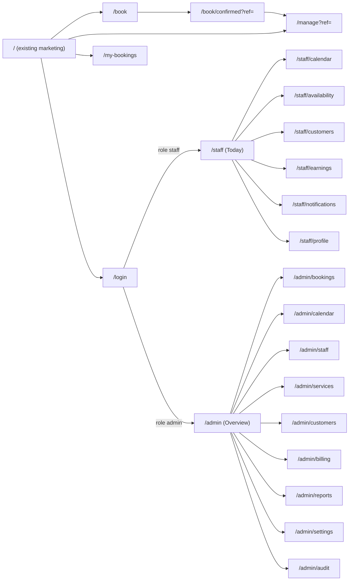

### 5.2 Customer booking flow

Three screens instead of six by merging Date + Time and Details + Confirm. Same information, fewer taps.

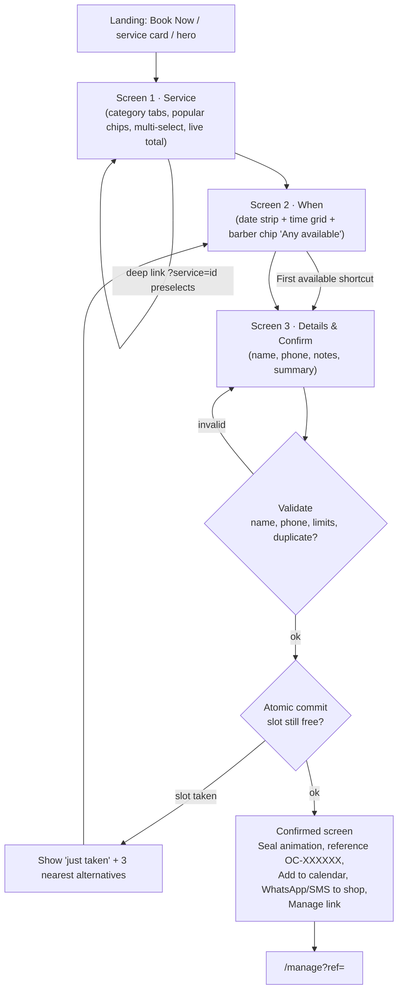

Tap budget: Service (1) → slot (1, auto-advances) → name + phone (typing) → Confirm (1) = **3 taps + 2 fields**. With "First available": 2 taps + 2 fields. "Remember me on this device" pre-fills name/phone for returning customers.

Progress indicator: 3 segments (gold fill animates left→right), labelled *Service · When · Confirm*, `aria-current="step"`, Back button always available; wizard draft persists in `sessionStorage` so a refresh does not lose progress.

### 5.3 Manage booking (cancel / reschedule)

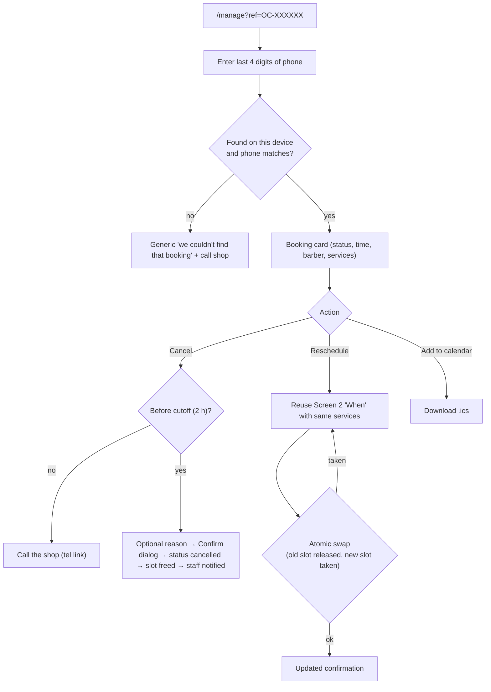

### 5.4 Authentication flow

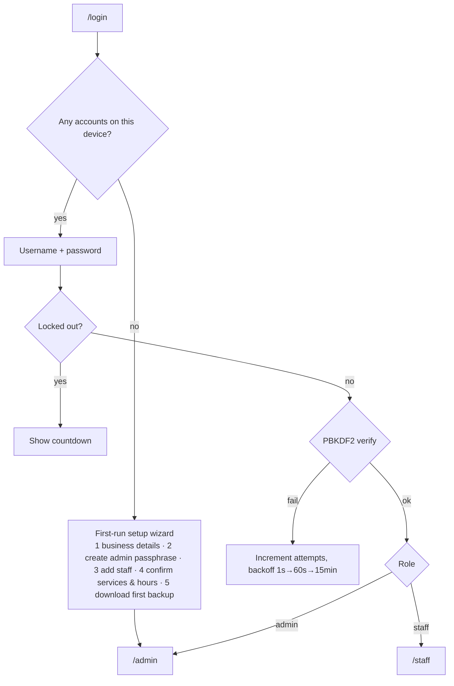

### 5.5 Barber day flow

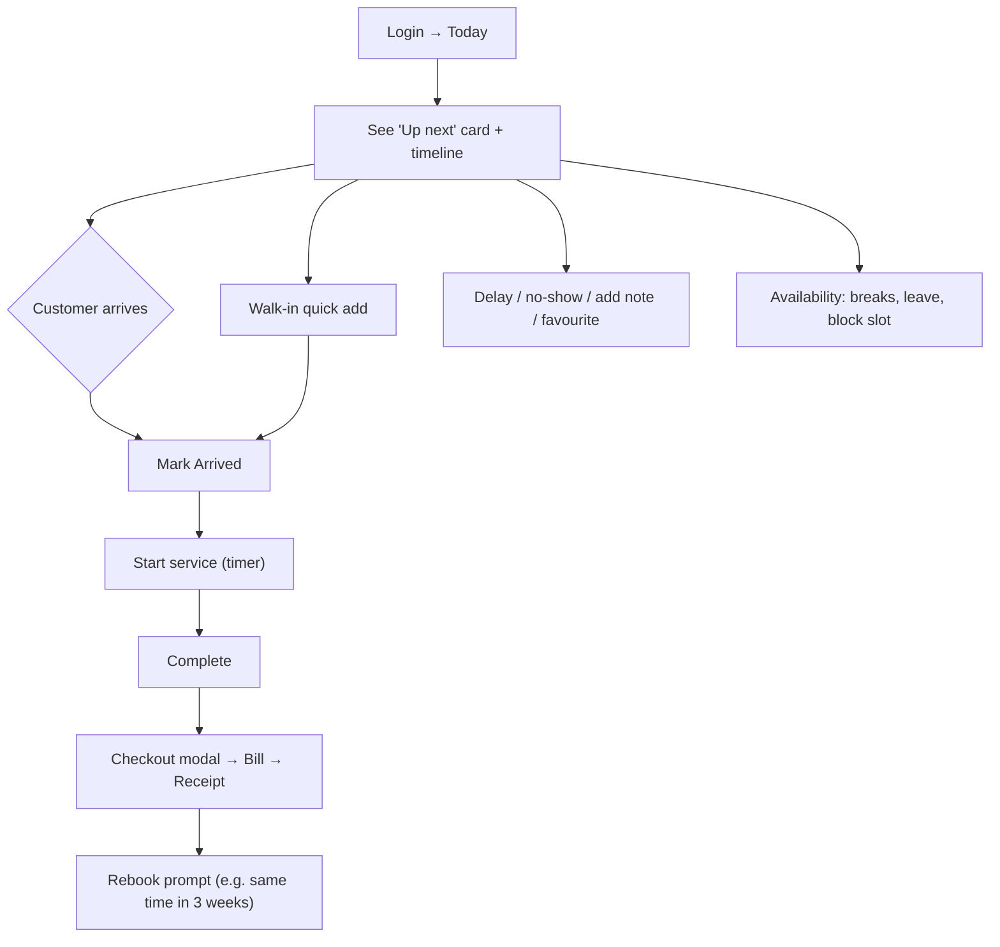

### 5.6 Admin flow

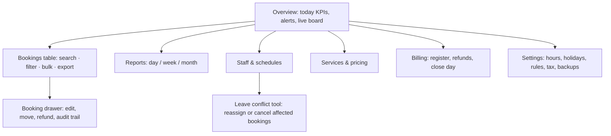

### 5.7 Booking status state machine

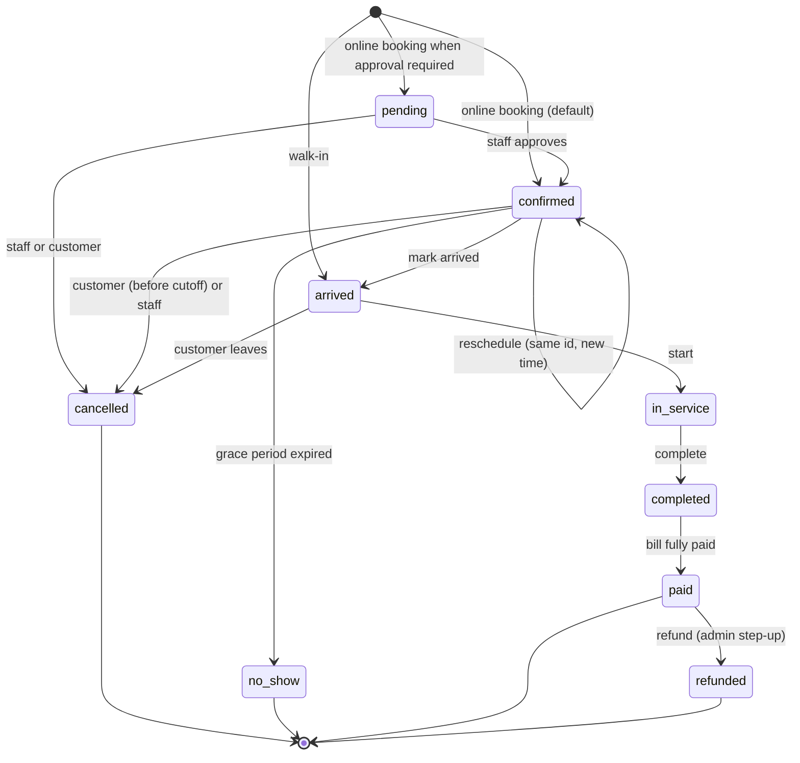

### 5.8 Checkout flow

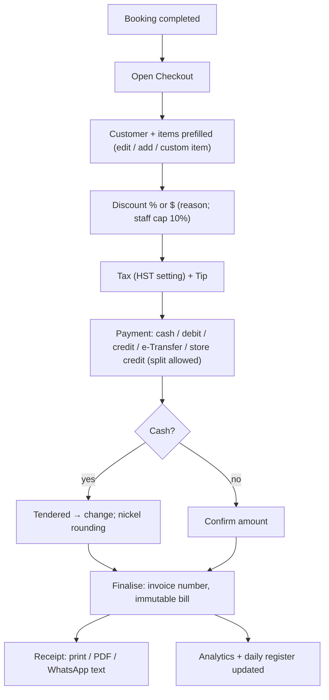

### 5.9 Booking creation sequence

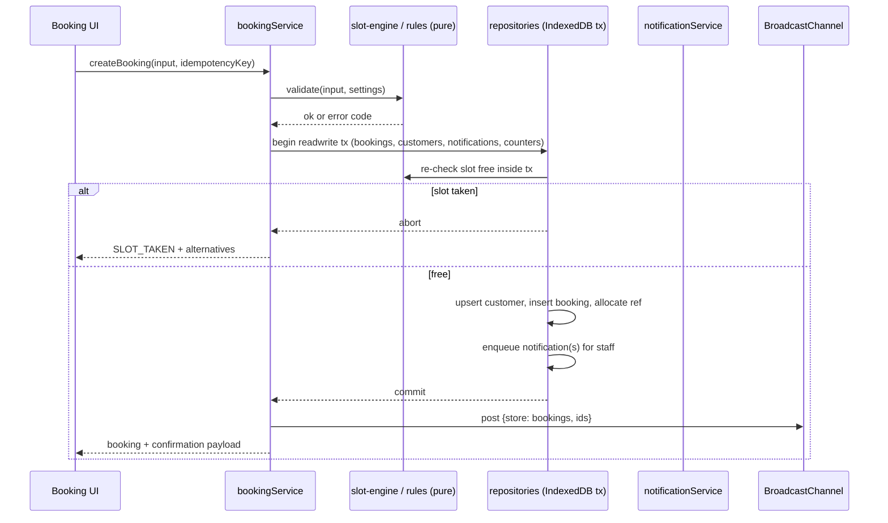

### 5.10 Screen inventory and responsive layouts

| Route | Screen | Roles | Mobile (< 768) | Tablet (768–1023) | Desktop (≥ 1024) |
|---|---|---|---|---|---|
| `/` | Landing (existing) | all | Existing | Existing | Existing |
| `/book` | Booking wizard (3 screens) | customer | Full-screen steps; sticky bottom bar with total + primary action; date strip scrolls horizontally; time grid 3 columns | Centered card (max 640 px); time grid 4 columns | Two-column: left step content, right sticky **Booking summary** card; time grid 5 columns |
| `/book/confirmed` | Confirmation | customer | Seal animation, big reference, stacked actions | Same, centered | Two-column: details + "what next" |
| `/manage` | Manage booking | customer | Single column card, sticky action bar | Centered card | Centered card + side help panel |
| `/my-bookings` | Booking history on this device | customer | Card list, tabs Upcoming / Past | Same | Table + cards |
| `/login` | Login / first-run setup | staff, admin | Full-screen form | Centered card | Split: brand panel + form |
| `/staff` | Today's appointments | staff | "Up next" hero card, vertical timeline, floating **+ Walk-in** button; bottom tab bar | Timeline + right details drawer | Left: timeline; right: Up next + quick actions + day stats |
| `/staff/calendar` | Calendar | staff | Day view only (swipe days) | 3-day view | Week view, drag to reschedule |
| `/staff/availability` | Hours, breaks, leave, blocks | staff | Accordion per weekday; leave in a bottom sheet | Two columns | Weekly grid editor + leave list |
| `/staff/customers` | Customer list and notes | staff | Search + card list; detail as full-screen sheet | Split view | Table + detail drawer |
| `/staff/earnings` | Own earnings | staff | KPI cards + list | Cards + chart | KPI row + chart + table |
| `/staff/notifications` | Notification center | staff | List with unread dot | List | List + preview pane |
| `/admin` | Admin overview | admin | KPI carousel, alerts, live board | 2-column | Sidebar + KPI grid + charts + live board |
| `/admin/bookings` | All bookings | admin | Card list with filter sheet | Compact table | Full table, column chooser, bulk actions, export |
| `/admin/calendar` | Resource calendar | admin | Barber picker + day view | Day columns | All barbers as columns, drag to move |
| `/admin/staff` | Employee management | admin | List + edit sheet | Table | Table + drawer with schedule tab |
| `/admin/services` | Services and pricing | admin | List + edit sheet | Table | Table with inline edit, reorder |
| `/admin/customers` | Customer directory | admin | Search + cards | Table | Table + segment chips + detail drawer |
| `/admin/billing` | Register, bills, refunds | admin | Bill list + filters | Table | Table + day-close panel |
| `/admin/reports` | Analytics | admin | Stacked cards, horizontal-scroll tables | 2-column | Full dashboard (§14) |
| `/admin/settings` | Settings and backups | admin | Grouped list → detail | Two columns | Sub-nav + forms |
| `/admin/audit` | Audit log | admin | List | Table | Table with filters |
| (modal) | Walk-in quick add | staff, admin | Bottom sheet | Dialog | Dialog |
| (modal) | Checkout / Receipt | staff, admin | Full-screen sheet | Dialog | Dialog (receipt preview right) |

---

## 6. User Journey Diagrams

### 6.1 Customer

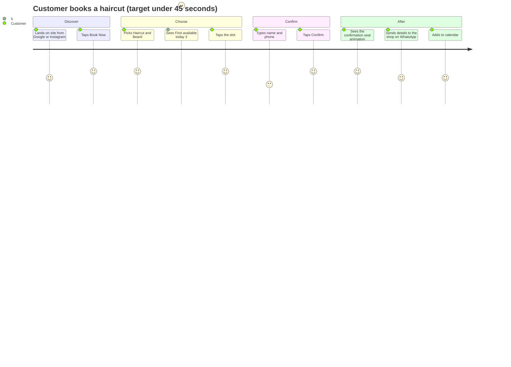

Failure moments and recoveries: slot taken → nearest 3 alternatives; invalid phone → inline hint with example; refresh mid-flow → draft restored; offline → the flow keeps working (local-first) and the confirmation explains that the shop must be notified (§10.9).

### 6.2 Barber

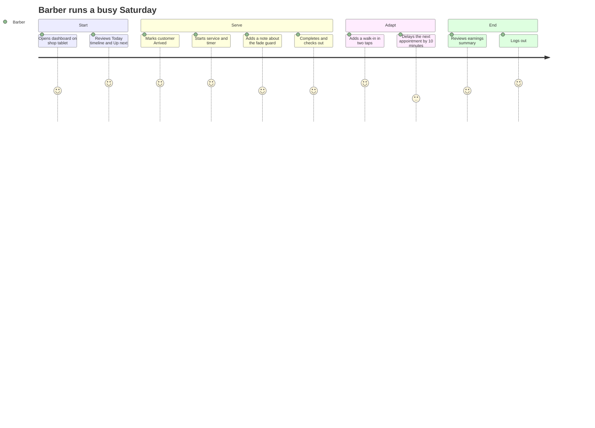

### 6.3 Admin / owner

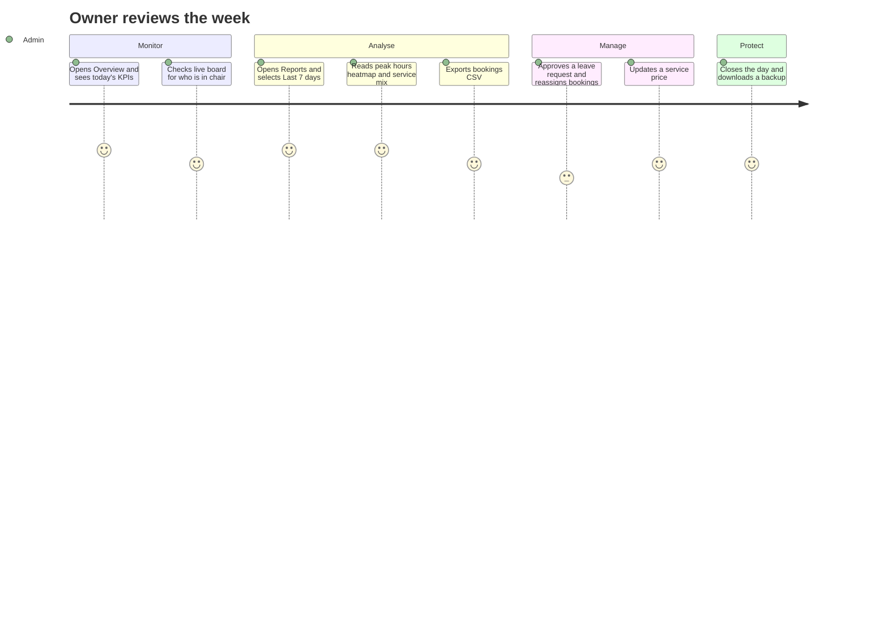

---

## 7. Component Tree, Component Specs and Motion System

### 7.1 Component tree

```
RootLayout (existing)                              fonts, <Navbar/>, providers
├─ <AppProviders>            (new, client)           BootGate → storage hydrate, MotionConfig reducedMotion="user", ToastHost
│
├─ Navbar (existing, modified)
│   └─ NavbarCtaSlider (new)                       Login | Book Now  → §4.1
│
├─ / (existing home)
│   └─ ServiceCard / CTAs deep-link to /book?service=…
│
├─ /book  (BookingLayout: cream theme, no marketing footer)
│   └─ BookingFlow
│       ├─ StepProgress
│       ├─ ServiceStep      → ServiceCategoryTabs, ServiceCard[], PopularChips
│       ├─ WhenStep         → DateStrip, CalendarPicker (popover), StaffChips, TimeSlotGrid, FirstAvailableCard
│       ├─ ConfirmStep      → CustomerDetailsForm, BookingSummary
│       └─ StickyActionBar (mobile)
├─ /book/confirmed → BookingSuccess (SealStamp, ReferenceCard, AddToCalendarButton, ShareToShopButton, ManageLink)
├─ /manage         → ManageBookingCard (lookup form, status, CancelDialog, reschedule → WhenStep)
├─ /my-bookings    → MyBookingsList
│
├─ /login          → LoginForm | SetupWizard
│
├─ /staff  (StaffLayout → AuthGuard role in [staff, admin] → DashboardShell)
│   ├─ DashboardShell → DashboardSidebar (≥ lg) | MobileTabBar (< lg), TopBar (NotificationBell, UserMenu, ClockChip)
│   ├─ Today       → UpNextCard, DayTimeline, WalkInFab, QuickActionBar, DayStatStrip
│   ├─ Calendar    → WeekCalendar / DayCalendar, BookingBlock, BookingDrawer
│   ├─ Availability→ AvailabilityEditor, BreakEditor, LeaveManager, BlockSlotDialog
│   ├─ Customers   → CustomerList, CustomerDrawer (notes, favourite, history)
│   ├─ Earnings    → StatCard[], RevenueChart, EarningsTable
│   └─ Notifications → NotificationList
│
└─ /admin  (AdminLayout → AuthGuard role=admin → DashboardShell)
    ├─ Overview    → StatCard[], RevenueChart, PeakHoursHeatmap, LiveBoard, AlertList
    ├─ Bookings    → BookingFilters, BookingTable, BookingDrawer, ExportMenu
    ├─ Calendar    → ResourceCalendar
    ├─ Staff       → StaffTable, StaffEditor (profile, services, hours, commission, credentials)
    ├─ Services    → ServiceTable, ServiceEditor
    ├─ Customers   → CustomerTable, SegmentChips, CustomerDrawer
    ├─ Billing     → BillTable, RegisterPanel, RefundDialog, ReceiptModal
    ├─ Reports     → DateRangePicker, KpiGrid, charts, ExportMenu
    ├─ Settings    → BusinessForm, HoursForm, HolidaysForm, RulesForm, TaxPaymentForm, BackupPanel, DangerZone
    └─ Audit       → AuditTable

Shared modals (mounted by DashboardShell): WalkInDialog, BillingModal, ReceiptModal, ConfirmDialog, StepUpDialog
```

### 7.2 Component specifications

The brief requires each component to state **responsibility, props, state, reusability**. Names below are final; file paths are in §22.

#### 7.2.1 Public and booking components

| Component | Responsibility | Key props | State | Reuse |
|---|---|---|---|---|
| `NavbarCtaSlider` ("BookingButtonSlider") | Book Now ↔ (Login / Book Now) sliding pill | `solid`, `variant`, `onNavigate` | `open`, `hovered`, `dismissed` | Navbar desktop + mobile menu |
| `BookingFlow` | Owns wizard state machine (service → when → confirm), draft persistence, submission | `initialServiceId?`, `mode: "create" \| "reschedule"`, `bookingId?` | `step`, `draft`, `submitState` | `/book` page; wrapped by `BookingSheet` later |
| `BookingSheet` ("BookingModal") | Optional dialog/bottom-sheet wrapper for `BookingFlow` opened from CTAs | `open`, `onOpenChange`, `initialServiceId?` | none | Home CTAs (Phase 3b, optional) |
| `StepProgress` | 3-segment gold progress, `aria-current` | `steps`, `current` | none (animated by props) | Booking + reschedule |
| `ServiceStep` | Category tabs, popular chips, multi-select list, live total | `selectedIds`, `onChange` | active category | Booking, walk-in dialog, billing add-item |
| `ServiceCard` | One selectable service: name, price, duration, badge, check state | `service`, `selected`, `onToggle`, `variant` | none | Booking + marketing featured cards (variant) |
| `StaffChips` / `BarberCard` | Choose "Any available" or a specific barber (photo, role, next free time) | `staff[]`, `value`, `onChange` | none | Booking, reschedule, admin picker |
| `WhenStep` | Compose date strip + slots + staff chips + first-available | `services`, `staffId`, `value`, `onChange` | `dateKey` | Booking, reschedule, staff walk-in |
| `DateStrip` | Horizontally scrolling 30-day strip; disabled/closed days | `value`, `min`, `max`, `disabledDates`, `onChange` | none | Booking |
| `CalendarPicker` | Month grid popover (APG date-picker keyboard model) | `value`, `onChange`, `min`, `max`, `isDisabled` | `viewMonth`, roving focus | Booking, reports date range, availability |
| `TimeSlotGrid` | Radio-group grid of slots with states: available, full, past, disabled, selected | `slots`, `value`, `onChange`, `timeZoneLabel` | none | Booking, reschedule, walk-in "later today" |
| `FirstAvailableCard` | One-tap best slot across eligible staff | `slot`, `onSelect` | none | Booking |
| `CustomerDetailsForm` | Name + phone + optional notes + "remember me"; inline validation | `value`, `onChange`, `errors` | touched fields | Booking, walk-in, admin customer editor |
| `BookingSummary` | Services, staff, date/time, duration, total, policy note | `draft`, `editable` | none | Sidebar (desktop), inline (mobile), confirmation |
| `StickyActionBar` | Mobile bottom bar with total + primary CTA (safe-area aware) | `label`, `total`, `disabled`, `onClick` | none | Booking, checkout |
| `BookingSuccess` | Confirmation view with seal animation and next actions | `booking` | `phase` (animating/settled) | `/book/confirmed`, reschedule confirmation |
| `SealStamp` | Circular seal with drawing check + scissors (from `our-stars` `Seal`) | `size`, `animate` | none | Success, receipts, login brand |
| `AddToCalendarButton` | Generates `.ics` (Blob URL) | `booking` | none | Confirmation, manage |
| `ShareToShopButton` | Booking Code hand-off: WhatsApp / SMS / email / copy | `booking` | none | Confirmation (§10.9) |
| `ManageBookingCard` | Ref + last-4 lookup, status, cancel, reschedule | `initialRef?` | `verified` | `/manage`, `/my-bookings` |
| `CancelDialog` | Cancel with optional reason and policy check | `booking`, `onConfirm` | `reason` | Manage, staff drawer |

#### 7.2.2 Shared UI primitives (`components/ui`)

Add via the shadcn CLI in the existing `base-nova` style so they sit on `@base-ui/react`: `dialog`, `sheet`/drawer, `select`, `tabs`, `tooltip`, `popover`, `switch`, `checkbox`, `input`, `label`, `textarea`, `badge`, `skeleton`, `table`, `dropdown-menu`, `toast`.

| Component | Responsibility | Notes |
|---|---|---|
| `Button` (existing) | Extend variants `gold`, `maroon`, `ghost-gold`; sizes `pill-md` (h-10), `pill-lg` (h-12) | `cva`; keeps focus ring convention |
| `CountUp` | Motion-value count-up; `run`, `value`, `format` | Extracted from `our-stars.tsx` |
| `ShineLink` | Pill link with shine sweep | Extracted from services/stars |
| `RippleSurface` | Soft gold pointer ripple for primary actions (§7.4) | Optional wrapper, primary CTAs only |
| `EmptyState` | Illustration-free icon + copy + action | Every list/table |
| `Skeleton` | Shimmer placeholders | Table, card, chart variants |
| `ConfirmDialog` | Destructive confirmation | Cancel, delete, refund |
| `StepUpDialog` | Re-enter password for sensitive actions | Auth (§9.4) |

#### 7.2.3 Dashboard components (`components/dashboard`)

| Component | Responsibility | Key props | State | Reuse |
|---|---|---|---|---|
| `DashboardShell` | Layout: sidebar/tab bar, top bar, content slot, modal host, idle-timeout watcher | `role`, `nav` config | sidebar collapsed (persisted) | Staff + admin |
| `DashboardSidebar` | Role-filtered nav, collapse to icon rail at `md`, active indicator with `layoutId` | `items`, `collapsed` | none | Shell |
| `MobileTabBar` | 5-slot bottom nav (Today, Calendar, + Walk-in, Alerts, More), safe-area padding | `items` | none | Shell (< lg) |
| `NotificationBell` | Unread count, popover list, permission prompt entry | none (reads store) | `open` | Top bar |
| `StatCard` | KPI: label, value (`CountUp`), delta, sparkline, tooltip | `label`, `value`, `format`, `delta?`, `series?` | none | Both dashboards |
| `PageHeader` | Title, description, actions, breadcrumbs | `title`, `actions?` | none | All pages |
| `DataTable` | Generic sortable/filterable table with column chooser and card fallback < md | `columns`, `rows`, `getRowId`, `onRowClick`, `renderCard` | sort, filters, selection | Bookings, customers, bills, audit, staff, services |
| `BookingTable` | `DataTable` preset for bookings (status pills, bulk actions) | `filters`, `onOpen` | selection | Admin bookings, staff calendar list |
| `BookingDrawer` | Side sheet: details, timeline, notes, actions (arrive, start, complete, delay, cancel, move, bill) | `bookingId`, `onClose` | edit mode | Both dashboards |
| `UpNextCard` | Next appointment with countdown, customer badges, primary action | `booking` | tick (1 s) | Staff Today |
| `DayTimeline` | Vertical agenda for one staff and day | `bookings`, `hours` | none | Staff Today |
| `WeekCalendar`, `ResourceCalendar` | Time-grid calendars; drag/move with conflict preview | `bookings`, `staff`, `range`, `onMove` | drag state | Staff and admin calendars |
| `AvailabilityEditor` | Weekly hours + breaks per weekday | `staffId` | draft schedule | Staff + admin staff editor |
| `LeaveManager` | Add/remove time off; conflict list before saving | `staffId` | draft | Staff + admin |
| `WalkInDialog` | 2-tap walk-in: service, barber (auto), optional name | `onCreated` | form | Both dashboards |
| `CustomerDrawer` | Customer profile, notes, favourite, history, lifetime value | `customerId` | none | Both dashboards |

#### 7.2.4 Billing, notification and settings components

| Component | Responsibility | Key props | State | Reuse |
|---|---|---|---|---|
| `BillingModal` | Checkout: items, discount, tax, tip, payments, totals | `bookingId` or `walkInDraft` | bill draft (reducer) | Staff + admin |
| `ReceiptModal` | Preview + print + PDF + WhatsApp text | `billId` | none | Post-checkout, billing list |
| `ReceiptDocument` | Print-optimised receipt (58/80 mm and A4) | `bill`, `paper` | none | Modal, print CSS |
| `RefundDialog` | Partial/full refund with step-up | `billId` | lines to refund | Admin billing |
| `RegisterPanel` | Open/close day, counted cash, variance, Z-report | `dateKey` | counts | Admin billing |
| `NotificationList` | Grouped by day, unread dot, actions | `filter` | none | Center page + bell popover |
| `BackupPanel` | Export, restore preview, last backup age | none | file state | Settings, setup wizard |
| `SettingsForm` sections | Business, hours, holidays, rules, tax/payments | per section | draft | Admin settings |

#### 7.2.5 Chart components (`features/analytics/components`)

Custom SVG + `motion` (no chart library; Appendix C rationale).

| Component | Responsibility | Key props |
|---|---|---|
| `Sparkline` | Tiny trend in `StatCard` | `series`, `tone` |
| `RevenueChart` | Area/line with hover crosshair, previous-period ghost line | `series`, `compareSeries?`, `range` |
| `BarChart` | Horizontal/vertical bars (services, barbers) | `data`, `orientation`, `valueFormat` |
| `DonutChart` | Cancellation reasons, payment mix | `data`, `centerLabel` |
| `PeakHoursHeatmap` | 7 × hours grid, intensity scale, tooltip | `cells`, `hours` |
| `ChartFrame` | Title, legend, skeleton, empty state, accessible table fallback | `title`, `children`, `dataTable` |

Every chart ships an **accessible data table** (visually hidden or toggle) and `role="img"` with a summary `aria-label`.

### 7.3 Hooks

| Hook | Purpose |
|---|---|
| `useRepository(store, selector)` | `useSyncExternalStore` subscription to the in-memory cache |
| `useSession()` / `useRequireRole(role)` | Session snapshot, redirect helpers |
| `useMediaQuery(query)` | Hydration-safe matchMedia |
| `useHoverIntent({ openDelay, closeDelay })` | Timers for the navbar slider |
| `useNow(intervalMs)` | Ticking clock (aligned to the shop time zone) for countdowns, reminders, past-slot logic |
| `useAvailability(params)` | Memoised slot computation for a date/services/staff |
| `useBookingDraft()` | `sessionStorage`-backed wizard draft |
| `useNotifications()` | Unread count, permission state, actions |
| `useIdleTimeout(ms, onIdle)` | Session idle detection (pointer, key, visibility) |
| `useBroadcast(channel, handler)` | Cross-tab messages |
| `useReducedMotionSafe()` | Wrapper around `useReducedMotion` returning boolean |

### 7.4 Motion system (Feature 11)

**Principle:** luxury motion is slow-in-slow-out, small in distance, and never draws attention to itself. If a user notices the animation before the content, it is too much. Library: **`motion/react`** (already in use). `gsap` and `lenis` are not used by this feature.

#### 7.4.1 Tokens (`src/animations/motion.ts`)

```ts
export const EASE: [number, number, number, number] = [0.22, 1, 0.36, 1]; // typed tuple (see §2.5)

export const DURATION = { instant: 0.09, fast: 0.18, base: 0.32, slow: 0.55, hero: 0.9 } as const;

export const SPRING = {
  snappy: { type: "spring", stiffness: 460, damping: 36, mass: 0.7 }, // thumb, tab indicator
  soft:   { type: "spring", stiffness: 260, damping: 30, mass: 0.9 }, // drawers, sheets
  press:  { type: "spring", stiffness: 600, damping: 40 },             // press feedback
} as const;

export const STAGGER = { list: 0.05, section: 0.1 } as const;
```

Shared variants (`variants.ts`): `fadeUp` (y 16→0), `fade`, `scaleIn` (0.98→1), `listContainer`/`listItem`, all **explicitly typed `Variants`**.

#### 7.4.2 Pattern catalogue

| Pattern | Spec |
|---|---|
| **Navbar slider** | §4.1.5 |
| **Hover (cards)** | `whileHover={{ y: -4 }}` + shadow grow, 320 ms `EASE`; images scale ≤ 1.05 over 900 ms. No colour flashes |
| **Buttons** | `whileTap={{ scale: 0.97 }}` (90 ms); existing shine sweep on links; primary gold buttons may use `RippleSurface` |
| **Button ripple** | On `pointerdown`, a radial gradient (`rgba(231,205,138,0.28)`) scales from the pointer position to the button bounds over 450 ms and fades to 0. One ripple at a time, disabled on `prefers-reduced-motion`, never on destructive buttons |
| **Card selection** | Selecting a `ServiceCard`: border cross-fades to gold (180 ms), check icon scales 0.6→1 with `SPRING.press` |
| **Step transitions** | Booking steps slide 24 px + fade, direction-aware (forward/back), 320 ms, `AnimatePresence mode="wait"`; `StepProgress` fill animates width via `scaleX` (transform-origin left) |
| **Time slots** | Grid items stagger 20 ms up to 12 items, then no stagger (avoid long entrances) |
| **Booking success** | See §7.4.3 |
| **Modal / dialog** | Overlay fade 180 ms; panel `scaleIn` 0.98→1 + fade, 260 ms `EASE`; exit 160 ms |
| **Drawer / sheet** | Side drawer: x 32 px→0 + fade with `SPRING.soft`; bottom sheet: y 100 %→0 `SPRING.soft`, drag-to-dismiss on mobile |
| **Dashboard route transitions** | Content area cross-fade 180 ms only (no slide) to keep data-dense screens calm; sidebar indicator uses `layoutId` with `SPRING.snappy` |
| **Data entrance** | KPI numbers count up once per mount (1.4 s, `EASE`); charts draw once (lines: `pathLength` 0→1 over 700 ms; bars: `scaleY` from baseline over 500 ms, 40 ms stagger) |
| **Loading skeletons** | Shimmer: 1.6 s linear gradient sweep at 6 % white on night theme / 4 % ink on cream; skeleton shapes match final layout to avoid layout shift |
| **Empty states** | Icon fades up 12 px (400 ms), copy 80 ms later; single primary action; no looping animation |
| **Toasts** | Slide-up 16 px + fade 240 ms; auto-dismiss 5 s; pause on hover/focus |
| **Live updates** | New booking row: background pulses gold at 12 % opacity for 1.2 s, once |
| **Reduced motion** | `MotionConfig reducedMotion="user"` in `AppProviders` disables transform/layout animation globally; counters render final values; skeleton shimmer stops; ripple removed |

Performance budget: only `transform`, `opacity`, `clip-path`, `filter` (sparingly) are animated; no `width/height/top/left`; no animation runs while `document.hidden`; max 2 concurrent looping animations on screen (ambient glows count).

#### 7.4.3 Booking success animation (premium, restrained)

Total ≈ 1.6 s, then everything is static.

| t (ms) | Element | Motion |
|---|---|---|
| 0–450 | Gold ring (the `SealStamp` circle) | Draws with `pathLength` 0→1 |
| 250–700 | Scissors icon | Fades in and rotates 0→−15°→0 once (open-close), scale 0.9→1 |
| 500–900 | Check mark | Draws with `pathLength` 0→1 |
| 700–1100 | Seal | Single 1.04 scale "stamp" settle with `SPRING.press`; outer hairline ring expands to 1.25 and fades (one pulse, 12 % gold) |
| 900–1600 | Heading "You're booked", reference, details card | Stagger `fadeUp`, 90 ms apart |

No confetti, no sound, no looping. Reduced motion: final static seal + fade of text (120 ms). Announced with `role="status"` ("Booking confirmed for …").

### 7.5 Theme scopes

To keep shadcn/Base UI primitives on-brand without editing them, scope **semantic variables** by container. No existing token changes.

```css
/* globals.css (additive) */
@theme inline {
  --color-oc-night-950: var(--oc-night-950);
  --color-oc-night-900: var(--oc-night-900);
  --color-oc-night-800: var(--oc-night-800);
  --color-oc-night-700: var(--oc-night-700);
}
:root {
  --oc-night-950: #0b0708;
  --oc-night-900: #130d0f;
  --oc-night-800: #1c1416;
  --oc-night-700: #2a2024;
}

/* Booking / public app pages: cream + maroon + gold */
[data-theme="oc-cream"] {
  --background: var(--oc-cream-50);   --foreground: var(--oc-ink-900);
  --card: #ffffff;                    --card-foreground: var(--oc-ink-900);
  --primary: var(--oc-maroon-800);    --primary-foreground: var(--oc-cream-50);
  --secondary: rgba(74,22,32,0.06);   --secondary-foreground: var(--oc-maroon-800);
  --muted: rgba(74,22,32,0.05);       --muted-foreground: rgba(43,18,25,0.68);
  --accent: rgba(201,162,75,0.14);    --accent-foreground: var(--oc-maroon-800);
  --border: rgba(74,22,32,0.12);      --input: rgba(74,22,32,0.16);
  --ring: var(--oc-gold-500);
}

/* Dashboards: black + gold + cream */
[data-theme="oc-night"] {
  --background: var(--oc-night-950);  --foreground: var(--oc-cream-50);
  --card: var(--oc-night-900);        --card-foreground: var(--oc-cream-50);
  --popover: var(--oc-night-800);     --popover-foreground: var(--oc-cream-50);
  --primary: var(--oc-gold-300);      --primary-foreground: var(--oc-night-950);
  --secondary: var(--oc-night-800);   --secondary-foreground: var(--oc-cream-50);
  --muted: var(--oc-night-800);       --muted-foreground: rgba(251,246,236,0.66);
  --accent: rgba(231,205,138,0.12);   --accent-foreground: var(--oc-gold-200);
  --border: rgba(231,205,138,0.14);   --input: rgba(231,205,138,0.2);
  --ring: var(--oc-gold-300);
  --destructive: oklch(0.704 0.191 22.216);
}
```

Rules: booking pages set `data-theme="oc-cream"` on their layout wrapper; dashboards set `oc-night`. Text/background pairs are pre-checked ≥ 4.5 : 1 (gold-300 on night-950 ≈ 12 : 1; cream on night-950 ≈ 18 : 1; muted 66 % cream on night-900 ≈ 7 : 1 — values are approximate and must be re-verified with a contrast tool during Phase 0). Gold is **never** used for body text on cream (G6).

---

## 8. Storage Architecture

### 8.1 Principles

1. **UI never touches storage.** Components call hooks → services → repositories → IndexedDB. Swapping to a server means replacing repositories/adapters only (§17).
2. **Records in IndexedDB, tiny state in localStorage.** Bookings and bills grow into tens of thousands of rows; localStorage is 5 MB and synchronous.
3. **Every write is validated (zod), versioned (`version` integer), and audited.**
4. **Every write appends to an `outbox`** so V1.5/V2 sync can replay changes without redesigning data.
5. **Data is portable.** One-click JSON export/import is a first-class feature, not an afterthought (H4).

Capacity check (assumption for sizing): 3 staff × ~15 bookings/day × 365 ≈ 16 k bookings/year; at ~1.2 KB each ≈ 20 MB/year — comfortably inside IndexedDB quotas, impossible in localStorage.

### 8.2 What lives where

| Mechanism | Holds | Why |
|---|---|---|
| **IndexedDB** (`open-chair`) | Settings, services, staff, accounts, time off, holidays, customers, bookings, bills, refunds, register days, notifications, audit, counters, outbox, backups | Structured, indexed, large, transactional |
| **localStorage** (`oc:v1:*`) | Device id, session pointer, UI prefs, customer's "my bookings" refs, remember-me name/phone, backup metadata | Small, synchronous reads needed before first paint (e.g. session gate) |
| **sessionStorage** | Booking wizard draft, step-up timestamp, tab-alive marker | Tab-scoped, disappears on close |
| **In-memory cache** | Hydrated copy of all *small* stores (settings, services, staff, schedules) and a rolling window of bookings (today − 7 … +60 days) | Sync snapshots for `useSyncExternalStore`; fast slot computation |
| **Cache Storage / Service Worker** (Phase 9) | App shell for offline/PWA | Shop device keeps working without internet |

### 8.3 localStorage keys

All keys are prefixed `oc:v1:` and parsed through zod on read; invalid or oversized values are discarded (never trusted).

| Key | Shape | Notes |
|---|---|---|
| `oc:v1:schema` | `{ version: number, migratedAt: string }` | Mirrors IndexedDB version for a fast boot check |
| `oc:v1:device` | `{ deviceId: string, deviceCode: string, createdAt: string }` | `deviceCode` = 1 letter used in invoice numbers (e.g. `A`) |
| `oc:v1:session` | `{ sessionId, accountId, role, staffId?, issuedAt, lastActiveAt, expiresAt, idleTimeoutMs, remember }` | See §9.4 |
| `oc:v1:prefs` | `{ sidebarCollapsed, calendarView, soundOn, density }` | Per device |
| `oc:v1:my-bookings` | `Array<{ id, ref, addedAt }>` (max 50) | Customer's booking pointers; details live in IndexedDB |
| `oc:v1:remember` | `{ name, phone }` | Only if the customer opted in |
| `oc:v1:notif-ask` | `{ askedAt, result }` | Do not re-prompt within 30 days |
| `oc:v1:backup` | `{ lastAt, lastBytes, dismissedUntil }` | Drives reminder banner |
| `oc:v1:lockout` | `{ failures, lockedUntil, lastAt }` | Login throttling (§9.2) |

sessionStorage: `oc:v1:draft` (wizard draft, max 4 KB), `oc:v1:stepup` (`{ until }`), `oc:v1:tab` (`{ id }`).

### 8.4 IndexedDB schema

Database `open-chair`, version integer starting at **1**. Implemented with the small `idb` wrapper (Appendix C).

| Object store | Key path | Indexes | Notes |
|---|---|---|---|
| `meta` | `key` | — | `schemaVersion`, `seededAt`, `installId` |
| `settings` | `id` (`"shop"`) | — | Single record (§16) |
| `services` | `id` | `by-category`, `by-active`, `by-sort` | Soft delete via `archivedAt` |
| `staff` | `id` | `by-active` | Contains weekly hours, service ids, commission |
| `accounts` | `id` | `by-username` (unique), `by-staff` | Credential hash records |
| `timeOff` | `id` | `by-staff-range` `[staffId, startDate]`, `by-date` | Leave, blocks |
| `holidays` | `dateKey` | — | Shop closures/reduced hours |
| `customers` | `id` | `by-phone` (unique), `by-name`, `by-last-visit`, `by-created` | Phone is the identity (E.164) |
| `bookings` | `id` | `by-ref` (unique), `by-date`, `by-staff-date` `[staffId, dateKey]`, `by-status`, `by-phone`, `by-updated` | Hot store |
| `bills` | `id` | `by-number` (unique), `by-date`, `by-booking`, `by-staff` | **Immutable once finalised** |
| `refunds` | `id` | `by-bill`, `by-date` | Append-only |
| `registerDays` | `dateKey` | — | Open/close cash counts |
| `notifications` | `id` | `by-recipient-read` `[recipientId, readAt]`, `by-created` | Cap at 500 per recipient (prune oldest read) |
| `auditLog` | `seq` (autoIncrement) | `by-at`, `by-actor`, `by-entity` `[entityType, entityId]` | Append-only |
| `counters` | `key` | — | Atomic sequences (invoice per day/device, booking ref collision guard) |
| `outbox` | `seq` (autoIncrement) | `by-created` | `{ entity, entityId, op, version, at }` for future sync |
| `backups` | `id` | `by-created` | Last 5 automatic pre-restore snapshots |
| `rollups` | `key` (`YYYY-MM`) | — | Monthly aggregates written at day close (§14.4); rebuildable from bills and bookings |
| `creditLedger` | `id` | `by-customer` `[customerId, at]`, `by-date` | Append-only store-credit ledger (§11.4) |

**Transactions.** Any operation touching more than one store (create booking, finalise bill, refund, restore) runs inside **one `readwrite` transaction** so it is atomic. Slot re-validation happens **inside** the transaction (§10.6).

### 8.5 JSON structure examples

`settings` (single record):

```json
{
  "id": "shop",
  "version": 1,
  "business": {
    "name": "Open Chair Barbershop & Salon",
    "address": "56 Grand Ave East, Chatham, ON N7L 1V7",
    "phone": "+15193519193",
    "timeZone": "America/Toronto",
    "currency": "CAD",
    "hstNumber": null
  },
  "hours": {
    "mon": [{ "start": 600, "end": 1260 }], "tue": [{ "start": 600, "end": 1260 }],
    "wed": [{ "start": 600, "end": 1260 }], "thu": [{ "start": 600, "end": 1260 }],
    "fri": [{ "start": 600, "end": 1260 }], "sat": [{ "start": 600, "end": 1260 }],
    "sun": [{ "start": 600, "end": 1260 }]
  },
  "booking": {
    "provider": "setmore",
    "slotIntervalMin": 15,
    "minLeadMin": 30,
    "maxAdvanceDays": 30,
    "cancelCutoffMin": 120,
    "maxUpcomingPerPhone": 2,
    "requireApproval": false,
    "noShowGraceMin": 15,
    "walkInsEnabled": true
  },
  "billing": {
    "tax": { "enabled": false, "label": "HST", "rateBp": 1300, "mode": "exclusive" },
    "tipsEnabled": true,
    "cashRounding": "nickel",
    "paymentMethods": ["cash", "debit", "credit", "etransfer", "credit_store"],
    "staffMaxDiscountPct": 10
  }
}
```

(`start`/`end` are **minutes from local midnight**, the `Interval` type of §10.3 and §16.1: 600 = 10:00, 1260 = 21:00. Rates are **basis points**: 1300 = 13.00 %.)

A `booking` record is specified in §16.

### 8.6 Cache, reactivity and concurrency

1. **Boot (`storage/boot.ts`)**: open DB → run migrations → seed if empty → hydrate small stores + bookings window → mark `ready`. `AppProviders` renders a branded skeleton until `ready` (target < 300 ms on a mid device).
2. **Reads**: `useRepository(store, selector)` uses `useSyncExternalStore` against an in-memory store; selectors are pure and memoised. No `setState` inside effects (ESLint rule).
3. **Writes**: service → repository transaction → update memory cache → notify subscribers → `BroadcastChannel("oc-sync")` message `{ store, ids, at }` so other tabs refresh those records.
4. **Cross-tab locking**: booking commits acquire `navigator.locks.request("oc-booking", …)` where supported; the IndexedDB transaction is still the source of truth if `locks` is missing.
5. **Idempotency**: `createBooking` requires an `idempotencyKey` (UUID generated when the wizard opens). Repeated submits return the first result.
6. **Windowing**: bookings older than today − 7 days are queried on demand (`by-date` range) and not held in memory. Reports use streaming cursors.
7. **Derived caches**: per-day availability is memoised by `(dateKey, staffId, serviceSignature, bookingsVersion)`; invalidated when that day's bookings change.
8. **Failure handling**: quota/`AbortError`/`InvalidStateError` surface as typed `StorageError` → non-blocking toast + "Export backup now" action; if IndexedDB is unavailable (private mode on old browsers) the app falls back to a **memory-only session** with a persistent warning banner.

### 8.7 Backup and restore

**Format** (`open-chair-backup-YYYYMMDD-HHmm.json`):

```json
{
  "format": "open-chair-backup",
  "schemaVersion": 1,
  "exportedAt": "2026-09-20T18:42:11.000Z",
  "deviceId": "…",
  "counts": { "bookings": 1832, "bills": 1410, "customers": 964 },
  "checksum": "sha256:…",
  "data": { "settings": {}, "services": [], "staff": [], "customers": [], "bookings": [], "bills": [], "refunds": [], "registerDays": [], "timeOff": [], "holidays": [], "auditLog": [] }
}
```

- **Excluded by default:** `accounts` credential hashes (a restore never silently replaces logins), `notifications`, `outbox`, `backups`. Optional "include accounts" for full device cloning.
- **Optional encryption:** AES-GCM with a key derived (PBKDF2) from a passphrase; file extension `.ocbackup`. Recommended because backups contain customer names and phone numbers.
- **Export:** admin-only, requires step-up; streamed into a Blob; triggers download; updates `oc:v1:backup`.
- **Restore:** (1) choose file; (2) parse with size cap (default 100 MB) and zod validation; (3) verify checksum; (4) run `migrateBackup(from → current)`; (5) **dry-run preview** (counts, date range, conflicts); (6) choose **Merge** (by `id`, higher `updatedAt`/`version` wins, never delete) or **Replace** (requires typing `REPLACE`); (7) auto-snapshot current DB into `backups` first; (8) apply in chunked transactions; (9) rebuild cache; (10) audit entry.
- **Reminders:** banner in admin when last backup > 7 days; extra warning on Safari/iOS; prompt after closing a day (§11.7).
- **Automatic rolling snapshot:** on day close, keep the latest 5 in `backups` (in-browser safety net only — it is *not* a substitute for a downloaded file).

### 8.8 Versioning and migrations

- **DB version** and **backup `schemaVersion`** are the same integer, bumped only when a stored shape changes.
- Migrations live in `storage/migrations/NNN-description.ts`, each exporting `{ version, up(tx), upBackup(data) }`; **forward-only**, idempotent, unit-tested against fixtures of every prior version.
- On boot, if the stored version is **newer** than the app supports (user opened an old cached build), refuse to open, show a "please refresh / update" screen, and do not write.
- Record shape changes are additive where possible (new optional fields with defaults in the zod schema). Every record has `version` (per-record, for optimistic concurrency and sync) separate from the schema version.
- Data is never migrated in place without a pre-migration snapshot.

### 8.9 Persistence risks and mitigations

| Risk | Mitigation |
|---|---|
| Safari 7-day eviction of script-written data (H4) | Install as PWA on shop devices; `navigator.storage.persist()`; backup reminders; document "use Chrome/Edge on the shop PC" |
| Browser "Clear site data" | Backup nudges; on empty DB with existing `oc:v1:device` in localStorage, show "data missing — restore from backup?" |
| Quota exceeded | Estimate via `navigator.storage.estimate()`, warn at 70 %; archive old bookings (§8.10) |
| Private/Incognito mode | Detect; memory-only fallback with clear banner; customers can still complete a booking and get the Booking Code |
| Two tabs running different builds | Version check on boot + `versionchange` handler closes the old connection and prompts refresh |
| Corrupt record | zod `safeParse` on read; quarantine to `meta.quarantine` (not deleted); toast + audit entry |

### 8.10 Retention and archive

Keep 24 months of detailed bookings/bills in IndexedDB; beyond that offer an **archive export** (encrypted JSON) then delete from the live store (admin action, step-up). Aggregated monthly rollups (revenue, counts per service/staff) are retained forever in a small `rollups` store to keep long-term charts working.

---

## 9. Authentication Architecture

### 9.1 Model and trust boundary

| Actor | Identity | Notes |
|---|---|---|
| Customer | None (anonymous) | Identified only by normalised phone number inside a booking |
| Barber / Stylist | Account (`role: "staff"`) linked to a `staff` record | Username + password |
| Admin | Account (`role: "admin"`) | Username + passphrase; step-up for sensitive actions |

**Trust boundary (be explicit with the owner):** in V1 the security boundary is *the physical device*. Login prevents casual access on a shared shop tablet. It does **not** protect data from someone who can open DevTools on that device, and it protects nothing across devices (there is no shared data across devices in V1 — H1/H2). Real protection arrives with server-side sessions in V2.

### 9.2 Credentials

| Item | Decision |
|---|---|
| Storage | `accounts` store; **no secrets in source code, env vars, or the bundle** |
| Hashing | `crypto.subtle` **PBKDF2-HMAC-SHA-256**, random 16-byte salt, **600 000 iterations** (stored per account so it can be raised later), 32-byte derived key; compare with constant-time equality |
| Password policy | Admin ≥ 12 characters; staff ≥ 10 characters; block the top 1 000 common passwords (small bundled list, lazy-loaded); no composition rules; show a strength meter |
| First credential | Created in the **first-run setup wizard** on the shop device; no default passwords exist anywhere |
| Change / reset | Change: current password + new. Admin resets a staff password (forces change on next login). **Admin lock-out recovery** (V1): restore from a backup that includes accounts, or clear site data — documented. Email reset arrives with V2 |
| Throttling | Client-side backoff after failures: 1 s, 2 s, 5 s, then 60 s, 5 min, 15 min; persisted in `oc:v1:lockout`. Bypassable by a determined local user — acceptable per §9.1 |
| Timing | Hash work runs in a Web Worker so the UI stays responsive (≈ 200–600 ms) |

### 9.3 Roles and permissions

Permissions are a static map `ROLE_PERMISSIONS` checked by a single `can(session, permission, resource?)` helper. UI hides what a role cannot do; **services re-check** (defence in depth, and identical to future server checks).

| Permission | Customer | Staff | Admin |
|---|:-:|:-:|:-:|
| Create booking (online) | ✓ | ✓ | ✓ |
| View / cancel / reschedule own booking (ref + phone) | ✓ | — | — |
| View own bookings and today's board | — | ✓ | ✓ |
| View other staff's bookings | — | — | ✓ |
| Mark arrived / start / complete (own) | — | ✓ | ✓ |
| Create walk-in / phone booking | — | ✓ | ✓ |
| Edit own availability, breaks, leave | — | ✓ | ✓ |
| Edit others' availability | — | — | ✓ |
| Customer notes / favourites | — | ✓ | ✓ |
| Create bill (checkout) | — | ✓ | ✓ |
| Discount above staff cap | — | — | ✓ |
| Refund | — | — | ✓ (+ step-up) |
| Manage services / prices | — | — | ✓ |
| Manage staff and accounts | — | — | ✓ (+ step-up) |
| Reports / analytics (business-wide) | — | own only | ✓ |
| Export bookings / customers | — | — | ✓ (+ step-up) |
| Backup / restore / danger zone | — | — | ✓ (+ step-up) |
| View audit log | — | — | ✓ |

### 9.4 Sessions

```ts
type Session = {
  sessionId: string;      // random 128-bit
  accountId: string;
  role: "staff" | "admin";
  staffId?: string;
  issuedAt: number;       // epoch ms
  lastActiveAt: number;
  expiresAt: number;      // absolute cap
  idleTimeoutMs: number;  // admin 30 min, staff 12 h
  remember: boolean;
};
```

| Concern | Behaviour |
|---|---|
| Persistence | Session pointer in `localStorage` (`oc:v1:session`). If `remember` is false it is additionally bound to a `sessionStorage` tab marker so closing the browser ends it |
| Idle timeout | `useIdleTimeout` (pointer, key, touch, visibility) touches `lastActiveAt` at most once per 30 s. Admin 30 min, staff 12 h. A 60-second warning dialog precedes automatic logout |
| Absolute expiry | Admin 12 h; staff 12 h, or 30 days when "remember this device" is ticked (staff only; admin never) |
| Cross-tab | Logout writes a `logout` message to `BroadcastChannel("oc-auth")` and clears the key; other tabs react via `storage` events |
| Step-up | Sensitive actions (refund, export, restore, delete, account changes) open `StepUpDialog`; a correct password sets `oc:v1:stepup.until = now + 10 min` |
| Logout | Clears session and step-up, clears in-memory caches of protected stores, `router.replace("/login")` |
| Clock manipulation | Sessions compare against `Date.now()`; device-clock changes are a known limitation |

### 9.5 Route protection and role-based routing

With `output: "export"` there is **no middleware/proxy and no server redirects** (G1). All protection is client-side and must therefore avoid exposing data, not just hiding pages.

- `/staff/layout.tsx` and `/admin/layout.tsx` render `<AuthGuard roles={[…]}>`. Until the guard has read the session, it shows a **branded skeleton** (no protected UI, no data hooks mounted), then either renders children or `router.replace("/login?returnTo=…")`.
- A staff user visiting `/admin/*` sees a friendly "Not available for your role" page with a link to `/staff`; an admin may use `/staff` (read-only "view as" for a chosen staff member).
- `returnTo` is validated against an **allow-list of internal paths** (must start with `/staff` or `/admin`; no protocol, no `//`) to prevent open redirects.
- Protected data hooks (`useRepository` on `bookings`, `bills`, `customers`) are only mounted **below** the guard, and services re-check `can()`.
- Static HTML for `/admin` is downloadable by anyone; it contains **no data and no secrets** — all data comes from the device's IndexedDB.
- Persistent login: on boot, `getSession()` validates expiry and account still exists/active.
- Role-based nav: `DashboardSidebar` items are filtered by `can()`.
- Navbar behaviour: hides on `/staff` and `/admin`; on other routes shows **Login** or **Dashboard** depending on the session.

### 9.6 Frontend validation rules (Feature 13)

All validation is defined once as **zod schemas** (`domain/validators/*`) and reused by forms, services and backup import.

| Field | Rules | Error copy (examples) |
|---|---|---|
| Customer name | Trim; collapse inner whitespace; 2–60 chars; Unicode letters, spaces, `'`, `’`, `-`, `.` only; must contain ≥ 2 letters | "Please enter your name" / "Names can include letters, spaces, apostrophes and hyphens" |
| Phone | Strip spaces, dashes, parentheses, dots; accept `+1XXXXXXXXXX`, `1XXXXXXXXXX`, `XXXXXXXXXX`; NANP: area and exchange codes start 2–9; normalise to E.164 `+1…`; other country codes allowed only if the setting `allowInternationalPhones` is on | "Enter a 10-digit phone number, e.g. 519 351 9193" |
| Notes | ≤ 300 chars, plain text (rendered as text, never HTML) | — |
| Email (optional, future) | RFC-pragmatic regex + ≤ 254 chars | — |
| Service selection | ≥ 1 active service; total duration ≤ `maxBookingMinutes` (default 240); services must be eligible for at least one active staff member | "Choose at least one service" |
| Date / time | Not in the past (shop time); ≥ `minLeadMin`; ≤ `maxAdvanceDays`; shop open; not a holiday; slot still free at commit | "That time was just taken — here are the closest options" |
| Booking limits | ≤ `maxUpcomingPerPhone` active future bookings per phone; no overlapping booking for the same phone | "You already have 2 upcoming bookings" |
| Ref lookup | `OC-` + 6 chars of Crockford Base32 (no I, L, O, U), case-insensitive; phone last-4 digits | Generic not-found message (no enumeration hints) |
| Money inputs | Decimal string → integer cents; ≥ 0; ≤ `$10 000`; max 2 decimals | "Enter an amount like 25.00" |
| Discount | Percent 0–100 or fixed ≤ subtotal; reason required when > 0; staff ≤ `staffMaxDiscountPct` | "Needs admin approval above 10 %" |
| Staff / service admin forms | Name 2–80; price ≥ 0; duration 5–480 step 5; buffer 0–60; unique active service name | — |
| Backup file | Size cap; `format` and `schemaVersion` match; checksum; each record zod-validated; unknown keys stripped; `__proto__`/`constructor` keys rejected | "This file isn't a valid Open Chair backup" |
| Storage reads | Every localStorage/IndexedDB read passes `safeParse`; failures quarantined | Toast + audit |

UX rules: validate on blur then on change; show errors under fields with `aria-describedby`, `aria-invalid`; error summary at the top on submit; never clear user input on error; inputs use `font-size: 16px` minimum on mobile to prevent iOS zoom; `autocomplete="name"`, `autocomplete="tel"`, `inputmode="tel"`.

### 9.7 Security controls

| Threat | Control |
|---|---|
| XSS | React escaping; **no `dangerouslySetInnerHTML`** for user data; notes and names rendered as text; CSP via `.htaccess` (`default-src 'self'`; `img-src 'self' data: blob:`; `frame-ancestors 'none'`; Next's static export needs inline bootstrap scripts, so start from a report-only CSP and use hashes/`'unsafe-inline'` only if unavoidable) |
| CSV / formula injection on export | Prefix cells starting with `=`, `+`, `-`, `@`, tab or CR with `'`; quote all fields |
| Malicious backup file | Size cap, schema validation, key allow-list, no `eval`, prototype-pollution guards, preview before apply |
| Clickjacking | `X-Frame-Options: DENY` / `frame-ancestors 'none'` |
| Open redirect | `returnTo` allow-list (§9.5) |
| Data exposure in URLs | Only `ref` in query strings; **never** phone numbers or names |
| Abuse without OTP | Per-device limits (§10.5), honeypot field on the booking form, minimum time-on-form (≥ 2 s), idempotency key. These deter casual abuse only; real rate limiting requires a server |
| Personal data | Collect only name and phone (+ optional notes). Show a short consent line on the confirm step and link a privacy notice (Ontario/Canada privacy law — the owner should have this reviewed by a professional). Provide "delete my data on this device" in `/my-bookings` |
| Backups contain PII | Optional AES-GCM encryption; warn before unencrypted export |
| Supply chain | Minimal new dependencies (Appendix C); lockfile committed; `npm audit` in CI |

### 9.8 Browser notification permission

Never prompt on page load. Ask only after a **user gesture with context** (§12.6): staff tap "Enable alerts" in the notification center or after their first login on a device. Store the outcome in `oc:v1:notif-ask`; if `denied`, show instructions instead of re-prompting. Customers are never prompted in V1.

### 9.9 Known limits and migration path

| Limit in V1 | Resolved by |
|---|---|
| Auth is a UX gate | V1.5/V2: managed Auth service (server-side password hashing, signed sessions) with row-level security in the database (§24.2) |
| No shared accounts across devices | V1.5/V2: managed Auth accounts (sign-in works on any device) |
| No email reset | V1.5/V2: the managed Auth service's password-reset email |
| Brute force not enforceable | V1.5/V2: the managed Auth service's server-side rate limits |
| Audit log is local and editable by a local attacker | V1.5/V2: append-only audit table written by database functions |

The service layer already exposes `authService.login/logout/getSession/changePassword`; only the adapter changes.

---

## 10. Booking Engine Design

The engine is **pure TypeScript with no React, no storage and no clock access** (`src/domain/`). Time is injected (`Clock`), data is passed in, results are returned. That makes it exhaustively unit-testable and lets the same code run unchanged inside a future remote-adapter client or a Web Worker.

### 10.1 Service catalog

The catalog is seeded from the real menu already in `our-service.tsx` (prices in CAD). Durations are proposed in [Appendix A](#appendix-a--proposed-service-catalog-with-durations) and must be confirmed (D5).

```ts
type ServiceCategory = "barbershop" | "salon";

type Service = {
  id: string;                 // stable slug, e.g. "haircut-beard"
  name: string;
  category: ServiceCategory;
  group?: string;             // "Women's Cut", "Colour Services" (salon groups)
  description?: string;
  priceCents: number | null;  // null = "ask in shop" (not bookable online)
  priceFrom?: boolean;        // "From $150"
  durationMin: number;        // hands-on time
  bufferMin: number;          // clean-up / turnover after the service
  isAddOn?: boolean;          // e.g. "Add Head Massage to Any Service"
  addOnFor?: ServiceCategory; // add-ons attach to a base service of this category
  includes?: string[];        // combo components (for bundle suggestions)
  popular?: boolean;
  online: boolean;            // bookable online (false hides from the public wizard)
  active: boolean;
  sort: number;
  archivedAt?: string;
  version: number;
  updatedAt: string;
};
```

Rules:

- **Add/remove/edit services** through `catalogService` (admin). Removal is a **soft archive**; existing bookings keep their own **snapshot** (`nameSnapshot`, `priceCents`, `durationMin`) so history and receipts never change.
- **Combos are separate services** (Haircut & Beard = $40, cheaper than $25 + $20). When a customer selects services that together match a combo's `includes`, the UI **suggests the combo** ("Save $5") but never swaps silently.
- **Add-ons** (head massage +$15, 10 min) require at least one base service in the selection.
- **Multi-service booking** sums durations; buffers are **not** summed — only the **largest** `bufferMin` among selected services applies once, after the last service.
- **Custom services**: admin can create any (e.g. "Hair Spa", which appears in the brief but not the current menu). "Face Framing" has no price on the menu → `priceCents: null`, `online: false` (call/ask in shop); staff can still add it at checkout with a manual price.
- **Eligibility**: each `staff` record lists `serviceIds`. Default seed: Anmol and Hussein → barbershop services; Megan → salon services (D6). A service with no eligible active staff is hidden from the wizard.
- **Price display**: "From" prices are shown with the "From" label and the bill is finalised at checkout.

### 10.2 Time model and time zones

| Concept | Representation |
|---|---|
| Shop time zone | `settings.business.timeZone` = `America/Toronto` |
| Calendar day | `dateKey: "YYYY-MM-DD"` **in shop time** |
| Time within a day | `Minutes` = integer minutes since local midnight (600 = 10:00) |
| Exact instant | `startAt`/`endAt` UTC ISO strings, **derived** from `(dateKey, minutes)` via a time-zone library (`@date-fns/tz` `TZDate`) — never from the device zone |
| "Now" | Injected `Clock.now()` → `{ dateKey, minutes, instant }` in shop time |

Why minutes-since-midnight: slot arithmetic becomes integer math and is immune to browser time-zone settings. Shop hours (10:00–21:00) never cross the 2 AM daylight-saving change, so the wall-clock model is safe; the engine still asserts `0 ≤ open < close ≤ 1440` and rejects schedules that would span midnight (unsupported in V1).

Customer in another time zone (travelling, VPN): the UI always shows **shop time** with a label ("Chatham time (ET)") when the device zone differs; `.ics` files carry a `TZID` or UTC times so the customer's calendar converts correctly.

### 10.3 Working-schedule model

```
Effective windows(staff, date) =
    ShopHours(date)                     // settings.hours[weekday], or Holiday override
  ∩ StaffWeeklyHours(staff, weekday)   // default: inherit shop hours
  − StaffBreaks(staff, weekday)        // lunch etc.
  − TimeOff(staff, date)               // leave, sick, training, ad-hoc blocks
```

| Input | Structure | Notes |
|---|---|---|
| Shop hours | `Record<Weekday, Interval[]>` | Multiple intervals per day allowed (split shifts) |
| Holidays | `{ dateKey, closed: boolean, hours?: Interval[], label }` | e.g. Christmas Day closed; Boxing Day reduced hours |
| Staff weekly hours | `Record<Weekday, Interval[]>` | Must lie within shop hours (validated) |
| Breaks | `Record<Weekday, Interval[]>` | Recurring (lunch) |
| Time off | `{ staffId, startDate, endDate, startMin?, endMin?, kind, note }` | `kind`: `leave`, `sick`, `training`, `block` (ad-hoc unavailable slot). Missing minutes = whole day |
| Disabled slots | Any interval removed above | The UI can render them as disabled (with reason) for context |

### 10.4 Slot generation algorithm

**Signature**

```ts
type Interval = { start: Minutes; end: Minutes };            // [start, end)
type SlotStatus = "available" | "full" | "past" | "disabled";
type Slot = { startMin: Minutes; endMin: Minutes; status: SlotStatus; staffIds: string[] };

type GenerateSlotsInput = {
  dateKey: string;
  now: { dateKey: string; minutes: Minutes };
  durationMin: number;            // sum of selected services
  bufferMin: number;              // max buffer among selected services
  staff: StaffAvailability[];     // eligible staff only, each with windows + busy intervals
  settings: { slotIntervalMin: number; minLeadMin: number; maxAdvanceDays: number };
  maxConcurrent?: number;         // shop-level chair limit
};

function generateSlots(input: GenerateSlotsInput): Slot[];
```

**Steps (per eligible staff member)**

1. `windows = effectiveWindows(staff, date)` → sorted, merged `Interval[]`.
2. `busy = bookings(staff, date).filter(isActive).map(b => ({ start: b.startMin, end: b.endMin + b.bufferMin }))`, merged.
3. `free = subtract(windows, busy)` (linear sweep on two sorted lists).
4. For every candidate start `s` from `ceil(open / interval) * interval` in steps of `slotIntervalMin` (aligned to clock multiples: :00, :15, :30, :45):
   - `service = [s, s + durationMin)`; `needed = service + buffer`.
   - **available** if some free interval `[a, b)` satisfies `a ≤ s` and `s + durationMin ≤ b` **and** (`s + durationMin + bufferMin ≤ b` **or** `b` is the end of the window — the last appointment of the day needs no trailing buffer).
   - else **full** if it overlaps an active booking (or its buffer); else **disabled** if it falls in a break, time off, outside hours or holiday.
5. Apply time rules to `available` slots: if `dateKey === now.dateKey` and `s < now.minutes + minLeadMin` → **past**; if the date is before today or beyond `maxAdvanceDays` → the whole day is `disabled`.
6. **"Any available"**: run steps 1–5 for each eligible staff, then merge by `startMin`. A merged slot is `available` if any staff is available; its `staffIds` lists the available ones. Assignment at commit uses `pickStaff(candidates, strategy)`:
   - `requested` wins if still available;
   - else **least booked minutes that day** (spreads load fairly);
   - tie-break: lowest `sort`, then stable id.
7. **Shop-level concurrency** (optional `maxConcurrent`, e.g. 2 chairs for 3 staff): sweep-line over all active bookings; a candidate is rejected if it would push simultaneous appointments above the limit. Default = number of active staff (no effect).

**Complexity:** O(S · (B log B + G)) where S = staff, B = bookings per staff per day, G = grid points (≈ 45 for a 11-hour day at 15 min). Effectively instant; no worker needed.

**Required property tests** (§23): no returned `available` slot overlaps any busy interval or break; monotonic — adding a booking never *adds* availability; adding time off never adds availability; slots are aligned to the interval; idempotent for identical inputs; "Any available" ⊆ union of individual staff availability.

### 10.5 Booking rules and limits

| # | Rule | Enforced in |
|---|---|---|
| R1 | **No double booking:** the same staff cannot have two active bookings whose `[start, end + buffer)` intervals overlap | Engine + commit transaction |
| R2 | Service must fit entirely inside the staff member's effective window | Engine |
| R3 | Staff on leave / break / blocked time are never offered | Engine |
| R4 | Existing bookings that later conflict with new time off are **flagged** (not silently cancelled) and go to the conflict tool | `scheduleService` |
| R5 | Shop-level simultaneous limit `maxConcurrent` | Engine |
| R6 | Not in the past; ≥ `minLeadMin`; ≤ `maxAdvanceDays`; online booking closes `onlineCutoffMin` before closing time | Engine + service |
| R7 | Only staff eligible for **all** selected services can take the booking (single staff per booking in V1) | Engine |
| R8 | Active statuses that occupy time: `pending`, `confirmed`, `arrived`, `in_service`, `completed` (until end of day). `cancelled`, `no_show`, `rescheduled-away` free the slot | Engine |
| R9 | **Per-phone limits:** ≤ `maxUpcomingPerPhone` (default 2) active future bookings; **no overlapping** bookings for the same phone (even with different staff) | Service |
| R10 | **Duplicate detection:** same phone + same day + same service set within 2 h → warn "You already booked this" with link to manage | Service + UI |
| R11 | Admin **blocked phone list** (`settings.blockedPhones`) → generic "Please call the shop" | Service |
| R12 | Maximum booking duration `maxBookingMinutes` (default 240) | Validator |
| R13 | Optional `walkInReservePct` hides a percentage of online slots per hour (default 0) | Engine |
| R14 | Optional `requireApproval` → new online bookings start as `pending` | Service |
| R15 | **Unavailable barber:** if the chosen barber becomes unavailable between selection and confirmation, the commit fails with `STAFF_UNAVAILABLE` and offers alternatives (same time with another barber first, then nearest times) | Commit |

### 10.6 Atomic commit and concurrency

```ts
async function createBooking(input: CreateBookingInput, idempotencyKey: string): Promise<Result<Booking>> {
  // 1. return the stored result if idempotencyKey was seen
  // 2. validate input (zod) and rules R6, R9–R12 against fresh settings
  // 3. open ONE readwrite transaction on: bookings, customers, notifications, counters, outbox, auditLog
  // 4. inside the transaction: reload staff-day bookings, rerun generateSlots for the chosen start,
  //    confirm the exact slot is still 'available' for the chosen (or picked) staff  → else abort SLOT_TAKEN
  // 5. upsert customer by phone; allocate unique ref; insert booking with version 1 and timeline entry
  // 6. enqueue notifications for assigned staff (+ admins); append outbox + audit
  // 7. commit; then update cache and broadcast
}
```

- **Invariant:** a `(staffId, dateKey, startMin)` interval can be claimed only once per device because steps 4–5 execute in a single IndexedDB transaction (serialised by the browser).
- **Soft hold (UX only):** when a customer taps a slot, it is held in memory for 5 minutes in that tab so the grid does not flicker; the hold is **not** a reservation.
- **Idempotency:** double-taps and retries return the first booking; keys expire after 24 h (in `meta`).
- **Optimistic concurrency for edits:** updates require the caller's `version`; mismatch → `VERSION_CONFLICT`, UI reloads and asks the user to retry.
- **Cross-device (not solved in V1):** two devices can each hold the same slot (H1). The Booking Code import (§10.9) detects the collision at import time; Sync Lite (§24.2) enforces it in the database with an exclusion constraint on each barber's occupied time range, which also catches overlaps between bookings of different lengths.

### 10.7 Cancellation and reschedule

| Aspect | Rule |
|---|---|
| Who | Customer (via `/manage` with ref + phone last 4, on the device that holds the booking, or after Booking Code import), staff, admin |
| Customer cancel | Allowed until `cancelCutoffMin` (default 120) before start; after that "Please call the shop" (tel link). Late cancellations by staff are flagged `lateCancel: true` for analytics |
| Reason | Optional list: *Schedule conflict, Feeling unwell, Found another time, Other* (feeds cancellation analysis) |
| Effect | `status = cancelled`, timeline entry, slot freed, staff notification, outbox/audit written; nothing is deleted |
| Reschedule | Same booking `id` and `ref` (customers keep one reference). Runs the **atomic swap** in one transaction: validate new slot → update `startMin/endMin/staffId` → `rescheduledFrom` snapshot appended to `timeline` → `version++`. Old slot is released in the same commit |
| Limits | `maxReschedules` per booking (default 2); cutoff same as cancel; staff/admin may override with a reason |
| Notifications | Assigned staff (`booking.rescheduled`), and admin if reassigned to another staff member |
| Confirmation | Updated confirmation screen + fresh `.ics` (same `UID`, incremented `SEQUENCE`) so calendars update rather than duplicate |

### 10.8 Walk-ins, delays, no-shows

- **Walk-in quick add** (staff/admin, two taps): choose service(s) → the engine returns the **earliest available start ≥ now (rounded up to 5 min)** across eligible staff with an **ETA** ("Anmol · free in 10 min"). Creates a booking with `source: "walk_in"` and status `arrived`, visible on the timeline immediately. Name/phone optional (anonymous customers are stored without a customer record).
- **Delay appointment** (`delayBooking(id, minutes)`, max 60): shifts this booking and **previews cascading conflicts** for later bookings of the same staff; the user chooses *Shift following bookings*, *Keep them and mark conflicts*, or *Cancel delay*. Optional prefilled WhatsApp/SMS to affected customers.
- **Overrun:** while `in_service` past the planned end, show "Over by N min" and suggest a delay for the next booking.
- **No-show:** after `noShowGraceMin` past start with status `confirmed`, the UI prompts staff to mark **No-show** (never automatic unless `autoNoShow` is enabled). No-show frees the remaining time and increments the customer's `noShows` counter.
- **Late arrival within grace:** staff can shorten or shift with one tap.

### 10.9 Booking Code bridge (cross-device in V1)

Because V1 has no shared data (H1), a booking made on a customer's phone is **a request that exists only on that phone** until the shop acknowledges it. The bridge turns it into a real shop booking without a backend.

1. On confirmation, the wizard creates a **Booking Code**:
   `OC1.<base64url(deflate-raw(JSON))>.<check>` where the JSON is compact (`v`, `id`, `ref`, service ids, staff id, `dateKey`, `startMin`, name, phone, `createdAt`) and `check` is the first 8 hex characters of SHA-256 (typo detection, **not** authenticity).
2. The confirmation screen offers: **Send to the shop on WhatsApp** (`https://wa.me/15193519193?text=…` — readable summary + import link), **Text the shop** (`sms:` link), **Email** (`mailto:`), **Copy**, and **Show QR** (generated in-browser).
3. The import link is `…/staff/import/#OC1…` — the code is in the **URL fragment**, which browsers never send to the server.
4. A logged-in staff/admin device opens **Import booking**: previews the booking, re-runs the rules against the shop's real calendar (R1–R9), and offers **Accept** (creates the booking, `source: "online"`, notifies the assigned barber), **Suggest another time** (prefilled reply message), or **Decline**.
5. **Honest customer copy** depends on `syncMode`:
   - `local-only` (V1): "Booking saved on this device. **Send it to the shop to reserve your time.**" Status chip: *Awaiting shop confirmation*.
   - `synced` (V1.5+): "You're booked." Status chip: *Confirmed*.
6. In **Front-Desk Mode** (booking created on the shop's own device by staff or via a counter kiosk) the booking is immediately authoritative, so copy is "You're booked".

This is the reason H5 recommends keeping Setmore as the public provider until Sync Lite exists.

**Optional kiosk mode (S):** `/book?kiosk=1` on the shop tablet: full-screen wizard, resets after 60 s idle, hides Manage/My bookings, writes directly to the authoritative database.

### 10.10 Identifiers and references

| Item | Format |
|---|---|
| `id` | `crypto.randomUUID()` |
| Booking `ref` | `OC-` + 6 characters of Crockford Base32 (≈ 10⁹ combinations); generated inside the commit transaction with a uniqueness check on `by-ref` |
| Customer `id` | UUID; **identity key is the normalised phone (E.164)** |
| Invoice number | `OC-YYMMDD-<deviceCode><seq3>` (§11.5) |
| Device code | One letter per registered device (`A`, `B`, …) chosen at setup |

---

## 11. Billing System Design

A deliberately small **POS-lite**: checkout, receipt, refund, daily close. It is **not** accounting software and does not process card payments — card/debit are recorded as taken on the shop's existing terminal.

### 11.1 Principles

1. **Integer cents everywhere** (`domain/money.ts`); never floating point for money.
2. **Immutable bills.** After finalisation a bill is never edited. Corrections are **refunds** (append-only) or a same-day **void** by an admin before the day is closed.
3. **Snapshots.** A bill stores names, prices, staff name and business details as they were at checkout.
4. **Audit everything** money-related (create, void, refund, discount overrides, day close).
5. **Works offline** and in Front-Desk Mode without any network.

### 11.2 Flow

See the checkout diagram in §5.8. Entry points: (a) **Complete** on a booking → Checkout; (b) **Walk-in checkout** without a prior booking; (c) admin **Manual sale** (custom line items). Required steps: appointment complete → generate bill → customer details → services → price → discount → tax (optional) → final total → payment method → receipt.

### 11.3 Pricing math (single source: `domain/pricing.ts`)

Order of operations:

```
subtotal        = Σ (unitPriceCents × qty)                       // lines: booking services + add-ons + custom items
discount        = percent ? round_half_up(subtotal × pct / 100)    // or fixed cents, capped at subtotal
taxable         = subtotal − discount
tax (exclusive) = enabled ? round_half_up(taxable × rateBp / 10000) : 0
tax (inclusive) = enabled ? taxable − round_half_up(taxable × 10000 / (10000 + rateBp)) : 0   // total unchanged
tip             = user input (not taxed, not discounted)
totalBeforeRounding = taxable + (exclusive ? tax : 0) + tip
roundingCents   = cash-only nickel rounding of the cash tender (see below)
total           = totalBeforeRounding + roundingCents
```

Worked example: Haircut & Beard **$40.00**, 10 % discount, HST 13 % exclusive, $5.00 tip:

| Line | Amount |
|---|---:|
| Subtotal | $40.00 |
| Discount (10 %) | −$4.00 |
| Taxable | $36.00 |
| HST 13 % | $4.68 |
| Tip | $5.00 |
| Total (card) | **$45.68** |
| Total (cash, nickel rounding) | **$45.70** (rounding +$0.02) |

Rules: rounding is **half-up at each derived line**; the bill stores every intermediate value so it can be re-audited; tests cover boundary cents (§23).

### 11.4 Payment methods

`PaymentMethod = "cash" | "debit" | "credit" | "etransfer" | "credit_store" | "upi"`. Defaults enabled (D4): `cash`, `debit`, `credit`, `etransfer`, `credit_store`. `upi` exists as a disabled option only because the brief mentions it; it is not appropriate for an Ontario shop by default.

- **Split payments:** multiple `payments[]`; sum must equal `total`.
- **Cash:** capture `tenderedCents` → show **change due**. If the **cash portion is the final tender**, apply nickel rounding to that portion only (recorded as `roundingCents`).
- **Card / debit:** amount + optional terminal reference (last 4 or approval code; **never** full card numbers — no PAN storage, out of PCI scope).
- **e-Transfer:** reference note.
- **Store credit ("wallet"):** per-customer `creditCents` with an append-only ledger (`credit_ledger` entries: `issued`, `spent`, `refunded`, `adjusted`); can be issued instead of a cash refund; requires a customer record.

### 11.5 Invoice numbers and daily records

- Format `OC-YYMMDD-<deviceCode><seq3>`, e.g. `OC-260920-A001`.
- `seq` is allocated with an atomic increment of `counters["inv:260920:A"]` **inside the finalise transaction**; device code prevents collisions between devices before sync exists. A server later issues a global sequence and stores the legacy number as `legacyNumber`.
- Credit notes for refunds: `<invoice>-R1`, `-R2`…
- **No gaps policy:** bills cannot be deleted; a same-day void keeps its number with `status: "void"`.
- **Daily billing records:** every bill has `dateKey`; `registerDays[dateKey]` aggregates and locks at close.

### 11.6 Receipt

Content: logo, business name/address/phone, HST number (if configured), invoice number, date/time (shop time), staff, customer name (if any), itemised lines, discount, tax, tip, rounding, total, payment lines, thank-you line and "Book again" URL/QR.

| Output | Approach |
|---|---|
| **Print** | `ReceiptDocument` rendered in a print-only container; `@media print` hides the app; `@page { size: 80mm auto; margin: 4mm }` for thermal (58 mm variant), A4 variant with letterhead. Triggered by `window.print()` |
| **Download PDF** | V1: the browser's **Save as PDF** from the print dialog (zero dependencies). Optional lazy-loaded `jspdf` for a one-click download (Appendix C) |
| **Share on WhatsApp** | Text summary via `https://wa.me/<phone>?text=` (no server). Later: PDF via Web Share API (files) and then server-sent messages (V3) |
| **Email** | `mailto:` prefilled in V1; server email in V3 |

Receipts are rendered from the stored `receiptSnapshot`, so reprints are identical years later.

### 11.7 Daily register and day close

1. **Open day** (optional): float amount.
2. During the day the register shows totals by payment method, tips by staff, discounts, refunds.
3. **Close day** (admin): expected cash = float + cash sales − cash refunds; enter **counted cash**; variance shown with a required note if ≠ 0; **Z-report** (printable summary); day becomes **locked** (bills can no longer be voided; admin can reopen with reason + step-up).
4. Close triggers: monthly rollup update (§14.5), rolling snapshot in `backups`, and a **download-backup prompt** (§8.7).

### 11.8 Refunds

- Admin only, **step-up required**, reason required, within `refundWindowDays` (default 30) unless admin overrides.
- Full or **line-level partial**; multiple partial refunds allowed until the paid amount is exhausted.
- Methods: **original method** (cash: drawer payout recorded; card/debit: record that it was refunded on the terminal + reference), **store credit**, or **cash**.
- Creates a `Refund` record and a credit note number; the original bill remains untouched and shows "Refunded $X".
- Analytics use **net** revenue (sales − refunds) attributed to the **refund date** for cash flow and, in the sales report, shown as a separate negative line.
- Voided bills cannot be refunded.

### 11.9 Canada-specific configuration (confirm with the owner's accountant)

This is configuration guidance, not tax advice.

- **HST 13 %** applies in Ontario for registered businesses; the setting exists but ships **disabled** (D4). If enabled, the HST registration number must appear on receipts.
- **Cash rounding:** cash totals are commonly rounded to the nearest 5 ¢ because the penny is no longer in circulation; electronic payments are not rounded. Implemented as an option (`cashRounding: "nickel" | "none"`).
- **Tips** are recorded separately from sales so they are not taxed or counted as revenue.
- Prices on the website are displayed without tax; if the shop wants tax-inclusive posted prices, switch `tax.mode` to `"inclusive"`.

---

## 12. Notification System Design

### 12.1 What is and is not possible without a backend

| Capability | Without a server? | Decision |
|---|---|---|
| In-app notification center + unread badge | Yes | **Use** |
| Toasts, document title prefix `(3) Open Chair`, `navigator.setAppBadge` (installed PWA) | Yes | **Use** |
| Browser **Notification API** while the app is open (or backgrounded but alive) | Yes, with permission | **Use** |
| Sound cue | Yes, after a user gesture (autoplay policy) | Optional setting |
| Cross-tab alerts on the same device (`BroadcastChannel`) | Yes | **Use** |
| **Web Push** to a closed browser | **No** — requires a server sending via VAPID | V3 |
| SMS / email to customers | **No** — requires a provider/server | V3 (V1: staff-initiated `wa.me`/`sms:`/`mailto:` links; `.ics` alarms for customers) |
| Scheduled notifications while the browser is closed (Notification Triggers, Periodic Background Sync) | Not reliable / experimental / installed-PWA-only | **Do not rely on** |

Therefore V1 alerts arrive **only while a staff/admin tab or installed PWA is running** (H3). The plan makes that as robust as possible.

### 12.2 Event catalogue

| Event | Recipient | Trigger | Priority | Text example |
|---|---|---|---|---|
| `booking.created` | Assigned staff, admins | Booking commit or import | High | "New booking: Sam K. · Haircut & Beard · Sat 3:30 PM" |
| `booking.cancelled` | Assigned staff, admins | Cancel by customer/staff | High | "Cancelled: Sam K. · Sat 3:30 PM (freed)" |
| `booking.rescheduled` | Assigned staff (old + new), admins | Reschedule | High | "Moved: Sam K. · Sat 3:30 → Sun 11:00" |
| `reminder.upcoming` | Assigned staff | Start − 15 min (configurable 10/15/30) | Normal | "Next in 15 min: Sam K. · Haircut & Beard" |
| `customer.arriving_soon` | Assigned staff | Start − 5 min and status still `confirmed` | Normal | "Sam K. is due in 5 min" |
| `customer.late` | Assigned staff | Start + grace, still `confirmed` | Normal | "Sam K. is 10 min late — mark no-show?" |
| `service.overrun` | Assigned staff | `in_service` past planned end | Normal | "Running 6 min over — delay next?" |
| `schedule.conflict` | Staff + admin | New time off overlapping bookings | High | "3 bookings affected by leave on Tue" |
| `day.summary` | Staff, admin | 30 min after closing or on logout | Low | "Today: 9 clients · $412 net" |
| `backup.due` | Admin | Last backup > 7 days / after day close | Normal | "Download today's backup" |
| `storage.warning` | Admin | Quota > 70 %, IndexedDB error, eviction risk | High | "Storage nearly full — export and archive" |
| `import.pending` | Staff, admin | Booking Code opened but not accepted | Normal | "1 booking waiting for your decision" |

Each notification has `dedupeKey` (e.g. `reminder.upcoming:<bookingId>:<startAt>`) so retries, multiple tabs and catch-up runs never duplicate.

### 12.3 Architecture

```
services write path  ──▶ notificationService.enqueue(event)  ──▶ notifications store (dedupe)
                                          │
NotificationEngine (client singleton mounted in DashboardShell, one per tab, leader-elected via Web Locks)
  ├─ Subscriber: local writes + BroadcastChannel("oc-sync") → immediate events (booking.created …)
  ├─ Scheduler:  every 30 s (and on `visibilitychange`/`focus`) scan the booking window for due reminders
  │              • computes due reminders from data (no per-booking timers) → survives timer throttling and reloads
  │              • catch-up: anything due since `lastRunAt` that has no notification yet is emitted once
  └─ Delivery:   persist → update unread count → toast (if visible) → native notification (if permitted and
                 hidden or unfocused) via ServiceWorkerRegistration.showNotification (fallback `new Notification`),
                 `tag = dedupeKey`, click → focus/open the tab and route to the booking
```

Background tab timers are throttled (about once a minute; heavier after several minutes hidden). Mitigations: scan-based scheduling instead of per-event timers; default lead times ≥ 10 minutes; catch-up on focus; recommend the **installed PWA** on the shop device; document that closing the app stops alerts.

### 12.4 Reminder defaults

| Role | Reminders |
|---|---|
| Staff | Upcoming at −15 min; arriving-soon at −5 min; late at +grace |
| Admin | Same for all staff is **off** by default (noise); shows only High-priority and system events |
| Customer (no push in V1) | `.ics` file includes two `VALARM`s (−24 h and −1 h) so the customer's own calendar app reminds them. Staff can also open **Tomorrow's reminders**: a list with one-tap prefilled WhatsApp/SMS reminder messages |

### 12.5 Delivery matrix

| Priority | In-app center | Toast | Native notification | Sound (if enabled) | Badge |
|---|:-:|:-:|:-:|:-:|:-:|
| High | ✓ | ✓ | ✓ if hidden or unfocused | ✓ | ✓ |
| Normal | ✓ | ✓ | ✓ if hidden | — | ✓ |
| Low | ✓ | — | — | — | — |

Do-not-disturb window (staff setting) suppresses toasts/native/sound but still records to the center.

### 12.6 Permission UX

- Never ask on load. Show a **primer card** in the Notification Center and once after first staff login: "Get a heads-up 15 minutes before each appointment." → **Enable alerts** / **Not now** (snooze 30 days via `oc:v1:notif-ask`).
- On Enable → `Notification.requestPermission()`. Show a **Send test notification** button.
- `denied`: replace the card with browser-specific instructions; never re-prompt.
- iOS/iPadOS: notifications require the site to be **added to the Home Screen** (installed PWA); show that guidance when `navigator.standalone` is false on iOS.
- Feature-detect: `"Notification" in window`, service worker availability; degrade to in-app only.

### 12.7 Notification center

Grouped by day; unread dot; filters (All, Bookings, Reminders, System); actions per item (Open booking, Snooze reminder 5 min, Mark read); **Mark all read**; retention 30 days (pruned on boot); realtime list via `useRepository`; keyboard accessible list with `aria-live="polite"` region for new high-priority items.

### 12.8 Path to real notifications (V3)

Without PHP or any server code you run: in-app realtime alerts come from the managed database's change feed (V1.5, §24.2). Push when the app is closed, SMS or email need a sender that holds secret keys, so they are only possible if the owner later allows an off-site sender or a provider's HTTP API called from the database (§24.4). The `notificationService` interface and `notifications` schema are unchanged — delivery moves from the client engine to the server.

---

## 13. Dashboard Design

Both portals share `DashboardShell` (§13.3). Theme: **night** scope (§7.5). Data-dense screens use the 4/8 px grid, tabular numerals (`font-variant-numeric: tabular-nums`), and display font only for page titles and hero numbers.

### 13.1 Barber / Stylist portal

Designed for a busy chair: **glanceable, one-thumb, tablet-first**.

| Screen | Purpose and content | Primary actions |
|---|---|---|
| **Today** (`/staff`) | **Up next** card (countdown, customer name, services, notes, badges: *First visit*, *Repeat*, *Favourite*, *Kids*; tap-to-call and WhatsApp); vertical **timeline** of the day with colour-coded statuses; day strip (bookings, completed, revenue so far, next free gap); overrun and late chips | Arrived → Start (timer) → Complete → Checkout; **+ Walk-in**; Delay; No-show; Add note |
| **Calendar** | Day / 3-day / week; drag to move with conflict preview (desktop); tap for drawer | Move, cancel, block, open booking |
| **Availability** | Weekly hours, breaks (lunch), time off / leave (date range or partial day), **block slot** ("Break now 15/30 min" one-tap) | Save; conflict list when bookings are affected → choose *reassign / keep / cancel* |
| **Customers** | Search by name/phone; profile: visits, last visit, notes (private or shared), tags (e.g. "#2 guard sides"), favourite ★, **Repeat customer badge** at ≥ 3 completed visits, no-show count | Add note, favourite, book again |
| **Earnings** | Today / week / month: services count, revenue, tips, average ticket, commission (if configured), payment mix; simple chart | Date range, export own CSV |
| **Notifications** | Center (§12.7) | Enable alerts, mark read |
| **Profile** | Change password, alert preferences, sound, density (comfortable/compact), "view as" (admin only) | Save |

**Booking status actions (state machine §5.7).** The drawer shows only legal next actions: `confirmed` → *Mark arrived*, *Cancel*, *Reschedule*, *No-show*; `arrived` → *Start*; `in_service` → *Complete*; `completed` → *Checkout*; `paid` → *Receipt*, *Rebook*.

**Premium extras (recommended, in priority order)**

1. **Service timer** with planned vs actual duration (feeds analytics and improves future durations).
2. **Rebook at checkout** ("Same time in 3 weeks?") — the highest-value retention feature.
3. **Running-late / delay message** with one tap (prefilled WhatsApp/SMS).
4. **Customer preferences** as structured tags (guard size, style, sensitivities) plus free note.
5. **Break now** one-tap block (15/30/45 min) that also shifts nothing without preview.
6. **End-of-day summary** notification and printable page.
7. **Keyboard shortcuts** on desktop: `N` walk-in, `A` arrived, `S` start, `C` complete, `/` search, `?` help.
8. **Large-touch density** for shared tablets.

States for every screen: **loading** (skeletons), **empty** ("No appointments today — enjoy the calm" + action), **error** (storage failure toast + retry), **offline** (works; a subtle "Offline — data is on this device" chip), **read-only** (day closed).

### 13.2 Admin portal

Enterprise feel, owner-friendly language.

| Screen | Content | Key capabilities |
|---|---|---|
| **Overview** (`/admin`) | KPI row (Revenue today, Bookings today, Occupancy today, Completion rate), 30-day revenue chart with compare, peak-hours heatmap, service mix, barber leaderboard, cancellation donut, **Live board** (each chair: current service + time left, next up), **Alerts** (conflicts, pending approvals, backup due, storage warning) | Drill-through to filtered Bookings/Reports |
| **Bookings** | Table: Ref, customer, phone, service(s), staff, date/time, status, source, paid; **search** (name, phone, ref); **filters** (date range, status, staff, service, source, paid/unpaid, no-show/late-cancel); saved views; column chooser; **bulk actions** (cancel with reason, reassign, export); booking drawer with full timeline and audit | **Export CSV** (formula-safe) of filtered rows; step-up required |
| **Calendar** | Resource view, barbers as columns; drag to move/reassign with conflict checks | Create booking on click, block time |
| **Staff** (Employee management) | List and editor: profile (name, title, photo from assets, bio, years), **eligible services**, **weekly working schedule**, breaks, commission %, account (username, reset password, deactivate), active toggle | Deactivating with future bookings requires reassigning or cancelling first; adding staff is data-only (scales to unlimited) |
| **Services** | Table: name, category, group, price, duration, buffer, online, popular, active; reorder; combos and add-ons | Add/edit/archive; price changes affect only future bookings |
| **Customers** | Directory with search; segments: *New (30 d)*, *Returning (≥ 2 visits)*, *Lapsed (60+ d)*, *VIP (top 10 % spend)*, *Blocked*; profile: visits, spend, average ticket, favourite service/barber, no-shows, notes | Merge duplicates (same person, different phone formats), block phone, erase customer data |
| **Billing** | Bills list (search by invoice/customer), payment mix, discounts, refunds, tax collected report, **Register** (open/close day, Z-report) | Refund (step-up), void (same day), reprint, close day |
| **Reports** | See §14 | Range presets, compare, export, print |
| **Settings** | Business info; **hours and holidays**; booking rules (interval, lead time, advance window, cancel cutoff, limits, approval, walk-ins); tax/payment/tip options; notification defaults; **Backup & restore**; feature flags (`bookingProvider`, kiosk); danger zone (clear data) | Every change audited |
| **Audit log** | Who/what/when for money, staff, settings, data operations | Filter and export |

### 13.3 Shared shell

| Region | Behaviour |
|---|---|
| Sidebar (≥ lg) | Icon + label, collapse to icon rail at `md`; active indicator `layoutId`; groups: *Run* (Today/Bookings/Calendar), *People* (Customers/Staff), *Money* (Billing/Reports), *System* (Settings/Audit) filtered by `can()` |
| Mobile tab bar (< lg) | Today, Calendar, **+** (walk-in), Alerts, More; safe-area padding; hides on scroll down in long lists |
| Top bar | Shop-time clock chip, storage/backup health chip, notification bell, user menu (profile, view-as, logout), **command palette** (`Ctrl/⌘ K`) for customers, bookings, refs, pages |
| Content | Max width 1440 px; page header with actions; skeleton on load; consistent empty and error states |
| Modals | Walk-in, checkout, receipt, confirm, step-up mount once in the shell |
| Session | Idle warning dialog 60 s before logout; inactivity locks the shell (blur + password to resume for admin) |

Navigation sets:

| Role | Items |
|---|---|
| Staff | Today, Calendar, Availability, Customers, Earnings, Notifications, Profile |
| Admin | Overview, Bookings, Calendar, Staff, Services, Customers, Billing, Reports, Notifications, Settings, Audit (+ "View as staff") |

---

## 14. Analytics Design

### 14.1 Principles

- Compute from local records with pure selectors in `features/analytics/lib`; memoise by `(range, dataVersion)`.
- Bucket by **shop-local `dateKey`** (§10.2).
- **Revenue definition** (shown in an info tooltip on every revenue KPI): *Net sales = Σ(subtotal − discount) of finalised, non-void bills − refunds*, **excluding tax and tips**, which are reported separately.
- Comparison to the previous period of equal length; percentage change shown with direction and an accessible text alternative.
- Empty ranges show an explanatory empty state, never "NaN" or zeros without context.

### 14.2 Metric dictionary

| Metric | Definition / formula | Visual |
|---|---|---|
| Revenue today / month | Net sales (above) for the day / calendar month to date | KPI + sparkline |
| Bookings today | Count of bookings on `dateKey` not `cancelled` | KPI |
| Booking growth | `(count(range) − count(prevRange)) / count(prevRange)` on created-for dates | Delta chip |
| Occupancy | `bookedMinutes / availableMinutes` over the range, where available = Σ effective windows (after breaks/time off) across active staff; booked = Σ durations of `confirmed → completed` | KPI + trend |
| Barber utilisation | Same formula per staff | Horizontal bars |
| Peak booking hours | Count of bookings by weekday × start hour | Heatmap |
| Average service duration | Mean of `completedAt − startedAt` (actual) vs mean planned duration; per service | Bar + delta |
| Returning customers | Customers with ≥ 2 completed visits (all time) who visited in the range ÷ all customers who visited in the range | KPI + donut |
| New vs returning | Customers whose first-ever completed visit falls in the range vs earlier | Donut |
| Retention 30/60/90 | % of customers with a completed visit who return within N days | Table |
| Service popularity | Count and net revenue per service (snapshot names) | Bars |
| Most booked barber | Count and revenue per staff | Leaderboard |
| Completion rate | `completed ÷ (completed + cancelled + no_show)` for bookings whose date is in the range | KPI |
| Cancellation rate | `cancelled ÷ all non-walk-in bookings`; split by *late* (< cutoff), *lead-time distribution*, *reason* | KPI + donut + histogram |
| No-show rate | `no_show ÷ (completed + no_show)` | KPI |
| Average ticket | Net sales ÷ finalised bills | KPI |
| Revenue per available hour | Net sales ÷ available hours | KPI |
| Tips | Σ tips (total and per staff) | Table |
| Discounts | Σ discounts; % of gross | KPI |
| Refunds | Σ refunds; count; % of sales | KPI |
| Payment mix | Share by method | Donut |
| Source mix | Online / walk-in / phone / staff | Donut |
| Booking lead time | Days between created and appointment date | Histogram |
| Lapsed customers | Last completed visit > 60 days ago (setting) | Count + list |
| Top customers | By net spend in range and lifetime | Table |

### 14.3 Dashboards

**Admin Overview:** 4 KPI cards → revenue chart (30 days, compare toggle) → peak-hours heatmap → service mix + barber leaderboard → cancellation donut + alerts → live board.

**Reports page:** preset chips (*Today, Yesterday, Last 7 days, Last 30 days, This month, Last month, Custom*), compare toggle, **daily / weekly / monthly** grouping, section tabs (*Sales, Bookings, Staff, Services, Customers, Cancellations*), each with charts + tables, **Export CSV**, **Print** (print stylesheet).

**Staff Earnings:** the same components scoped to the logged-in staff member (own revenue, tips, services, average ticket, utilisation).

Filters available everywhere: date range, staff, service, source. Filters are reflected in the URL query (`?range=last-30&staff=anmol`) so views are shareable inside the app.

### 14.4 Computation and performance

- Ranges up to 90 days compute directly from IndexedDB `by-date` index cursors (≤ ~5 k rows) in ≤ 50 ms.
- **Monthly rollups** (`rollups` store) are written at day close: per month → net sales, bills, bookings, per-service and per-staff counts, hourly histogram. Long-range charts read rollups; drill-down reads raw records.
- If a range exceeds 50 k rows, move the aggregation to a Web Worker (same pure functions).
- Charts render as SVG with `viewBox` scaling; animation follows §7.4; tooltips are keyboard reachable.

### 14.5 Accessibility and export

Every chart has a summary `aria-label`, an optional **View as table**, colour-independent encodings (patterns/labels), and meets 3 : 1 non-text contrast. CSV exports are UTF-8 with BOM (Excel), formula-injection-safe (§9.7), and named `open-chair-<report>-<from>-<to>.csv`.

---

## 15. Folder Structure

### 15.1 Principles

1. **Additive only.** Existing files stay where they are. New code goes into new folders; existing files change only as listed in §15.6.
2. **Match the repo's conventions** (§2.7): kebab-case files, named exports, `type` aliases, `UPPER_SNAKE_CASE` constants, `@/*` imports, `"use client"` only where needed.
3. **`app/` holds routes only.** Pages are thin: they compose feature components and contain no business logic.
4. **Feature folders own feature UI; `components/` holds shared UI; `domain/` holds pure logic.**
5. **Strict layering** (§15.4) so the backend swap in §24 touches one layer only.
6. **Mapping to the brief's example folders:** `utils/` is `lib/` here because `src/lib/utils.ts` already exists; `booking/`, `billing/`, `notifications/` are folders under `features/`; `dashboard/` is `components/dashboard/` (shared shell) plus the role pages under `app/staff` and `app/admin`; `animations/`, `hooks/`, `services/`, `storage/`, `types/` exist under the same names.

### 15.2 Proposed tree

`NEW` = new file or folder. `MOD` = existing file, changed additively. No tag = existing and untouched.

```
Open-Chair/
├─ plan.md                                     this document
├─ AGENTS.md · CLAUDE.md                       existing (read the Next docs first, §21.1)
├─ next.config.ts                              MOD  output "export", trailingSlash, images.unoptimized
├─ eslint.config.mjs                           MOD  layer boundaries and domain purity (§15.4)
├─ package.json                                MOD  dependencies (Appendix C), scripts
├─ vitest.config.ts · playwright.config.ts     NEW
├─ .github/workflows/ci.yml                    NEW  lint, typecheck, unit, build, e2e smoke
├─ scripts/
│  ├─ optimize-images.mjs                      NEW  asset diet with sharp (G2)
│  └─ generate-icons.mjs                       NEW  PWA icons from src/assets/logo.png (Phase 9)
├─ e2e/                                        NEW  Playwright specs, page objects, fixtures (§23)
├─ supabase/                                   NEW  V1.5 only: SQL migrations, policies, database tests (§24.2)
├─ public/
│  ├─ .htaccess                                NEW  Hostinger rules (Appendix B)
│  ├─ manifest.webmanifest · sw.js · icons/    NEW  Phase 9
│  └─ logo.jpg                                 existing
└─ src/
   ├─ app/                                     ROUTES ONLY
   │  ├─ layout.tsx                            MOD  wraps children in <AppProviders>, metadata
   │  ├─ globals.css                           MOD  additive: night tokens, theme scopes, print CSS
   │  ├─ page.tsx                              existing home
   │  ├─ book/                                 layout.tsx · page.tsx · confirmed/page.tsx
   │  ├─ manage/page.tsx
   │  ├─ my-bookings/page.tsx
   │  ├─ login/page.tsx
   │  ├─ staff/                                layout.tsx (AuthGuard) · page.tsx · calendar/ · availability/ · customers/ · earnings/ · notifications/ · profile/ · import/
   │  └─ admin/                                layout.tsx (AuthGuard) · page.tsx · bookings/ · calendar/ · staff/ · services/ · customers/ · billing/ · reports/ · settings/ · audit/
   ├─ animations/                              NEW  motion.ts (EASE, DURATION, SPRING, STAGGER) · variants.ts
   ├─ assets/                                  existing images (slimmed by the asset diet)
   ├─ components/
   │  ├─ app-providers.tsx                     NEW  boot gate, MotionConfig reducedMotion="user", ToastHost
   │  ├─ open-chair/                           existing marketing sections
   │  │  ├─ navbar.tsx                         MOD
   │  │  ├─ navbar-cta-slider.tsx              NEW  Book Now / Login pill (§4.1)
   │  │  ├─ section-heading.tsx · ambient-background.tsx   NEW  extracted patterns (§3)
   │  │  └─ our-service.tsx · our-stars.tsx · Herohome.tsx · cta-booking.tsx · footer.tsx   MOD (§15.6)
   │  ├─ ui/                                   existing button.tsx (MOD) + shadcn primitives + count-up · shine-link · ripple-surface · empty-state · skeleton · toast · confirm-dialog · step-up-dialog · calendar-picker
   │  └─ dashboard/                            NEW  shared shell (§7.2.3)
   ├─ config/                                  NEW  site.ts · nav.ts
   ├─ data/                                    NEW  services.ts · team.ts · seed.ts
   ├─ domain/                                  NEW  PURE TypeScript (§10, §11, §16)
   ├─ features/                                NEW  booking · auth · schedule · customers · billing · notifications · analytics · catalog-admin · settings
   ├─ hooks/                                   NEW  shared hooks (§7.3)
   ├─ lib/                                     existing utils.ts + format.ts · csv.ts · ics.ts · qr.ts · download.ts
   ├─ services/                                NEW  business API + adapters (§17)
   ├─ storage/                                 NEW  IndexedDB mechanics (§8)
   └─ types/                                   NEW  ambient declarations and the HTTP contract (§17.7)
```

### 15.3 Detail of the new folders

```
src/domain/                     pure: no React, no storage, no Date.now() or new Date()
├─ time.ts            dateKey and minutes helpers, weekday, shop-time to UTC conversion
├─ clock.ts           Clock type, systemClock, fixedClock (tests)
├─ intervals.ts       merge, subtract, intersect, overlaps on [start, end)
├─ schedule.ts        effectiveWindows(staff, date)                        §10.3
├─ slots.ts           generateSlots()                                      §10.4
├─ assign.ts          pickStaff()                                          §10.4 step 6
├─ rules.ts           booking rules R1–R15                                 §10.5
├─ booking-state.ts   status machine and legal actions                     §5.7
├─ money.ts · pricing.ts   integer-cent math, bill totals                 §11.3
├─ refs.ts            booking ref (Crockford Base32), invoice numbers      §10.10, §11.5
├─ booking-code.ts    encode / decode / check OC1 codes                    §10.9
├─ permissions.ts     ROLE_PERMISSIONS and can()                           §9.3
├─ result.ts · errors.ts · ids.ts
├─ schemas/           zod schemas + inferred types, one file per record    §16
└─ validators/        name.ts · phone.ts · money-input.ts · ref.ts · password.ts   §9.6

src/storage/                    IndexedDB mechanics; only services/adapters/indexeddb.ts and hooks/use-repository.ts import it
├─ idb.ts · db.ts     open database, object stores, indexes                 §8.4
├─ migrations/        001-initial.ts, 002-...                              §8.8
├─ repositories/      one file per store (bookings.ts, customers.ts, bills.ts, ...)
├─ cache.ts           in-memory store + subscribe for useSyncExternalStore §8.6
├─ broadcast.ts       BroadcastChannel wrapper with storage-event fallback
├─ local-storage.ts   typed, zod-validated oc:v1:* access                  §8.3
├─ session-storage.ts draft, step-up, tab id
├─ persist.ts         navigator.storage.persist() and estimate()
├─ backup.ts          export / dry-run / merge / replace                   §8.7
├─ boot.ts            open, migrate, seed, hydrate, ready                  §8.6
└─ seed.ts            first-run seed built from src/data

src/services/                   the API simulation layer (§17)
├─ types.ts           service contracts, Result, AppError, DTOs
├─ container.ts       createServices({ adapter, clock, ids })
├─ adapters/          types.ts (DataAdapter, UnitOfWork) · indexeddb.ts · memory.ts · remote.ts (V1.5)
├─ booking-service.ts · availability-service.ts · catalog-service.ts · customer-service.ts
├─ staff-service.ts · schedule-service.ts · billing-service.ts · register-service.ts
├─ notification-service.ts · auth-service.ts · settings-service.ts · analytics-service.ts
├─ backup-service.ts · import-service.ts · audit-service.ts
└─ testing/           fake clock, id sequence, fixtures, latency and failure injector (dev only)

src/hooks/                      use-repository · use-session · use-require-role · use-media-query · use-hover-intent · use-now
                                use-availability · use-booking-draft · use-notifications · use-idle-timeout · use-broadcast · use-reduced-motion-safe

src/features/<name>/            each folder holds components/ · hooks/ · lib/ as needed, plus an index.ts public surface
├─ booking/         booking-flow · booking-sheet · step-progress · service-step · service-card · barber-card · when-step · date-strip
│                   time-slot-grid · first-available-card · customer-details-form · booking-summary · sticky-action-bar
│                   booking-success · seal-stamp · manage-booking-card · cancel-dialog · add-to-calendar-button
│                   share-to-shop-button · my-bookings-list · import-review
├─ auth/            login-form · setup-wizard · auth-guard · not-authorised · password-strength · pbkdf2.worker.ts
├─ schedule/        availability-editor · break-editor · leave-manager · block-slot-dialog · day-timeline · week-calendar
│                   resource-calendar · booking-block
├─ customers/       customer-list · customer-table · customer-drawer · segment-chips · note-editor
├─ billing/         billing-modal · receipt-modal · receipt-document · refund-dialog · register-panel · bill-table
├─ notifications/   notification-engine.ts · notification-list · notification-primer · permission-card
├─ analytics/       components/ (charts, §7.2.5) · lib/ (pure selectors, §14)
├─ catalog-admin/   service-table · service-editor · staff-table · staff-editor
└─ settings/        business-form · hours-form · holidays-form · rules-form · tax-payment-form · backup-panel · danger-zone

src/components/dashboard/       dashboard-shell · dashboard-sidebar · mobile-tab-bar · top-bar · notification-bell · page-header
                                data-table · booking-table · booking-drawer · up-next-card · stat-card · walk-in-dialog
```

### 15.4 Layering and import rules

| Layer | May import | Must not import |
|---|---|---|
| `domain/` | `zod`, `@date-fns/tz`, other `domain/` files | React, Next, `services/`, `storage/`, `features/`, `components/`; browser globals (`window`, `document`, `localStorage`, `indexedDB`); `Date.now()` and `new Date()` with no arguments (time arrives through the injected `Clock`) |
| `storage/` | `domain/`, `idb` | React, Next, `services/`, UI |
| `services/` | `domain/`, `services/adapters/*`; **only** `adapters/indexeddb.ts` may import `storage/` | React, Next, UI |
| `hooks/` | `services/`, `domain/`, `storage/cache.ts` (read-only subscription) | `features/`, `app/` |
| `features/` | `components/`, `hooks/`, `services/`, `domain/`, `lib/`, `animations/`, `config/`, `data/`; other features **only through their `index.ts`** | `storage/` |
| `components/ui`, `components/open-chair` | `hooks/`, `lib/`, `animations/`, `config/`, `data/`, `domain/` types | `storage/`, `features/` |
| `components/dashboard`, `components/app-providers.tsx` | everything `features/` may import, plus `features/*` through `index.ts` | `storage/` |
| `app/` | anything except `storage/` | — |

`features/analytics/lib` is pure and follows the `domain/` rules. Enforce with ESLint flat-config overrides (illustrative; final selectors to be verified against the installed ESLint version):

```js
// eslint.config.mjs (additions)
{
  files: ["src/domain/**/*.{ts,tsx}", "src/features/analytics/lib/**/*.ts"],
  rules: {
    "no-restricted-imports": ["error", { patterns: ["react", "react-dom", "next/*", "@/services/*", "@/storage/*", "@/features/*", "@/components/*"] }],
    "no-restricted-globals": ["error", "window", "document", "localStorage", "sessionStorage", "indexedDB"],
    "no-restricted-syntax": ["error",
      { selector: "NewExpression[callee.name='Date'][arguments.length=0]", message: "Use the injected Clock." },
      { selector: "CallExpression[callee.object.name='Date'][callee.property.name='now']", message: "Use the injected Clock." },
    ],
  },
},
{
  files: ["src/app/**", "src/features/**", "src/components/ui/**", "src/components/open-chair/**"],
  rules: { "no-restricted-imports": ["error", { patterns: ["@/storage/*", "idb"] }] },
},
```

### 15.5 Where each component from the brief lives

| Component (brief name) | File |
|---|---|
| Navbar | `components/open-chair/navbar.tsx` (existing, modified) |
| BookingButtonSlider | `components/open-chair/navbar-cta-slider.tsx` (`NavbarCtaSlider`) |
| BookingModal | `features/booking/components/booking-sheet.tsx` (`BookingSheet`, wraps `booking-flow.tsx`) |
| ServiceCard | `features/booking/components/service-card.tsx` |
| BarberCard | `features/booking/components/barber-card.tsx` |
| TimeSlotGrid | `features/booking/components/time-slot-grid.tsx` |
| CalendarPicker | `components/ui/calendar-picker.tsx` (shared by booking, availability and report ranges) |
| BookingSummary | `features/booking/components/booking-summary.tsx` |
| NotificationBell | `components/dashboard/notification-bell.tsx` |
| DashboardSidebar | `components/dashboard/dashboard-sidebar.tsx` |
| StatCard | `components/dashboard/stat-card.tsx` |
| RevenueChart | `features/analytics/components/revenue-chart.tsx` |
| BookingTable | `components/dashboard/booking-table.tsx` |
| BillingModal | `features/billing/components/billing-modal.tsx` |
| ReceiptModal | `features/billing/components/receipt-modal.tsx` |

### 15.6 Changes to existing files (all additive)

| File | Change | Phase |
|---|---|---|
| `next.config.ts` | `output: "export"`, `trailingSlash: true`, `images: { unoptimized: true }` | 0 |
| `package.json` | New dependencies (Appendix C); scripts `typecheck`, `test`, `test:e2e`, `optimize:images` | 0 |
| `src/app/layout.tsx` | Wrap `children` in `AppProviders`; metadata title becomes "Open Chair \| Barbershop & Salon"; keep fonts and `Navbar` | 0 / 1 |
| `src/app/globals.css` | Night tokens and theme scopes (§7.5), print CSS for receipts, reduced-motion guards for the marquee keyframes | 0 |
| `navbar.tsx` | As §4.1.9 | 2 |
| `Herohome.tsx` | Inline Setmore URL becomes `bookingHref()` | 0 |
| `our-service.tsx` | Data moves to `data/services.ts`; each card's **Book** uses `bookingHref({ serviceId })`; local constants removed | 0 |
| `our-stars.tsx` | `TEAM` moves to `data/team.ts`; local `EASE` replaced by the import from `animations/motion`; `CountUp` extracted; `BOOKING_HREF` from config | 0 |
| `cta-booking.tsx` | Contact facts and booking URL from `config/site.ts` | 0 |
| `footer.tsx` | Facts from `config/site.ts`; add **Login** and **Manage booking** links | 0 / 4 |
| `components/ui/button.tsx` | Variants `gold`, `maroon`, `ghost-gold`; sizes `pill-md`, `pill-lg` (§3) | 0 |
| `about.tsx`, `advantage.tsx`, `Gallery.tsx`, `reviews.tsx`, `scallop-divider.tsx` | No change | — |

`bookingHref(options?)` (in `config/site.ts`) returns the Setmore URL while `bookingProvider === "setmore"` (the `serviceId` option is ignored there) and `/book/` or `/book/?service=<id>` when it is `"native"`.

### 15.7 Naming conventions for new code

| Item | Convention | Example |
|---|---|---|
| Files and folders | kebab-case | `time-slot-grid.tsx`, `booking-service.ts` |
| Components | PascalCase named export, one main component per file | `export function TimeSlotGrid()` |
| Hooks | `use-*.ts`, exported `useXxx` | `use-hover-intent.ts` |
| Types | `type` aliases, PascalCase | `type Booking = ...` |
| Zod schemas | camelCase with `Schema` suffix; type inferred | `bookingSchema`, `type Booking = z.infer<typeof bookingSchema>` |
| Constants | `UPPER_SNAKE_CASE` | `MAX_UPCOMING_PER_PHONE` |
| Services | `xxxService` object returned by the container | `services.booking.create()` |
| Tests | Co-located `*.test.ts(x)`; e2e in `e2e/*.spec.ts` | `slots.test.ts` |
| Test ids | `data-testid`, kebab-case, only where role/label queries are not enough | `data-testid="slot-1530"` |
| Storage keys | `oc:v1:<name>` | `oc:v1:session` |
| Commit / branch | One branch per phase (`phase-3-booking-flow`), conventional commits | `feat(booking): first-available shortcut` |

---

## 16. Data Schema (Frontend Storage)

These are the canonical record shapes. Each is defined **once** as a zod schema in `domain/schemas/` (types are inferred from it), stored in the IndexedDB stores of §8.4, exported in backups (§8.7), and later becomes the `jsonb` record and promoted Postgres columns of §24.2. Field lists are complete for V1.

### 16.1 Primitives and conventions

```ts
type Id = string;          // crypto.randomUUID()
type DateKey = string;     // "YYYY-MM-DD" in shop time
type Minutes = number;     // integer 0-1440, minutes since shop-local midnight
type Cents = number;       // integer, CAD
type IsoInstant = string;  // UTC, e.g. "2026-09-26T19:30:00.000Z"
type Weekday = "mon" | "tue" | "wed" | "thu" | "fri" | "sat" | "sun";
type Interval = { start: Minutes; end: Minutes };   // half-open [start, end)
type Versioned<T> = T & { version: number; createdAt: IsoInstant; updatedAt: IsoInstant };
type PaymentMethod = "cash" | "debit" | "credit" | "etransfer" | "credit_store" | "upi";
```

- Every mutable record is `Versioned`. `version` starts at 1 and increments on each write (optimistic concurrency, later sync).
- **Snapshots, not lookups:** bookings and bills copy names and prices at the moment of creation. History never changes when a service is renamed or repriced.
- **Soft delete** (`active: false` or `archivedAt`). Hard delete exists only for customer erasure (§18) and the admin "clear data" action.
- Unknown keys are stripped on read; missing optional keys receive the schema default.
- Phones are E.164 strings. Names and notes are trimmed plain text and are never rendered as HTML.

### 16.2 Configuration records

**Settings** (single record, id `"shop"`). This is a superset of the sample in §8.5; every field has a default so a partially filled record is valid.

```ts
type Settings = Versioned<{
  id: "shop";
  business: {
    name: string; address: string; phone: string; email: string | null;
    timeZone: string;                 // "America/Toronto"
    currency: "CAD";
    hstNumber: string | null;
  };
  hours: Record<Weekday, Interval[]>; // shop opening hours; split shifts allowed
  booking: {
    provider: "setmore" | "native";
    syncMode: "local-only" | "synced";
    slotIntervalMin: 5 | 10 | 15 | 20 | 30;   // default 15
    minLeadMin: number;               // default 30
    maxAdvanceDays: number;           // default 30
    onlineCutoffMin: number;          // stop online booking N min before close, default 45
    cancelCutoffMin: number;          // default 120
    maxReschedules: number;           // default 2
    maxUpcomingPerPhone: number;      // default 2
    maxBookingMinutes: number;        // default 240
    maxConcurrent: number | null;     // chairs in use at once; null = number of active staff
    walkInsEnabled: boolean;
    walkInReservePct: number;         // default 0
    requireApproval: boolean;         // default false
    noShowGraceMin: number;           // default 15
    autoNoShow: boolean;              // default false
    allowInternationalPhones: boolean;
    blockedPhones: string[];          // E.164
    kioskEnabled: boolean;
  };
  billing: {
    tax: { enabled: boolean; label: string; rateBp: number; mode: "exclusive" | "inclusive" };
    tipsEnabled: boolean;
    tipPresetsPct: number[];          // default [15, 18, 20]
    cashRounding: "nickel" | "none";
    paymentMethods: PaymentMethod[];
    staffMaxDiscountPct: number;      // default 10
    refundWindowDays: number;         // default 30
    receiptFooter: string;
  };
  notifications: {
    reminderLeadMin: number;          // default 15
    arrivingSoonMin: number;          // default 5
    dndStart: Minutes | null; dndEnd: Minutes | null;
    soundDefault: boolean;
  };
  analytics: { lapsedAfterDays: number; repeatBadgeVisits: number };   // 60 and 3
  security: { adminIdleMin: number; staffIdleHours: number; stepUpMin: number };   // 30, 12, 10
}>;
```

**Service** — exactly as specified in §10.1, plus the derived index field `activeFlag: 0 | 1` (§16.9).

**Staff**

```ts
type Staff = Versioned<{
  id: Id;
  slug: string;                       // "anmol" (stable, used in URLs and seed)
  displayName: string;                // "Anmol"
  fullName: string | null;            // "Megan Awarm"
  role: "barber" | "stylist";
  title: string;                      // "Barber", "Senior Stylist"
  bio: string;
  years: number | null;
  skills: string[];
  photoKey: string | null;            // key into the asset map in src/data/team.ts
  serviceIds: Id[];                   // eligible services (§10.1)
  weeklyHours: Record<Weekday, Interval[]>;   // must lie inside settings.hours
  breaks: Record<Weekday, Interval[]>;        // recurring, must lie inside weeklyHours
  commissionBp: number | null;        // null = not tracked
  acceptsOnline: boolean;
  colorToken: string;                 // calendar accent, e.g. "gold", "maroon", "sage"
  sort: number;
  active: boolean;
  activeFlag: 0 | 1;
  accountId: Id | null;
}>;
```

**Account** (credentials never leave this store; excluded from backups by default, §8.7)

```ts
type Account = Versioned<{
  id: Id;
  username: string;                   // lowercase, unique
  displayName: string;
  role: "staff" | "admin";
  staffId: Id | null;
  credential: { algo: "pbkdf2-sha256"; iterations: number; salt: string; hash: string };   // base64
  credentialVersion: number;          // bump to invalidate every existing session
  mustChangePassword: boolean;
  active: boolean;
  lastLoginAt: IsoInstant | null;
}>;
```

**TimeOff and Holiday**

```ts
type TimeOff = Versioned<{
  id: Id; staffId: Id;
  kind: "leave" | "sick" | "training" | "block";
  startDate: DateKey; endDate: DateKey;
  startMin: Minutes | null; endMin: Minutes | null;   // null = whole day; partial only when startDate === endDate
  note: string | null;
}>;

type Holiday = Versioned<{
  dateKey: DateKey;                   // key
  label: string;
  closed: boolean;
  hours: Interval[] | null;           // reduced hours when not closed
}>;
```

### 16.3 Customer and booking

```ts
type Customer = Versioned<{
  id: Id;
  phone: string;                      // E.164, unique (identity key)
  name: string;
  nameKey: string;                    // lowercase, diacritics stripped, for search
  email: string | null;
  notes: CustomerNote[];
  tags: string[];                     // e.g. "#2 guard sides"
  favourite: boolean;
  preferredStaffId: Id | null;
  blocked: boolean;
  creditCents: Cents;                 // store credit balance (ledger is the source of truth)
  // Denormalised counters, rebuilt by rebuildCustomerStats() after restore or merge
  visits: number; noShows: number; lateCancels: number; lifetimeNetCents: Cents;
  firstVisitAt: IsoInstant | null; lastVisitAt: IsoInstant | null;
  consentAt: IsoInstant;              // when the booking consent line was accepted
  erasedAt: IsoInstant | null;
}>;

type CustomerNote = {
  id: Id; at: IsoInstant; authorId: Id; authorName: string;
  visibility: "private" | "shared";   // private = author only; shared = all staff and admin
  text: string;                       // <= 500 chars
};
```

```ts
type BookingStatus =
  | "pending" | "confirmed" | "arrived" | "in_service" | "completed"
  | "paid" | "refunded" | "cancelled" | "no_show";

type BookingSource = "online" | "walk_in" | "phone" | "staff" | "import" | "kiosk";

type CancelReason =
  | "schedule_conflict" | "unwell" | "found_other_time" | "other" | "staff_unavailable";

type BookingLine = {
  serviceId: Id;
  nameSnapshot: string;
  priceCents: Cents | null;           // null = ask in shop (priced at checkout)
  priceFrom: boolean;
  durationMin: number;
  bufferMin: number;
  isAddOn: boolean;
};

type TimelineEntry = {
  at: IsoInstant;
  type: "created" | "imported" | "approved" | "arrived" | "started" | "completed" | "paid"
      | "refunded" | "cancelled" | "no_show" | "rescheduled" | "reassigned" | "delayed" | "note";
  actor: { id: Id | null; role: "customer" | "staff" | "admin" | "system"; name: string | null };
  detail: string | null;
  from?: { dateKey: DateKey; startMin: Minutes; staffId: Id };
  to?: { dateKey: DateKey; startMin: Minutes; staffId: Id };
};

type Booking = Versioned<{
  id: Id;
  ref: string;                        // "OC-7K3M9Q", unique
  status: BookingStatus;
  source: BookingSource;

  // When and who (busy interval = [startMin, endMin + bufferMin))
  dateKey: DateKey;
  startMin: Minutes;                  // current scheduled start (moves on delay / reschedule)
  originalStartMin: Minutes;          // first scheduled start (for lateness analytics)
  endMin: Minutes;                    // startMin + totalDurationMin, excludes buffer
  bufferMin: number;                  // max buffer among lines
  startAt: IsoInstant; endAt: IsoInstant;   // derived from shop time; stored for export and .ics
  staffId: Id; staffNameSnapshot: string;
  requestedStaffId: Id | null;        // null = "Any available"

  // What
  lines: BookingLine[];
  totalDurationMin: number;
  estimatedTotalCents: Cents | null;  // null if any line is priced in shop

  // Who (walk-ins may have no customer)
  customerId: Id | null;
  customerNameSnapshot: string | null;
  phone: string | null;               // E.164, denormalised for the by-phone index
  notes: string | null;               // customer-entered, <= 300 chars

  // Lifecycle
  arrivedAt: IsoInstant | null; startedAt: IsoInstant | null; completedAt: IsoInstant | null;
  delayMin: number;
  rescheduleCount: number;
  cancelledAt: IsoInstant | null;
  cancelledBy: "customer" | "staff" | "admin" | null;
  cancelReason: CancelReason | null;
  lateCancel: boolean;
  billId: Id | null;

  // Provenance and sync
  origin: { deviceId: string; idempotencyKey: string; importedFromCode: string | null };
  syncState: "local" | "pending" | "synced" | "conflict";
  timeline: TimelineEntry[];
}>;
```

Active statuses that occupy time (rule R8, §10.5): `pending`, `confirmed`, `arrived`, `in_service`, `completed` (until end of day), `paid`. `cancelled` and `no_show` free the slot.

### 16.4 Billing records

```ts
type BillLine = {
  id: Id;
  kind: "service" | "addon" | "custom" | "product";
  serviceId: Id | null;
  nameSnapshot: string;
  qty: number;
  unitPriceCents: Cents;
  lineSubtotalCents: Cents;
  staffId: Id | null;                 // for per-staff revenue and commission
};

type Payment = {
  id: Id; at: IsoInstant;
  method: PaymentMethod;
  amountCents: Cents;                 // portion of the bill settled by this payment
  tenderedCents: Cents | null;        // cash only
  changeCents: Cents | null;          // cash only
  roundingCents: Cents;               // nickel rounding on the final cash tender, else 0
  reference: string | null;           // terminal approval or last 4 digits; never a full card number
};

type Bill = Versioned<{
  id: Id;
  number: string;                     // "OC-260926-A001", unique
  dateKey: DateKey; issuedAt: IsoInstant;
  status: "final" | "void";
  voidedAt: IsoInstant | null; voidReason: string | null;
  bookingId: Id | null;
  customerId: Id | null;
  customerSnapshot: { name: string | null; phone: string | null };
  staffId: Id; staffNameSnapshot: string;
  deviceCode: string;

  lines: BillLine[];
  subtotalCents: Cents;
  discount: { kind: "percent" | "fixed" | null; value: number; cents: Cents; reason: string | null; approvedBy: Id | null };
  tax: { enabled: boolean; label: string; rateBp: number; mode: "exclusive" | "inclusive"; cents: Cents };
  tipCents: Cents;
  roundingCents: Cents;
  totalCents: Cents;
  payments: Payment[];

  // Written only in the same transaction as a refund or void
  paidCents: Cents;
  refundedCents: Cents;

  receiptSnapshot: { businessName: string; address: string; phone: string; hstNumber: string | null; footer: string };
}>;

type Refund = Versioned<{
  id: Id;
  number: string;                     // "OC-260926-A001-R1"
  billId: Id; dateKey: DateKey; at: IsoInstant;
  lines: Array<{ billLineId: Id; qty: number; cents: Cents }>;
  amountCents: Cents;                 // includes tax portion
  taxRefundedCents: Cents;
  method: "original" | "cash" | "credit_store";
  reference: string | null;
  reason: string;
  approvedBy: Id;
}>;

type RegisterDay = {
  dateKey: DateKey;                   // key
  openedAt: IsoInstant | null; floatCents: Cents;
  closedAt: IsoInstant | null; closedBy: Id | null;
  expectedCashCents: Cents; countedCashCents: Cents | null;
  varianceCents: Cents | null; varianceNote: string | null;
  totals: {
    bills: number; netSalesCents: Cents; taxCents: Cents; tipsCents: Cents;
    discountCents: Cents; refundCents: Cents;
    byMethod: Partial<Record<PaymentMethod, Cents>>;
  };
  locked: boolean;
  reopened: Array<{ at: IsoInstant; by: Id; reason: string }>;
};

type CreditLedgerEntry = {
  id: Id; customerId: Id; at: IsoInstant;
  kind: "issued" | "spent" | "refunded" | "adjusted";
  cents: Cents;                       // signed: positive adds credit, negative spends it
  billId: Id | null; refundId: Id | null;
  note: string | null; actorId: Id;
};
```

### 16.5 Operational records

```ts
type NotificationType =
  | "booking.created" | "booking.cancelled" | "booking.rescheduled" | "reminder.upcoming"
  | "customer.arriving_soon" | "customer.late" | "service.overrun" | "schedule.conflict"
  | "day.summary" | "backup.due" | "storage.warning" | "import.pending";

type Notification = {
  id: Id;
  recipientId: Id;                    // an account id; admin events fan out to every active admin
  type: NotificationType;
  priority: "high" | "normal" | "low";
  title: string; body: string;
  entity: { type: "booking" | "bill" | "staff" | "system"; id: string } | null;
  dedupeKey: string;                  // unique per recipient (§12.2)
  createdAt: IsoInstant;
  isRead: 0 | 1;                      // numeric so it can be indexed (§16.9)
  readAt: IsoInstant | null;
  snoozedUntil: IsoInstant | null;
  delivered: { toast: boolean; native: boolean };
};

type AuditEntry = {
  seq: number;                        // autoIncrement key
  at: IsoInstant;
  actor: { id: Id | null; role: "customer" | "staff" | "admin" | "system"; name: string | null };
  action: string;                     // see list below
  entityType: string; entityId: string;
  summary: string;                    // human readable, no full phone numbers
  changes: Record<string, { from: unknown; to: unknown }> | null;   // minimal diff, PII-free
  deviceId: string;
};

type OutboxEntry = {
  seq: number;                        // autoIncrement key
  entity: string; entityId: string;
  op: "put" | "delete";
  version: number; at: IsoInstant; deviceId: string;
};

type Counter = { key: string; value: number };   // "inv:260926:A" -> last sequence used

type Rollup = {
  key: string;                        // "2026-09"
  netSalesCents: Cents; taxCents: Cents; tipsCents: Cents; discountCents: Cents; refundCents: Cents;
  bills: number;
  bookings: { total: number; completed: number; cancelled: number; noShow: number; walkIn: number; online: number };
  byService: Record<string, { count: number; netCents: Cents }>;
  byStaff: Record<string, { count: number; netCents: Cents; tipsCents: Cents; minutesBooked: number }>;
  byHour: number[];                   // 24 entries, bookings started in that hour
  availableMinutes: number;
};

type MetaRecord = { key: string; value: unknown };   // schemaVersion, seededAt, installId, idem:<key>, quarantine:<store>:<id>, lastNotificationRunAt

type BackupSnapshot = {
  id: Id; createdAt: IsoInstant;
  reason: "pre-restore" | "pre-migration" | "day-close";
  schemaVersion: number; bytes: number;
  data: unknown;                      // same shape as the backup file's data (§8.7)
};
```

Auditable actions (the `action` string): `booking.create|update|cancel|reschedule|delay|status`, `bill.create|void`, `refund.create`, `register.open|close|reopen`, `discount.override`, `staff.create|update|deactivate`, `service.create|update|archive`, `settings.update`, `account.create|reset_password|change_password|deactivate`, `auth.login|logout|lockout|stepup`, `backup.export|restore`, `data.clear|erase_customer`, `import.accept|decline`.

### 16.6 Booking Code payload (§10.9)

```ts
type BookingCodeV1 = {
  v: 1;
  id: Id; ref: string;
  s: string[];                        // service ids
  st: string | null;                  // staff id, null = any
  d: DateKey; m: Minutes;             // requested date and start
  n: string; p: string;               // name, E.164 phone
  c: IsoInstant;                      // created at
};
```

Serialised as `OC1.<base64url(deflate(JSON))>.<check>`. The importer rejects a `v` it does not know, a failed check, an unknown service id, and a `ref` that already exists with a different `id`. Importing the same `id` twice is idempotent and returns the existing booking.

### 16.7 Worked examples

A booking made online by a customer for Anmol on Saturday 26 Sept 2026 at 15:30 (Haircut & Beard, 50 min, 5 min buffer):

```json
{
  "id": "6f0c2a7e-3d1b-4a6c-9b52-1c8e4d7a90f3",
  "ref": "OC-7K3M9Q",
  "status": "confirmed",
  "source": "online",
  "dateKey": "2026-09-26",
  "startMin": 930, "originalStartMin": 930, "endMin": 980, "bufferMin": 5,
  "startAt": "2026-09-26T19:30:00.000Z", "endAt": "2026-09-26T20:20:00.000Z",
  "staffId": "a1f4...", "staffNameSnapshot": "Anmol", "requestedStaffId": null,
  "lines": [
    { "serviceId": "haircut-beard", "nameSnapshot": "Haircut & Beard", "priceCents": 4000, "priceFrom": false, "durationMin": 50, "bufferMin": 5, "isAddOn": false }
  ],
  "totalDurationMin": 50, "estimatedTotalCents": 4000,
  "customerId": "c93b...", "customerNameSnapshot": "Sam K.", "phone": "+15195550142", "notes": null,
  "arrivedAt": null, "startedAt": null, "completedAt": null,
  "delayMin": 0, "rescheduleCount": 0,
  "cancelledAt": null, "cancelledBy": null, "cancelReason": null, "lateCancel": false,
  "billId": null,
  "origin": { "deviceId": "d-7c1e...", "idempotencyKey": "3e2b...", "importedFromCode": null },
  "syncState": "local",
  "timeline": [
    { "at": "2026-09-20T15:02:11.000Z", "type": "created", "actor": { "id": null, "role": "customer", "name": "Sam K." }, "detail": null }
  ],
  "version": 1, "createdAt": "2026-09-20T15:02:11.000Z", "updatedAt": "2026-09-20T15:02:11.000Z"
}
```

The bill for the same visit (the §11.3 worked example: 10 % discount, 13 % HST exclusive, $5.00 tip, paid by card):

```json
{
  "id": "b8d1...", "number": "OC-260926-A001", "dateKey": "2026-09-26", "status": "final",
  "bookingId": "6f0c2a7e-3d1b-4a6c-9b52-1c8e4d7a90f3",
  "lines": [{ "id": "l1", "kind": "service", "serviceId": "haircut-beard", "nameSnapshot": "Haircut & Beard", "qty": 1, "unitPriceCents": 4000, "lineSubtotalCents": 4000, "staffId": "a1f4..." }],
  "subtotalCents": 4000,
  "discount": { "kind": "percent", "value": 10, "cents": 400, "reason": "Regular customer", "approvedBy": null },
  "tax": { "enabled": true, "label": "HST", "rateBp": 1300, "mode": "exclusive", "cents": 468 },
  "tipCents": 500, "roundingCents": 0, "totalCents": 4568,
  "payments": [{ "id": "p1", "method": "credit", "amountCents": 4568, "tenderedCents": null, "changeCents": null, "roundingCents": 0, "reference": "APPR 4417" }],
  "paidCents": 4568, "refundedCents": 0,
  "version": 1
}
```

### 16.8 Index-to-query map

Every query the UI needs must be answered by an index; full scans are reserved for exports and rebuilds.

| Query | Store and index | Used by |
|---|---|---|
| A staff member's bookings on a day | `bookings` · `by-staff-date` | Slot engine, Today, calendars |
| All bookings on a day or range | `bookings` · `by-date` | Admin calendar, live board, reports |
| Booking by reference | `bookings` · `by-ref` | Manage, confirmation, import, search |
| A phone's upcoming bookings | `bookings` · `by-phone`, then filter by date and status | Limits R9/R10, my-bookings, customer drawer |
| Bookings by status in a range | `bookings` · `by-date` range, filter status (`by-status` for global counts) | Admin filters, no-show prompts |
| Customer by phone | `customers` · `by-phone` | Booking commit, search |
| Customer search by name prefix | `customers` · `by-name` on `nameKey` | Search boxes, command palette |
| Lapsed customers | `customers` · `by-last-visit` range | Segments |
| Bills on a day | `bills` · `by-date` | Register, reports |
| Bill for a booking | `bills` · `by-booking` | Checkout guard (one final bill per booking) |
| Bill by invoice number | `bills` · `by-number` | Search, reprint |
| Time off touching a date | `timeOff` · `by-staff-range` `[staffId, startDate]` scan up to the date, filter `endDate >= date` | `schedule.ts` |
| Unread notifications | `notifications` · `by-recipient-read` `[recipientId, isRead]` | Bell, center |
| Audit trail of one record | `auditLog` · `by-entity` `[entityType, entityId]` | Booking drawer timeline |

### 16.9 IndexedDB implementation notes (corrections to §8.4)

- **Booleans and `null` are not valid IndexedDB keys.** A record whose index field is a boolean or `null` is silently left out of that index. The schema therefore stores numeric index fields: `activeFlag: 0 | 1` on `services` and `staff` (index `by-active` uses `activeFlag`) and `isRead: 0 | 1` on `notifications` (the `by-recipient-read` index is `[recipientId, isRead]`). Repositories derive these fields on every write; callers never set them.
- Records with a `null` phone (anonymous walk-ins) are intentionally absent from `by-phone`.
- Compound indexes use array key paths. Range queries use `IDBKeyRange.bound` with `[staffId, dateKey]` style keys.
- Case-insensitive search uses the stored `nameKey`, not the display name.
- Only structured-cloneable values are stored: no class instances, functions, or `Date` objects (dates are strings).
- Keep each record small (well under 10 KB). `timeline` and `notes` arrays are capped (200 and 100 entries); older entries are summarised into a single `note` entry.

### 16.10 Invariants (enforced in services, asserted in tests)

1. `endMin = startMin + Σ lines.durationMin`; the busy interval is `[startMin, endMin + bufferMin)`; `bufferMin = max(lines.bufferMin)`.
2. No two bookings with an active status share a `staffId` and `dateKey` with overlapping busy intervals.
3. `phone` is E.164 or `null`. `customerId` is non-null exactly when `phone` is non-null; a walk-in with only a name stores `customerNameSnapshot`.
4. `bill.subtotalCents = Σ lines.lineSubtotalCents`; `totalCents = subtotal − discount + tax(exclusive only) + tip + rounding`; `Σ payments.amountCents = totalCents`.
5. A booking has at most one bill with `status: "final"`. Voiding a bill returns the booking to `completed`.
6. `refund.amountCents ≤ bill.paidCents − bill.refundedCents` at the time of writing.
7. A bill or refund is never edited. Only the denormalised `paidCents`, `refundedCents`, `status`, `voidedAt` and `voidReason` change, in the same transaction as the refund or void.
8. `customer.phone` is unique. `visits` equals the number of that customer's bookings that reached `completed` or `paid`; `rebuildCustomerStats()` recomputes all counters.
9. `timeOff.startDate ≤ endDate`; partial-day entries only when `startDate = endDate`.
10. `staff.weeklyHours` lies inside `settings.hours`; `staff.breaks` lies inside `staff.weeklyHours`.
11. Every write appends one `outbox` row per changed record, and one `auditLog` row when the action is auditable, **inside the same transaction**.
12. `counters` values are never lower than the highest invoice sequence already stored for that key; restore recomputes them from data.
13. Each `staffId` has at most one active account, and at least one active admin account always exists (the last admin cannot be deactivated or demoted).
14. Idempotency keys are unique per `origin.deviceId`.

### 16.11 Seed data (first run)

| Store | Seed |
|---|---|
| `settings` | The §8.5 defaults with `provider: "setmore"` and `syncMode: "local-only"`; business facts from `config/site.ts` |
| `services` | Appendix A catalog (built from the real price menu in `data/services.ts`) |
| `staff` | **Anmol** (Barber, 5 yrs), **Hussein** (Barber, 7 yrs), **Megan Awarm** (Senior Stylist, 10 yrs), built from `data/team.ts`. Eligible services follow D6: barbers get the barbershop menu, Megan the salon menu. Weekly hours inherit shop hours. **No breaks are seeded** (`ASSUMPTION`); the setup wizard suggests a lunch break and lets the owner choose |
| `accounts` | **None.** Created in the first-run wizard (§5.4); no default credentials exist anywhere |
| `holidays` | **None pre-closed.** The wizard offers a checklist of Ontario statutory holidays for the owner to tick, because the shop's actual holiday hours are not in the repository |
| `customers`, `bookings`, `bills`, others | Empty in production. Development and QA fixtures load through `?oc-seed=<scenario>` (§17.8) and are stripped from the production build |

---

## 17. API Simulation Layer (Frontend Service Layer)

### 17.1 Purpose and principles

The UI never talks to IndexedDB. It talks to **services** that behave like a remote API: async, validated, permission-checked, returning typed results, never throwing for expected failures. In V1 the services run in the browser; in V1.5/V2 the same contracts are fulfilled by a managed database called from the browser (§24.2) and no screen changes.

1. **Contract first.** Service interfaces live in `services/types.ts`. Implementations are interchangeable.
2. **Same rules on both sides of the seam.** Permission checks, validation and business rules run inside the service (and in the future server), never only in the UI.
3. **Results, not exceptions.** Expected failures (`SLOT_TAKEN`, `FORBIDDEN`, `VALIDATION`) return `{ ok: false, error }`. Only programmer errors throw.
4. **Dependency injection.** `createServices({ adapter, clock, ids, actor })` receives everything it needs, including time and id generation, so tests are deterministic.
5. **One transaction per mutation** (§8.4), including the audit row, outbox row and notifications.
6. **DTOs are the JSON contract.** Inputs and outputs are plain JSON-serialisable objects validated by zod, so they can travel over HTTP unchanged.

### 17.2 Layers and data flow

```
UI (features, components)
  │  reads:  useRepository(store, selector)  ──▶ in-memory cache (useSyncExternalStore)
  │  writes: services.booking.create(input)  ──▶ Result<T>
  ▼
services/*  (contracts + local implementation)
  │  1 resolve actor → 2 can() → 3 step-up? → 4 zod parse → 5 domain rules
  │  6 adapter.run(scope, "write", tx => { re-validate, write, audit, outbox, notifications })
  │  7 after commit: update cache, broadcast, return Result
  ▼
services/adapters/*   indexeddb.ts (production)  ·  memory.ts (tests, private-mode fallback)
  ▼
storage/*             idb wrapper, repositories, migrations

V1.5 / V2: container.ts composes  local reads (cache)  +  services/adapters/remote.ts (writes to the managed database)  +  sync engine
```

### 17.3 Core types

```ts
// domain/result.ts
export type Result<T> = { ok: true; value: T } | { ok: false; error: AppError };

// domain/errors.ts
export type AppError = {
  code: AppErrorCode;
  message: string;                      // safe to show to the user
  retryable: boolean;
  field?: string;                       // for VALIDATION
  details?: Record<string, unknown>;    // e.g. { fields: {...}, rule: "R9", alternatives: [...] }
};

export type Page<T> = { items: T[]; nextCursor: string | null; total: number | null };

export type Actor =
  | { kind: "anonymous" }
  | { kind: "account"; accountId: Id; role: "staff" | "admin"; staffId: Id | null; stepUpUntil: number | null };

type ManageProof = { ref: string; phoneLast4: string };   // lets an anonymous customer manage their own booking
```

| Code | Meaning | UI behaviour | Future HTTP |
|---|---|---|---|
| `VALIDATION` | Input failed schema or field rules | Inline field errors from `details.fields` | 400 |
| `UNAUTHENTICATED` | No valid session | Redirect to `/login?returnTo=` | 401 |
| `FORBIDDEN` | Role lacks permission | "Not available for your role" | 403 |
| `STEP_UP_REQUIRED` | Sensitive action needs a fresh password | Open `StepUpDialog`, then retry | 403 |
| `NOT_FOUND` | Record missing (or lookup proof wrong) | Generic not-found copy, no hints | 404 |
| `SLOT_TAKEN` | Chosen slot no longer free | "Just taken" + `details.alternatives` | 409 |
| `STAFF_UNAVAILABLE` | Chosen barber became unavailable | Alternatives, same time with another barber first | 409 |
| `VERSION_CONFLICT` | Record changed since it was loaded | Reload record, ask the user to retry | 409 |
| `DUPLICATE` | Rule R10 duplicate detected | Link to the existing booking | 409 |
| `LIMIT_EXCEEDED` | Booking limits (R9, max reschedules) | Explain the limit, offer manage link | 422 |
| `RULE_VIOLATION` | Any other rule R1–R15 (`details.rule`) | Contextual message | 422 |
| `POLICY_CUTOFF` | Cancel or reschedule after the cutoff | "Please call the shop" with tel link | 422 |
| `BLOCKED` | Phone on the blocked list | Generic "Please call the shop" (no reason shown) | 403 |
| `LOCKED_OUT` | Login throttling | Countdown from `details.retryAfterMs` | 429 |
| `DAY_LOCKED` | Register day is closed | Read-only banner; reopen (admin) | 423 |
| `STORAGE` | Quota, aborted transaction, unavailable DB | Toast + "Export backup now"; retry when `retryable` | 500 |
| `UNSUPPORTED` | Browser lacks a required API (e.g. `crypto.subtle` on HTTP) | Explain and link to supported browsers | 501 |
| `INTERNAL` | Unexpected | Generic toast, error logged to console and audit | 500 |

### 17.4 The two seams

**Seam 1 — storage adapter (below the services).** Business logic is written once against `UnitOfWork`.

```ts
// services/adapters/types.ts
export type StoreName =
  | "settings" | "services" | "staff" | "accounts" | "timeOff" | "holidays" | "customers" | "bookings"
  | "bills" | "refunds" | "registerDays" | "creditLedger" | "notifications" | "auditLog"
  | "counters" | "outbox" | "rollups" | "meta" | "backups";

export interface BookingRepo {
  get(id: Id): Promise<Booking | undefined>;
  getByRef(ref: string): Promise<Booking | undefined>;
  listByStaffDate(staffId: Id, dateKey: DateKey): Promise<Booking[]>;
  listByDateRange(from: DateKey, to: DateKey): Promise<Booking[]>;
  listByPhone(phone: string): Promise<Booking[]>;
  put(booking: Booking): Promise<void>;
}
// ...one small interface per store, each exposing exactly the queries in §16.8

export interface UnitOfWork {
  settings: SettingsRepo; services: ServiceRepo; staff: StaffRepo; accounts: AccountRepo;
  timeOff: TimeOffRepo; holidays: HolidayRepo; customers: CustomerRepo; bookings: BookingRepo;
  bills: BillRepo; refunds: RefundRepo; registerDays: RegisterRepo; creditLedger: CreditLedgerRepo;
  notifications: NotificationRepo; audit: AuditRepo; counters: CounterRepo; outbox: OutboxRepo;
  rollups: RollupRepo; meta: MetaRepo;
}

export interface DataAdapter {
  readonly kind: "indexeddb" | "memory";
  ready(): Promise<void>;
  run<T>(scope: readonly StoreName[], mode: "read" | "write", fn: (uow: UnitOfWork) => Promise<T>): Promise<T>;
  subscribe(listener: (change: { store: StoreName; ids: string[] }) => void): () => void;
}
```

- `indexeddb.ts` opens one `IDBTransaction` over `scope` and hands repositories bound to it. A thrown error or `tx.abort()` rolls back everything.
- `memory.ts` implements the same interfaces with `Map`s and snapshot-based rollback. It is used in unit tests and as the **private-mode fallback** (§8.6).

**Seam 2 — service implementation (above the adapter).** The service *interfaces* are fixed; the container picks an implementation from `settings.booking.syncMode`:

| Mode | Reads | Writes | Version |
|---|---|---|---|
| `local-only` | Local cache | Local services over `DataAdapter` | V1 |
| `synced` | Local cache (kept fresh by the sync engine) | `adapters/remote.ts` calls the managed database's functions; the result is applied to the local cache | V1.5 |
| `remote` (optional) | Server | Server | V2 if offline use is dropped |

Because screens only see `services.*` and `useRepository`, moving between modes is a change in `container.ts` plus the new implementation.

### 17.5 Service catalogue

Permissions refer to §9.3. "Public" methods are callable by an anonymous customer.

```ts
interface AvailabilityService {                                   // public
  getDaySlots(q: { dateKey: DateKey; serviceIds: Id[]; staffId: Id | null }): Promise<Result<DaySlots>>;
  getOpenDates(q: { from: DateKey; to: DateKey; serviceIds: Id[]; staffId: Id | null }): Promise<Result<Record<DateKey, "open" | "full" | "closed">>>;
  getFirstAvailable(q: { serviceIds: Id[]; staffId: Id | null; fromDateKey?: DateKey }): Promise<Result<SlotOffer | null>>;
  getWalkInOffers(q: { serviceIds: Id[] }): Promise<Result<WalkInOffer[]>>;     // staff, admin
}

interface BookingService {
  create(input: CreateBookingInput, opts: { idempotencyKey: string }): Promise<Result<BookingConfirmation>>;   // public
  lookup(proof: ManageProof): Promise<Result<Booking>>;                                                       // public, generic NOT_FOUND
  listMine(refs: string[]): Promise<Result<Booking[]>>;                                                     // public, refs from oc:v1:my-bookings
  cancel(input: { id: Id; version: number; reason: CancelReason | null; proof?: ManageProof }): Promise<Result<Booking>>;
  reschedule(input: { id: Id; version: number; dateKey: DateKey; startMin: Minutes; staffId: Id | null; proof?: ManageProof }): Promise<Result<Booking>>;

  get(id: Id): Promise<Result<Booking>>;                                                // staff (own), admin
  list(q: BookingQuery): Promise<Result<Page<Booking>>>;                              // staff scoped to self, admin all
  createWalkIn(input: WalkInInput): Promise<Result<Booking>>;                         // staff, admin
  createManual(input: ManualBookingInput): Promise<Result<Booking>>;                  // phone or staff-entered
  transition(input: { id: Id; version: number; action: "approve" | "arrive" | "start" | "complete" | "no_show" }): Promise<Result<Booking>>;
  previewDelay(input: { id: Id; minutes: number }): Promise<Result<DelayPreview>>;
  delay(input: { id: Id; version: number; minutes: number; cascade: "shift" | "keep" }): Promise<Result<DelayOutcome>>;
  reassign(input: { id: Id; version: number; staffId: Id; reason: string }): Promise<Result<Booking>>;
  addNote(input: { id: Id; text: string }): Promise<Result<Booking>>;
}

interface CatalogService {                                                  // read: public (online services only); write: admin
  listServices(opts?: { includeInactive?: boolean; onlineOnly?: boolean }): Promise<Result<Service[]>>;
  saveService(input: ServiceInput): Promise<Result<Service>>;
  archiveService(input: { id: Id; version: number }): Promise<Result<void>>;
  reorderServices(ids: Id[]): Promise<Result<void>>;
}

interface StaffService {                                                    // read: public (public fields only); write: admin
  listStaff(opts?: { includeInactive?: boolean }): Promise<Result<Staff[]>>;
  saveStaff(input: StaffInput): Promise<Result<Staff>>;
  deactivateStaff(input: { id: Id; version: number; resolution: "reassign" | "cancel"; reassignTo?: Id }): Promise<Result<DeactivationReport>>;
}

interface ScheduleService {                                                 // own for staff, all for admin
  listTimeOff(q: { staffId?: Id; from: DateKey; to: DateKey }): Promise<Result<TimeOff[]>>;
  previewTimeOff(input: TimeOffInput): Promise<Result<{ conflicts: Booking[] }>>;
  addTimeOff(input: TimeOffInput & { conflictResolution: "keep_flagged" | "reassign" | "cancel" }): Promise<Result<TimeOff>>;
  removeTimeOff(input: { id: Id; version: number }): Promise<Result<void>>;
  saveWeeklySchedule(input: { staffId: Id; weeklyHours: WeeklyIntervals; breaks: WeeklyIntervals; version: number }): Promise<Result<Staff>>;
  listHolidays(): Promise<Result<Holiday[]>>;
  saveHoliday(input: HolidayInput): Promise<Result<Holiday>>;                      // admin
  removeHoliday(dateKey: DateKey): Promise<Result<void>>;                          // admin
}

interface CustomerService {                                                 // staff, admin
  search(q: { text: string; segment?: CustomerSegment; cursor?: string }): Promise<Result<Page<Customer>>>;
  get(id: Id): Promise<Result<CustomerProfile>>;                                   // profile + history + notes visible to the actor
  addNote(input: { customerId: Id; text: string; visibility: "private" | "shared" }): Promise<Result<Customer>>;
  setFavourite(input: { customerId: Id; value: boolean }): Promise<Result<Customer>>;
  setBlocked(input: { customerId: Id; value: boolean }): Promise<Result<Customer>>;      // admin
  merge(input: { keepId: Id; mergeId: Id }): Promise<Result<Customer>>;                   // admin, step-up
  erase(input: { customerId: Id }): Promise<Result<void>>;                                // admin, step-up; also customer self-erase on device
}

interface BillingService {                                                  // staff, admin
  startCheckout(input: { bookingId: Id } | { walkIn: WalkInCheckoutSeed }): Promise<Result<BillDraft>>;
  quote(draft: BillDraft): Promise<Result<BillQuote>>;                             // pure pricing (§11.3), no writes
  finalize(input: { draft: BillDraft; payments: PaymentInput[]; idempotencyKey: string }): Promise<Result<Bill>>;
  void(input: { billId: Id; version: number; reason: string }): Promise<Result<Bill>>;       // admin, same day, register open
  refund(input: RefundInput): Promise<Result<Refund>>;                                        // admin, step-up
  getBill(id: Id): Promise<Result<Bill>>;
  listBills(q: BillQuery): Promise<Result<Page<Bill>>>;
  getReceipt(billId: Id): Promise<Result<ReceiptData>>;
}

interface RegisterService {                                                 // admin (staff read-only for today)
  getDay(dateKey: DateKey): Promise<Result<RegisterDay>>;
  open(input: { dateKey: DateKey; floatCents: Cents }): Promise<Result<RegisterDay>>;
  close(input: { dateKey: DateKey; countedCashCents: Cents; note: string | null }): Promise<Result<RegisterDay>>;
  reopen(input: { dateKey: DateKey; reason: string }): Promise<Result<RegisterDay>>;      // step-up
}

interface NotificationService {                                             // own notifications only
  list(q: { filter?: "all" | "bookings" | "reminders" | "system"; cursor?: string }): Promise<Result<Page<Notification>>>;
  unreadCount(): Promise<Result<number>>;
  markRead(ids: Id[]): Promise<Result<void>>;
  markAllRead(): Promise<Result<void>>;
  snooze(input: { id: Id; minutes: number }): Promise<Result<void>>;
  enqueue(event: NotificationEvent): Promise<Result<void>>;                            // internal, called by other services
  runScheduler(now: IsoInstant): Promise<Result<{ created: number }>>;                     // called by the notification engine (§12.3)
}

interface AuthService {
  getSetupState(): Promise<Result<{ needsSetup: boolean }>>;                             // public
  completeSetup(input: SetupInput): Promise<Result<Session>>;                              // public, only while no admin exists
  login(input: { username: string; password: string; remember: boolean }): Promise<Result<Session>>;   // public
  logout(): Promise<Result<void>>;
  getSession(): Promise<Result<Session | null>>;
  changePassword(input: { current: string; next: string }): Promise<Result<void>>;
  stepUp(input: { password: string }): Promise<Result<{ until: number }>>;
  resetPassword(input: { accountId: Id; temporary: string }): Promise<Result<void>>;    // admin, step-up
  listAccounts(): Promise<Result<AccountSummary[]>>;                                      // admin; never returns credential fields
  saveAccount(input: AccountInput): Promise<Result<AccountSummary>>;                      // admin, step-up
}

interface SettingsService {
  get(): Promise<Result<Settings>>;                                                       // public subset for anonymous callers
  update(input: { patch: SettingsPatch; version: number }): Promise<Result<Settings>>;      // admin
}

interface AnalyticsService {                                                       // staff (own scope), admin
  overview(q: { range: DateRange; compare: boolean; filters: AnalyticsFilters }): Promise<Result<OverviewMetrics>>;
  report(q: { kind: ReportKind; range: DateRange; grouping: "day" | "week" | "month"; filters: AnalyticsFilters }): Promise<Result<ReportData>>;
  exportCsv(q: { kind: ReportKind | "bookings" | "customers"; range: DateRange; filters: AnalyticsFilters }): Promise<Result<Blob>>;   // admin, step-up
}

interface BackupService {                                                          // admin, step-up
  exportBackup(opts: { includeAccounts: boolean; passphrase?: string }): Promise<Result<Blob>>;
  previewRestore(file: File, passphrase?: string): Promise<Result<RestorePreview>>;
  restore(input: { previewId: string; mode: "merge" | "replace"; confirmation?: string }): Promise<Result<RestoreReport>>;
  lastBackupInfo(): Promise<Result<{ lastAt: IsoInstant | null; ageDays: number | null }>>;
  clearAllData(input: { confirmation: string }): Promise<Result<void>>;
}

interface ImportService {                                                          // staff, admin (Booking Code, §10.9)
  decode(code: string): Promise<Result<ImportPreview>>;
  accept(input: { code: string; staffId?: Id }): Promise<Result<Booking>>;
  decline(input: { code: string; message?: string }): Promise<Result<{ replyText: string }>>;
}
```

### 17.6 Cross-cutting behaviour (applies to every mutation)

| Step | Rule |
|---|---|
| 1. Actor | Resolved from the current session snapshot by the injected `getActor()`; anonymous when none |
| 2. Permission | `can(actor, permission, resource)` (§9.3). Missing session → `UNAUTHENTICATED`; wrong role → `FORBIDDEN`. Own-data rules (staff see only their bookings) are part of `can()` |
| 3. Step-up | Permissions flagged step-up require `actor.stepUpUntil > now`, else `STEP_UP_REQUIRED` |
| 4. Validation | Input parsed with the zod schema; field errors returned in `details.fields`. Strings are trimmed and length-capped |
| 5. Rules | Domain functions (`rules.ts`, `slots.ts`, `pricing.ts`) run against a fresh settings snapshot |
| 6. Transaction | `adapter.run(scope, "write", …)`. Critical invariants (slot free, one bill per booking, refund cap, day not locked) are **re-checked inside the transaction** |
| 7. Side effects in the same transaction | `version + 1`, `updatedAt`, timeline entry, `auditLog` row, `outbox` row, and notification rows (deduped by `dedupeKey`) |
| 8. After commit | Update the in-memory cache, post `BroadcastChannel("oc-sync")`, return `Result` |
| Idempotency | `create` and `finalize` take an idempotency key; a repeated key returns the original result (§10.6) |
| Optimistic concurrency | Updates carry the `version` the user saw; mismatch → `VERSION_CONFLICT` |
| Reads | Filtered by actor scope; anonymous reads return only what the flow needs (a booking lookup returns that one booking after proof; it never lists customers) |
| Errors | Adapter exceptions are mapped to `STORAGE` (retryable when transient) or `INTERNAL`; nothing is swallowed silently |
| Pagination | Cursor-based; the cursor is an opaque base64 of the last index key. Default page 50, max 200 |
| Optimistic UI | Not used for bookings or money (commits take milliseconds locally). Allowed for reversible UI-only toggles (favourite, read state) |

How screens use it:

```tsx
"use client";
// Read: live, synchronous snapshot from the cache
const todays = useRepository("bookings", selectBookingsForDay(staffId, dateKey));

// Write: async Result, handled inline
const result = await services.booking.transition({ id, version, action: "arrive" });
if (!result.ok) toast.error(result.error.message);   // the store update arrives through the cache
```

### 17.7 Mapping to the remote contract (V1.5, managed database)

Types for these payloads live in `src/types/api.ts` and are generated from the zod schemas so both sides share them. Every remote call returns the same `Result` envelope (`{ ok: true, value }` / `{ ok: false, error }`): `adapters/remote.ts` converts the coded errors raised by the database functions (§24.2) into the `AppError` codes of §17.3. All calls are HTTPS requests from the browser to the managed database's origin, which is added to the CSP `connect-src` (Appendix B). No PHP or other server code is involved. Function names below are illustrative; final names are fixed in `supabase/migrations`.

| Service method | Remote operation | Caller | Notes |
|---|---|---|---|
| Public snapshot (catalog, staff public fields, hours, holidays, busy intervals) | Function `public_snapshot(from, to)` | anonymous | Cached in the browser for 30 s; contains no customer data |
| `booking.create` | Function `create_booking(payload, idempotency_key)` | anonymous (CAPTCHA-backed sign-in) | Rate limited; honeypot; returns `SLOT_TAKEN` with alternatives when the exclusion constraint fires |
| `booking.lookup` | Function `lookup_booking(token)`; staff lookup by reference and last four digits | anonymous or staff | Generic not-found reply; rate limited |
| `booking.cancel` · `reschedule` | Functions `cancel_booking`, `reschedule_booking` (customer, by token) or the staff transition functions | token or staff sign-in | |
| `booking.list` | Table read `bookings` (row-level security) | staff | Keyset pagination |
| `transition` · `delay` · `reassign` | Functions `transition_booking`, `delay_booking`, `reassign_booking` | staff | Status state machine enforced by a trigger |
| `createWalkIn` · `createManual` | Functions `create_walk_in`, `create_manual_booking` | staff | |
| Catalog and staff services | Table reads and writes on `services` and `staff` | staff (admin for writes) | Row-level security; triggers write `change_log` |
| Schedule (time off, holidays) | Table writes plus function `preview_time_off_conflicts` | staff | Conflicts are previewed before saving |
| Customer service | Table reads and note updates; functions `merge_customers`, `erase_customer` | staff | Merge and erase need step-up |
| Billing service | Functions `finalize_bill`, `void_bill`, `create_refund`; table reads | staff | Refund needs step-up; finalised bills are immutable |
| Register service | Functions `open_day`, `close_day`, `reopen_day`; table read `register_days` | admin | |
| Notification service | Table reads and updates on `notifications`, plus a realtime subscription | staff | |
| Auth service | The Auth client's sign-in, sign-out, password update and reset-email calls; step-up is a fresh sign-in | none or signed in | Short-lived tokens; sensitive functions check for a recent sign-in |
| Analytics service | Computed in the browser from synced data; optional server-side views (§24.3) | staff | |
| Backup service | Paged table reads (export); admin-only chunked import functions with a dry-run mode | admin, step-up | One-time migration (§24.2) |
| Sync engine | `change_log` reads by cursor plus a realtime wake-up; outbox replay calls the functions above | staff | Change feed and outbox (§24.2) |

### 17.8 Development tooling (never in production bundles)

Guarded by `process.env.NODE_ENV !== "production"` and loaded with dynamic `import()` so bundlers drop it from the production build.

| Flag | Effect |
|---|---|
| `?oc-sim=latency:250,fail:0.05` | Wraps the adapter: adds artificial latency and fails 5 % of writes with a retryable `STORAGE` error, so loading and error states are visible while building |
| `?oc-now=2026-09-26T14:00` | Installs a fixed `Clock` at that shop-local time, for testing "past slot", reminders, no-show grace, day close |
| `?oc-seed=<scenario>` | Replaces the dev database with a fixture scenario (below) |

| Scenario | Contents |
|---|---|
| `empty` | Settings and catalog only, no accounts (exercises the setup wizard) |
| `quiet-tuesday` | 4 bookings across 3 staff; nothing completed |
| `busy-saturday` | 34 bookings, back-to-back chairs, 2 walk-ins, 1 running late, 1 overrun |
| `month-of-history` | ~30 days of bookings and bills across every status and payment method, for analytics |
| `conflicts` | Bookings that collide with newly added leave and a holiday, for the conflict tool |
| `refunds` | Final, partially refunded, fully refunded and voided bills; one closed register day |
| `near-quota` | Large synthetic dataset to exercise the storage warning and archive flow |

### 17.9 Contract tests

A single suite (`services/contract.test.ts`) exercises every method against the `DataAdapter` implementations: `memory` and `indexeddb` (via `fake-indexeddb`) in V1, and the `remote` implementation against a throwaway test database created from the same SQL migrations in V1.5. Passing the same suite is the definition of "drop-in replacement". The suite covers: permission matrix, validation errors, idempotency, version conflicts, atomicity (a failure in step 7 leaves no partial rows), and error codes.

---

## 18. Edge Cases

Every row states the **required behaviour**; each must have a test (§23). IDs are stable so tests and bug reports can reference them (e.g. `E-B11`).

### 18.1 Time and calendar (E-T)

| ID | Case | Required behaviour |
|---|---|---|
| E-T1 | Clock change days (Ontario changes at 2:00 AM, outside opening hours) | The wall-clock minutes grid is unchanged. `startAt` and `endAt` are derived per date with the time-zone library. Tests cover the fall-back date in Nov 2026 and the spring-forward date in Mar 2027 |
| E-T2 | Device time zone differs from the shop's | Irrelevant to logic (all "now" values are UTC instants converted to shop time). Screens show "Chatham time (ET)" when the device zone differs |
| E-T3 | Device UTC clock is wrong | Not detectable offline. When online, staff dashboards compare with the `Date` header of a same-origin request and warn if the difference exceeds 5 minutes |
| E-T4 | Midnight passes while the wizard is open | `useNow` refreshes the date strip; a selected date now in the past is cleared with an explanation |
| E-T5 | Slot exactly at `now + minLeadMin` | Available (boundary inclusive) |
| E-T6 | Service would end after closing time | Not offered. The last valid start is `close − duration` (trailing buffer is waived for the last appointment) |
| E-T7 | Last allowed booking day (`maxAdvanceDays`) | Available through `today + maxAdvanceDays` inclusive; the following day is disabled |
| E-T8 | Shop hours edited while bookings exist | Existing bookings are untouched; those outside the new hours are flagged and sent to the conflict tool |
| E-T9 | Holiday added on a day with bookings | Same conflict tool: reschedule, cancel or keep (flagged) |
| E-T10 | Customer books from another time zone | Shop-time label on every time; `.ics` carries the exact instant so the customer's calendar converts |
| E-T11 | Leap day, month end, year boundary | `domain/time.ts` uses calendar arithmetic; tests cover 29 Feb, 31 Dec to 1 Jan, and 30-day months |
| E-T12 | Tab left open overnight | On focus or visibility change, revalidate "now" and availability; the commit re-validates regardless |
| E-T13 | Whole day closed (holiday, or every eligible barber on leave) | Date strip shows "Closed"; first-available skips the day |

### 18.2 Concurrency and lifecycle (E-C)

| ID | Case | Required behaviour |
|---|---|---|
| E-C1 | Two tabs pick the same slot | The second commit returns `SLOT_TAKEN` with alternatives |
| E-C2 | Double tap on Confirm | Idempotency key returns the first booking; no duplicate |
| E-C3 | Browser Back after confirmation | The draft is cleared on success; Back shows an empty Step 3 with a "You already booked — view booking" link |
| E-C4 | Refresh on `/book/confirmed/?ref=` | Loads by ref from local data; if the ref is not on this device, generic message plus call-the-shop link |
| E-C5 | Two staff edit one booking | Second save returns `VERSION_CONFLICT`; the drawer reloads and asks to re-apply |
| E-C6 | `navigator.locks` unsupported | Rely on IndexedDB transaction serialisation (already sufficient on one device) |
| E-C7 | Another tab restores a backup | `BroadcastChannel` message reloads every tab's cache; open forms warn before losing edits |
| E-C8 | App updated while a tab is open | `versionchange` closes the old connection; "Please refresh" screen; no writes from the old build |
| E-C9 | In-memory slot hold expires (5 min) | Grid re-renders; the hold was never a reservation |

### 18.3 Booking and service rules (E-B)

| ID | Case | Required behaviour |
|---|---|---|
| E-B1 | Service archived while the wizard is open | Removed from the selection with a notice; totals update |
| E-B2 | Price changed between selection and confirm | Commit uses the current price. If it differs from what the customer saw, return `RULE_VIOLATION` (`rule: "PRICE_CHANGED"`) and re-confirm with the new total |
| E-B3 | Chosen barber no longer eligible for a selected service | `STAFF_UNAVAILABLE` with alternatives |
| E-B4 | Service has no eligible active staff | Hidden from the wizard; the admin editor shows a warning badge |
| E-B5 | Add-on chosen without a base service | Add-on is disabled with a hint |
| E-B6 | Total duration exceeds `maxBookingMinutes` | Blocked with a message to book in parts or call the shop |
| E-B7 | Service priced "Ask in-shop" (Face Framing) | Not bookable online (`online: false`); staff can add it at checkout with a manual price |
| E-B8 | Selection matches a cheaper combo | Suggestion only ("Save $5"); never swapped silently |
| E-B9 | Deactivating a staff member with future bookings | Blocked until the admin chooses reassign or cancel for each |
| E-B10 | Leave added over existing bookings | `previewTimeOff` lists conflicts; resolution options: keep flagged, reassign, cancel |
| E-B11 | Reschedule to the same slot | No-op message; no version bump, no notification |
| E-B12 | Reschedule to another barber | Allowed if eligible; both barbers are notified |
| E-B13 | Reschedule limit reached | `LIMIT_EXCEEDED`; call-the-shop message |
| E-B14 | Cancel after the cutoff | Customer gets `POLICY_CUTOFF`; staff or admin may override with a reason and the booking is flagged `lateCancel` |
| E-B15 | Cancel an already cancelled or completed booking | Cancelled: idempotent success message. Completed or paid: illegal transition error |
| E-B16 | Mark arrived on a future date | Blocked; arrival applies to the current shop day only |
| E-B17 | Complete without Start | Allowed; analytics use the planned duration and record `startedAt: null` |
| E-B18 | Two `in_service` bookings for one barber | Warn "Already serving X"; allow after confirmation (colour processing time is legitimate overlap) |
| E-B19 | Walk-in while the shop is closed | Offers begin at the next opening time; staff can override with a reason |
| E-B20 | Walk-in whose duration passes closing | Only fitting services are offered; forcing requires confirmation and is audited |
| E-B21 | Delay pushes a booking past closing or into a break | Preview flags it; requires explicit confirmation |
| E-B22 | Delay cascade collides with leave or another booking | Preview lists unresolved conflicts; choices: shift, keep and flag, cancel delay |
| E-B23 | Customer arrives early | Arrival allowed any time that day; Start allowed early if the chair is free |
| E-B24 | Kids (12 and under) or Senior (60+) price cannot be verified online | Booking shows "Age confirmed in shop"; staff may adjust the line price at checkout with a reason |
| E-B25 | Multi-service selection where no single barber is eligible for all | Suggest booking the services separately (V1 assigns one barber per booking) |
| E-B26 | `requireApproval` on and nobody approves | Pending bookings keep holding the slot; admin Alerts list them. No auto-expiry in V1 |
| E-B27 | Staff or admin creates a booking for a phone already at the limit | R9 does not block staff; a confirmation dialog states the count and the action is audited |

### 18.4 Customers and phone numbers (E-P)

| ID | Case | Required behaviour |
|---|---|---|
| E-P1 | Same phone in different formats | Normalised to E.164; resolves to one customer |
| E-P2 | Family sharing a phone | Allowed; R9 counts per phone (default 2 upcoming). Staff bookings are exempt (E-B27) |
| E-P3 | Same phone, different name | Customer keeps the latest name; each booking stores its own snapshot; staff see "also booked as …" |
| E-P4 | Emoji, right-to-left scripts, very long names | Unicode letters (including RTL scripts) allowed; emoji and bidi control characters rejected; 60 character cap |
| E-P5 | International number | Rejected unless `allowInternationalPhones`; message gives the expected format |
| E-P6 | Blocked phone | `BLOCKED` with the generic "Please call the shop" message; no reason disclosed |
| E-P7 | Customer erasure | Customer record deleted; bookings and bills keep amounts and dates but replace name and phone with "Erased customer"; audit entry without PII. Financial record retention rules are for the owner and accountant to confirm |
| E-P8 | Duplicate customers (phone typo) | Admin merge tool re-points bookings and bills and rebuilds counters |
| E-P9 | Booking on behalf of someone else | Name field is the person attending; hint text and notes field cover it |
| E-P10 | "Remember me" on a shared device | Off by default; "Not you? Clear" link on the confirm step |

### 18.5 Money and billing (E-M)

| ID | Case | Required behaviour |
|---|---|---|
| E-M1 | Discount larger than subtotal | Percent capped at 100; a fixed amount above the subtotal is a validation error |
| E-M2 | Zero or negative line prices | Zero allowed with a reason; negative rejected (use a discount) |
| E-M3 | Split payment off by one cent | Finalise stays disabled; the UI shows the remaining amount |
| E-M4 | Nickel rounding | Applies to the cash amount due when cash is the last or only tender: remainders of 1–2 cents round down, 3–4 round up. Tested for all five remainders (0–4 cents) |
| E-M5 | Tax setting changed mid-day | Each bill snapshots its own rate; earlier bills are unchanged |
| E-M6 | Checkout for a booking that is not completed | Offered only from `completed`; the UI provides "Complete and check out" as one action |
| E-M7 | Double checkout | One final bill per booking; a second attempt opens the existing bill |
| E-M8 | Refund larger than the remaining paid amount | Rejected (invariant 6) |
| E-M9 | Refund after the register day is closed | Allowed, dated on the refund day, affects that day's register; requires step-up |
| E-M10 | Void after day close | Not allowed unless the day is reopened (admin, step-up, reason) |
| E-M11 | Receipt reprint after settings changed | Uses `receiptSnapshot`; identical to the original |
| E-M12 | Tip percent presets | Calculated on the taxable amount (after discount, before tax); tips are never taxed or discounted |
| E-M13 | Invoice counter after restore or merge | Counters are recomputed from the highest stored sequence for each key |
| E-M14 | Store credit larger than the bill | Partial use; remaining balance stays; ledger entries written |
| E-M15 | Custom item with no price | Required field; cannot finalise |
| E-M16 | Two devices issue invoices on the same day | Device code letter keeps numbers unique before sync exists |
| E-M17 | Currency formatting | `Intl.NumberFormat` with `en-CA` and `CAD`; never string concatenation |

### 18.6 Authentication and sessions (E-A)

| ID | Case | Required behaviour |
|---|---|---|
| E-A1 | Setup wizard interrupted | Progress is kept in `sessionStorage`; no account exists until the final step commits |
| E-A2 | Two devices set up separately | Separate data universes (H1); the wizard warns and recommends one primary shop device |
| E-A3 | Forgotten admin password | V1 recovery: restore a backup that includes accounts, or clear site data and restore a backup without accounts, then run setup. Documented under "Need help?" on `/login` |
| E-A4 | Session expires during checkout | Bill draft persisted in `sessionStorage`; after login `returnTo` reopens the modal with the draft |
| E-A5 | Logout in another tab | Every tab redirects to `/login`; protected caches are cleared |
| E-A6 | Account deactivated while logged in | Checked on focus and on every protected service call; forced logout |
| E-A7 | Staff opens an admin URL | `NotAuthorised` page with a link to `/staff` |
| E-A8 | Tampered `returnTo` | Allow-list validation; falls back to the role home |
| E-A9 | Login lockout after reload | Persisted in `oc:v1:lockout`; documented as bypassable on the device (§9.2) |
| E-A10 | Password changed | `credentialVersion` increments; other sessions become invalid on their next check |
| E-A11 | `crypto.subtle` unavailable (plain HTTP or very old browser) | `UNSUPPORTED`; login blocked with an explanation. The site must be served over HTTPS |
| E-A12 | Password managers and paste | Always allowed; correct `autocomplete` attributes |
| E-A13 | Last active admin | Cannot be deactivated, demoted or deleted |

### 18.7 Notifications (E-N)

| ID | Case | Required behaviour |
|---|---|---|
| E-N1 | Permission denied | In-app only; the primer card is replaced by browser-specific instructions; no re-prompt |
| E-N2 | Several tabs open | Leader election via Web Locks plus `dedupeKey`; exactly one notification per event |
| E-N3 | Tab was asleep or throttled | Scan-based catch-up on focus; reminders older than 30 minutes are recorded in the center as "missed" without a toast or native alert |
| E-N4 | Do-not-disturb window | Recorded in the center; no toast, native alert or sound |
| E-N5 | iOS or iPadOS, site not installed | Guidance to add to Home Screen; in-app alerts continue |
| E-N6 | Notification clicked after the booking was removed | Focus the app and show a "no longer available" toast |
| E-N7 | Import creates many events at once | Coalesced into one summary ("5 new bookings") |

### 18.8 Storage and backup (E-S)

| ID | Case | Required behaviour |
|---|---|---|
| E-S1 | Quota exceeded mid-transaction | Transaction aborts; no partial rows; `STORAGE` error with "Export backup now" |
| E-S2 | IndexedDB unavailable (private mode, blocked) | Memory-only fallback with a persistent banner (§8.6) |
| E-S3 | Site data cleared or evicted | Empty database with an existing `oc:v1:device` key triggers "Data missing — restore from backup?" |
| E-S4 | Corrupt record | Quarantined to `meta`, skipped, audited; the app keeps running |
| E-S5 | Restore file from a newer schema | Refused with an explanation |
| E-S6 | Very large restore file | Size cap (default 100 MB) checked before parsing; clear message |
| E-S7 | Wrong passphrase for an encrypted backup | Generic failure; nothing is applied |
| E-S8 | Merge restore with conflicting versions | Higher `version` wins; ties broken by `updatedAt`; conflicts listed in the report |
| E-S9 | `navigator.storage.persist()` denied | Warning on Safari and iOS with the installed-app recommendation |
| E-S10 | Migration fails | Roll back from the pre-migration snapshot; read-only recovery screen offers raw export |

### 18.9 Booking Code bridge (E-X)

| ID | Case | Required behaviour |
|---|---|---|
| E-X1 | Tampered or truncated code | Check mismatch: "This code looks damaged" |
| E-X2 | Code already imported | Idempotent; shows the existing booking |
| E-X3 | Requested slot now conflicts with a real booking | Import blocked; alternatives and a prefilled reply message |
| E-X4 | Unknown service id (catalog changed) | Rejected with the reason; staff can create the booking manually |
| E-X5 | Code from a newer version | "Update the app to read this code" |
| E-X6 | Customer edits the WhatsApp text | The parser extracts the `OC1.` token with a tolerant pattern |
| E-X7 | Privacy of the code | Consent line states it contains name and phone. The fragment is never sent to the site's server, but the messaging provider carries it |
| E-X8 | Several codes for the same person and time | R10 duplicate warning |
| E-X9 | Requested time already in the past | Rejected as expired |

### 18.10 Device and browser (E-D)

| ID | Case | Required behaviour |
|---|---|---|
| E-D1 | JavaScript disabled | `<noscript>` message with the phone number and (while enabled) the Setmore link |
| E-D2 | Browser lacks `BroadcastChannel` or Web Locks | `storage`-event fallback; IndexedDB serialisation |
| E-D3 | Mobile keyboard covers the sticky action bar | Layout uses `dvh` and `visualViewport`; focused field is scrolled into view |
| E-D4 | Back/forward cache restores a stale page | `pageshow` handler revalidates session and availability |
| E-D5 | Printing blocked | Receipts print in-page with `window.print()`; no popups. PDF via the browser dialog |
| E-D6 | 320 px wide screens | No horizontal page scroll; primary actions remain reachable |
| E-D7 | OS dark mode | Public and booking pages keep the brand cream theme; dashboards are already night themed |
| E-D8 | 200 % and 400 % zoom, text-only zoom | No loss of content or function (§19) |
| E-D9 | Slow or low-memory device | Skeletons for loading; hashing in a worker; no work on the main thread over 50 ms |

---

## 19. Accessibility Checklist

Target: **WCAG 2.2 Level AA** for every new screen. Check each item at the end of its phase and again in the Phase 9 audit. Items marked (SC) cite the relevant success criterion.

### 19.1 Global

- [ ] Every page has one `<h1>`, a logical heading order, and landmarks (`header`, `nav`, `main`, `footer`); dashboards label their multiple `nav` regions.
- [ ] A **skip link** to `main` is the first focusable element on booking and dashboard pages (SC 2.4.1).
- [ ] `lang="en"` on `<html>`; page titles are unique and descriptive (SC 2.4.2).
- [ ] Focus is always visible (2 px gold outline with offset, contrast 3:1 against adjacent colours) and never obscured by sticky bars (SC 2.4.11). Sticky headers and action bars use `scroll-padding`.
- [ ] Tab order follows visual order; no positive `tabindex`.
- [ ] Text contrast ≥ 4.5:1, large text and UI components ≥ 3:1 (SC 1.4.3, 1.4.11). **Do not reuse** the existing low-contrast micro labels (G6): booking and dashboard text is at least 12 px, gold is never body text on cream.
- [ ] Information is never conveyed by colour alone: status pills have text and icons (SC 1.4.1).
- [ ] Reflow at 320 px and zoom to 400 % without two-dimensional scrolling, except data tables and calendars, which scroll inside their own container (SC 1.4.10).
- [ ] Text spacing overrides do not break layouts (SC 1.4.12).
- [ ] Interactive targets are at least 44 × 44 px on touch layouts (minimum 24 × 24 px anywhere, SC 2.5.8).
- [ ] `prefers-reduced-motion` is honoured globally (`MotionConfig reducedMotion="user"`); no essential information is conveyed by animation (SC 2.3.3, 2.2.2).
- [ ] Forced-colors mode is usable: borders on controls, `Highlight` for selected states.
- [ ] Route changes move focus to the new `<h1>` (or `main`) and update the document title.

### 19.2 Navbar slider

- [ ] Two real links inside `role="group"` with an accessible name; DOM order equals visual order (SC 2.4.3).
- [ ] Expanding on focus, Esc to collapse, hover area persistent (SC 1.4.13).
- [ ] Always expanded on touch devices; both segments are 44 px targets.
- [ ] Authenticated label reads "Dashboard" and the destination matches the role.

### 19.3 Booking flow

- [ ] Progress indicator uses `aria-current="step"` and a text label ("Step 2 of 3: When").
- [ ] Step change announces via a polite live region and moves focus to the step heading.
- [ ] Service list is a group of checkboxes (multi-select) with the price and duration in the accessible name.
- [ ] **Time slots are a radio group** (`role="radiogroup"`, arrow-key navigation, roving tabindex); unavailable slots are `aria-disabled` and explain why ("Taken", "Past").
- [ ] Date strip and month picker follow the ARIA date-picker keyboard model: arrows move by day or week, Page Up/Down by month, Home/End by week edges, Enter selects, Esc closes.
- [ ] Selected date and time are announced in full ("Saturday 26 September, 3:30 PM Chatham time").
- [ ] Sticky action bar does not cover focused fields (SC 2.4.11).
- [ ] Confirmation screen uses `role="status"`; the reference is selectable text with a copy button that announces "Copied".
- [ ] Slot-taken and validation errors use `role="alert"` and move focus to the first problem.

### 19.4 Forms and authentication

- [ ] Every input has a visible `<label>`; placeholders are examples only (SC 3.3.2).
- [ ] Errors are text, linked with `aria-describedby`, set `aria-invalid`, and summarised at the top on submit (SC 3.3.1, 3.3.3).
- [ ] Correct `autocomplete` values (`name`, `tel`, `username`, `current-password`, `new-password`) and `inputmode="tel"` (SC 1.3.5).
- [ ] No cognitive test at login: pasting into password fields is allowed and password managers work (SC 3.3.8).
- [ ] Previously entered information is not requested again within a flow (SC 3.3.7).
- [ ] Idle timeout warns 60 seconds ahead with a clear "Stay signed in" action (SC 2.2.1).
- [ ] The honeypot field is hidden from assistive technology (`aria-hidden`, `tabindex="-1"`) and cannot be filled by keyboard users.

### 19.5 Dialogs, drawers, menus

- [ ] Dialogs and sheets use Base UI primitives: focus is trapped, moves in on open, returns to the trigger on close, Esc closes (except destructive confirmations mid-operation).
- [ ] Background content is inert while a modal is open; body scroll is locked without layout jump.
- [ ] Drawers and bottom sheets that support drag-to-dismiss also have a visible close button (SC 2.5.7).
- [ ] Toasts use `role="status"` (or `alert` for errors), pause on hover and focus, and never carry the only path to an action.

### 19.6 Dashboards, tables, charts

- [ ] Tables have captions or `aria-label`, `<th scope>`, and sortable columns expose `aria-sort`; the card fallback below `md` keeps the same information order.
- [ ] Calendars are operable by keyboard: arrow keys between slots, Enter opens the drawer, and **drag-to-move has a non-drag alternative** ("Move to…" dialog) (SC 2.5.7).
- [ ] Single-key shortcuts (`N`, `A`, `S`, `C`, `/`) can be turned off in Profile and are inactive while typing (SC 2.1.4).
- [ ] Notification center announces new high-priority items via a polite live region without stealing focus.
- [ ] Charts have `role="img"` plus a summary label, a "View as table" toggle, patterns or direct labels in addition to colour, and 3:1 non-text contrast.
- [ ] KPI deltas include text ("up 12 % versus previous period") for screen readers.
- [ ] Count-up numbers expose the final value to assistive technology immediately.

### 19.7 Documents

- [ ] Receipt and Z-report print layouts are real text (not images), with logical reading order.
- [ ] `.ics` files include a plain-text description.

### 19.8 How to verify

| Method | When |
|---|---|
| ESLint `jsx-a11y` rules (already in `eslint-config-next`) | Every commit |
| `@axe-core/playwright` scan on each route in each theme | CI, every PR |
| Keyboard-only walkthrough of the customer journey, staff day, and admin week | End of Phases 3, 5, 8 |
| Screen reader passes: NVDA + Firefox or Chrome on Windows, VoiceOver on iOS Safari | Phase 9 (and Phase 3 for booking) |
| 200 % and 400 % zoom, text-spacing bookmarklet, forced-colors emulation | Phase 9 |
| Contrast verification of every token pair (§7.5) with a contrast tool | Phase 0 and any palette change |

---

## 20. Responsive Checklist

### 20.1 Breakpoints (Tailwind defaults, mobile-first)

| Name | Min width | Typical devices | Layout intent |
|---|---|---|---|
| base | 0 | 320–639 px phones | Single column, sticky bottom action bar, bottom tab bar in dashboards |
| `sm` | 640 px | Large phones, landscape phones | Two-up cards, wider forms |
| `md` | 768 px | Tablets portrait | Centered card layouts, icon-rail sidebar, 4-column slot grid |
| `lg` | 1024 px | Tablets landscape, small laptops | Full navbar with slider, sidebar dashboard, two-column booking with sticky summary |
| `xl` | 1280 px | Laptops, shop POS screens | Wider tables and calendars |
| `2xl` | 1536 px | Desktops | Content capped at 1440 px |

Capability queries used alongside widths: `(hover: hover)` and `(hover: none)` for the navbar slider and hover effects, `(pointer: coarse)` for touch-size targets and density, `(orientation: landscape)` for the shop tablet, `(prefers-reduced-motion)`, `print`.

### 20.2 Test matrix

| Device class | Viewport | Notes |
|---|---|---|
| Small phone | 320 × 568 and 375 × 667 | Smallest supported; iPhone SE class |
| Modern phone | 390 × 844 and 412 × 915 | iOS Safari with dynamic toolbar; Chrome Android |
| Tablet portrait | 768 × 1024 | iPad mini class |
| Shop tablet landscape | 1280 × 800 and 1024 × 768 | Primary Front-Desk Mode device |
| Laptop | 1366 × 768 and 1440 × 900 | Owner's admin laptop |
| Desktop | 1920 × 1080 | Wide layout, max-width behaviour |

### 20.3 Checklist

**Navbar**
- [ ] Between 1024 and 1180 px the links, brand and 212 px CTA slot fit without wrapping (adjust gaps at `lg` and `xl`).
- [ ] Below `lg`, the hamburger menu contains the two-segment CTA and a compact **Book** pill sits beside the hamburger.
- [ ] Header height does not change between transparent and solid states (no layout shift).

**Booking flow**
- [ ] Mobile: one column, sticky bottom bar with total and primary action, safe-area padding (`env(safe-area-inset-bottom)`).
- [ ] Date strip scrolls horizontally with snap; the selected date scrolls into view.
- [ ] Slot grid: 3 columns (base), 4 (`md`), 5 (`lg`); slot buttons are at least 44 px high.
- [ ] Desktop: booking summary is a sticky right column; on mobile it collapses into an expandable bar.
- [ ] Virtual keyboard does not hide the focused input or the primary action.

**Dashboards**
- [ ] Below `lg`: bottom tab bar (Today, Calendar, +, Alerts, More); at `lg`: sidebar; `md` to `lg`: icon rail.
- [ ] Tables become card lists below `md` with the same fields and actions.
- [ ] Calendars: day view (base), 3-day (`md`), week or resource view (`lg`); the time axis stays visible while scrolling.
- [ ] Drawers are full-height side sheets from `md`; bottom sheets below `md`.
- [ ] Charts resize by `viewBox`; heatmap scrolls inside its own container on narrow screens.
- [ ] Density switch (comfortable or compact) works and persists per device.

**Touch and input**
- [ ] No feature depends on hover; every hover reveal has a tap or focus equivalent.
- [ ] Long-press is never required. Swipe gestures (day change) have buttons as alternatives.
- [ ] Inputs use 16 px minimum font size to prevent iOS zoom.

**Orientation and windows**
- [ ] Rotating a tablet preserves state (selected slot, open drawer, form values).
- [ ] Split-screen and narrow desktop windows down to 320 px behave like phones.

**Print**
- [ ] Receipts print correctly at 58 mm and 80 mm widths and on A4; the app chrome is hidden with `@media print`.
- [ ] Reports print with charts converted to their tables when colour is unavailable.

---

## 21. Implementation Order (Step-by-Step Development Plan)

### 21.1 Rules of engagement

1. **Read before you build.** `AGENTS.md` warns that this Next.js version (16.x) differs from older releases. Before each phase, read the matching guides under `node_modules/next/dist/docs/` (static exports, layouts, `next/font`, `next/image` with `unoptimized`, `useSearchParams` and `Suspense`, metadata). Do not code from memory of older Next versions.
2. **One branch per phase** (`phase-3-booking-flow`). Every phase ends in a state that can be deployed to a preview without breaking the live marketing site.
3. **`bookingProvider` stays `"setmore"`** until the go-live gate in §21.5 is met. New routes are built and tested on staging first.
4. **Gate unreleased routes.** Use a build-time flag (for example `NEXT_PUBLIC_OC_APP=1`) so production builds can omit incomplete dashboards. Verify the exact mechanism (static export together with `notFound()`) in the Next 16 docs before relying on it; the fallback is to deploy feature builds only to a staging subdomain.
5. **Domain first, UI second.** Rules, slots, pricing and permissions are written test-first (§23) before any screen uses them.
6. **The marketing site must not change visually.** Capture Playwright screenshots of `/` at 390, 768 and 1440 px before Phase 0 and compare after every phase.
7. **No new dependency** without an entry in Appendix C.
8. **Definition of Done** for every task:
   - [ ] `npm run lint`, `npm run typecheck`, `npm run test` pass; `npm run build` produces `out/`.
   - [ ] Unit or contract tests added for new logic; Playwright coverage for new user journeys.
   - [ ] Accessibility checks for the touched screens (§19) and responsive checks at 320, 768 and 1280 px (§20).
   - [ ] Reduced-motion behaviour verified for any animation.
   - [ ] Edge cases from §18 for the touched feature are covered by tests.
   - [ ] This plan is updated if a decision changed.

### 21.2 Phase dependencies

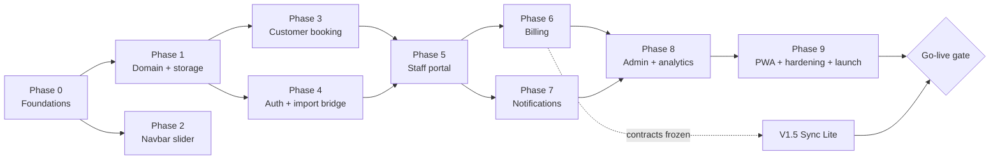

Phase 2 can run in parallel with Phase 1. Phase 7 can run in parallel with Phase 6. Sync Lite (§24.2) can start once the service contracts are frozen at the end of Phase 6.

### 21.3 Phases

Estimates are **working days for one developer using AI-assisted coding (Claude Code) while personally reviewing and testing every change**. A fully manual build is realistically 1.5 to 2.5 times longer. Treat all figures as ±30 %.

#### Phase 0 — Foundations (5–6 days) — Feature register F9, F11

| Step | Task |
|---|---|
| 0.1 | Baseline: screenshots of `/`; confirm `build` and `lint` pass; note bundle sizes |
| 0.2 | Tooling: Vitest, Testing Library, jsdom, fake-indexeddb, fast-check, Playwright, `@axe-core/playwright`; `ci.yml`; scripts `typecheck`, `test`, `test:e2e` |
| 0.3 | Static export: `output: "export"`, `trailingSlash: true`, `images.unoptimized`; fix any build errors; serve `out/` locally; deploy a preview to Vercel and to a Hostinger staging subdomain (Appendix B) |
| 0.4 | Asset diet (`optimize-images.mjs`): keep filenames and formats so no imports change; resize and recompress; budget every image at or under 300 KB and total image weight under about 12 MB (`ASSUMPTION`, adjust after measuring) |
| 0.5 | `config/site.ts` and `config/nav.ts`; replace the duplicated Setmore URL, phone, address and hours (G4) |
| 0.6 | Extract `data/services.ts` and `data/team.ts` from `our-service.tsx` and `our-stars.tsx` with no visual change (G5) |
| 0.7 | Tokens and theme scopes (§7.5); verify contrast for every pair (G6) |
| 0.8 | `animations/motion.ts` and `variants.ts`; replace the local `EASE` constants |
| 0.9 | UI primitives: add shadcn components as needed; extend `button.tsx`; extract `CountUp`, `SectionHeading`, `AmbientBackground` when first reused |
| 0.10 | ESLint layer rules (§15.4) |

**Exit:** home page visually identical; CI green; preview deployed on Vercel and Hostinger staging.

#### Phase 1 — Domain and storage (12–15 days) — F4, F7

| Step | Task |
|---|---|
| 1.1 | `domain/` primitives: `time`, `clock`, `intervals`, `result`, `errors`, `ids`, `money` |
| 1.2 | zod `schemas/` (§16) and `validators/` (name, phone, money input, ref, password) |
| 1.3 | `schedule`, `slots`, `assign`, `rules`, `booking-state`, with property tests (§23) |
| 1.4 | `pricing`, `refs`, `booking-code`, `permissions` |
| 1.5 | `storage/`: `idb`, `db`, migration `001-initial`, repositories, cache, broadcast, typed local and session storage, `persist`, `boot`, `seed`; `memory` adapter |
| 1.6 | Local services: settings, catalog, staff, schedule, availability, booking (create, cancel, reschedule, lookup, listMine), customer basics, audit, notification enqueue (persist only) |
| 1.7 | `AppProviders` with boot gate, `MotionConfig`, toast host; `useRepository` and friends |
| 1.8 | Contract test suite over both adapters; dev tooling (`oc-seed`, `oc-now`, `oc-sim`) |

**Exit:** domain coverage at or above 95 % lines; contract suite green on `memory` and `indexeddb`; cold boot with the `month-of-history` seed under 300 ms on a mid-range phone (measured, target).

#### Phase 2 — Navbar slider (2–3 days) — F1

| Step | Task |
|---|---|
| 2.1 | `use-media-query`, `use-hover-intent` |
| 2.2 | `NavbarCtaSlider` desktop behaviour (§4.1): hover, focus, Esc, elastic motion, no layout shift |
| 2.3 | Touch layout (always expanded) and the compact Book pill beside the hamburger |
| 2.4 | Integrate into `navbar.tsx`; the **Login** segment renders only while an `authEnabled` flag is on, so there is no dead link before Phase 4 |
| 2.5 | Tests: hover-intent unit tests; Playwright hover, keyboard and touch emulation; CLS measurement |

**Exit:** §4.1.10 acceptance criteria met on Chrome, Firefox, Safari (desktop), iOS Safari and Chrome Android.

#### Phase 3 — Customer booking (10–13 days) — F2a–F2e

| Step | Task |
|---|---|
| 3.1 | `/book` shell, wizard reducer, `StepProgress`, draft persistence |
| 3.2 | Service step: cards, popular chips, deep links (`?service=`), combo suggestions |
| 3.3 | When step: `DateStrip`, `CalendarPicker`, `BarberCard` chips, `TimeSlotGrid`, first-available shortcut |
| 3.4 | Confirm step: details form, consent line, honeypot, `booking.create` with idempotency key |
| 3.5 | `/book/confirmed`: `BookingSuccess` with `SealStamp` animation, add-to-calendar (`.ics`), Share-to-shop (Booking Code and QR) |
| 3.6 | `/manage` and `/my-bookings`: lookup by reference and last four digits, cancel, reschedule |
| 3.7 | Home page CTAs and per-service **Book** links use `bookingHref()` (still Setmore while the flag says so) |
| 3.8 | Playwright journeys, axe scans, edge cases E-T, E-C, E-B, E-P |
| 3.9 | Optional: `BookingSheet` (modal wrapper of the same flow) |

**Exit:** a scripted booking takes under 45 seconds from a service deep link; all listed edge cases pass; no axe violations.

#### Phase 4 — Authentication and import bridge (7–9 days) — F3, F2e (import)

| Step | Task |
|---|---|
| 4.1 | PBKDF2 worker; `authService`: setup, login, session, lockout, step-up, change password |
| 4.2 | `/login` with `LoginForm`; five-step `SetupWizard` |
| 4.3 | `AuthGuard`, role layouts, `NotAuthorised`, `returnTo` allow-list |
| 4.4 | `useSession`, `useIdleTimeout`, idle warning dialog, cross-tab logout |
| 4.5 | Navbar shows **Dashboard** when signed in; enable the Login segment |
| 4.6 | `/staff/import` with `ImportReview`; `importService.accept` and `decline` |
| 4.7 | Tests: hashing and throttle units; setup → login → guard → logout e2e; E-A cases |

**Exit:** the F3 checklist in §23.2 passes; forgotten-password recovery documented and rehearsed.

#### Phase 5 — Staff portal (14–17 days) — F2f

| Step | Task |
|---|---|
| 5.1 | `DashboardShell`, `DashboardSidebar`, `MobileTabBar`, `TopBar`, night theme |
| 5.2 | Today: `UpNextCard`, `DayTimeline`, status actions, `BookingDrawer` |
| 5.3 | `WalkInDialog` with offers from `availability.getWalkInOffers` |
| 5.4 | Delay (preview and cascade), no-show, notes |
| 5.5 | Calendar: day, 3-day, week; **Move to…** dialog as the non-drag alternative |
| 5.6 | Availability: weekly hours, breaks, time off, block slots, conflict resolution |
| 5.7 | Customers: list, drawer, notes, favourite, repeat badge |
| 5.8 | Profile, keyboard shortcuts, density; Earnings shell (data arrives in Phase 6) |
| 5.9 | Tests: unit, e2e on the `busy-saturday` seed, E-B18 to E-B23 |

**Exit:** a tester can run the whole `busy-saturday` scenario from the staff portal without developer tools.

> **Milestone M2 — Front-Desk beta** (about 10–13 weeks in). The shop tablet handles walk-ins and phone bookings. Setmore remains the public booking path.

#### Phase 6 — Billing (9–11 days) — F5

| Step | Task |
|---|---|
| 6.1 | `pricing.ts` boundary tests (discount, tax modes, tips, nickel rounding) |
| 6.2 | `billingService`: checkout, quote, finalize, void, refund; invoice counters; credit ledger |
| 6.3 | `BillingModal` (reducer, split payments, cash change) |
| 6.4 | `ReceiptDocument`, print CSS, `ReceiptModal`, WhatsApp and mailto share text; lazy PDF only if decided (Appendix C) |
| 6.5 | `registerService`, `RegisterPanel`, Z-report |
| 6.6 | Refund dialog with step-up; basic admin bills list |
| 6.7 | Entry points: Complete → Check out, walk-in checkout, quick sale; rebook prompt |
| 6.8 | Wire Earnings; E-M cases |

**Exit:** golden-file receipt tests; the register reconciles to zero variance on the `refunds` fixture.

#### Phase 7 — Notifications (6–8 days) — X1

| Step | Task |
|---|---|
| 7.1 | `notificationService`: enqueue, dedupe, list, read, snooze |
| 7.2 | `NotificationEngine`: leader election, scheduler scan, catch-up, delivery (§12.3) |
| 7.3 | `NotificationBell`, center page, primer and permission card, do-not-disturb settings |
| 7.4 | Wire events from booking, billing and schedule services |
| 7.5 | Title badge and optional sound; import coalescing |
| 7.6 | Tests with the fake clock; manual matrix on Chrome, Edge, Firefox, Android Chrome, installed iOS PWA; E-N cases |

**Exit:** one notification per event across multiple tabs; catch-up rules verified.

#### Phase 8 — Admin and analytics (16–20 days) — F2g, F6

| Step | Task |
|---|---|
| 8.1 | Admin shell, overview layout, command palette |
| 8.2 | `DataTable`; Bookings page with filters, saved views, bulk actions, CSV export |
| 8.3 | `ResourceCalendar` (all barbers side by side) |
| 8.4 | Catalog and staff editors; schedule editing |
| 8.5 | Customers directory and segments; merge and erase (step-up) |
| 8.6 | Settings: business, hours, holidays, rules, tax and payment, notifications; `BackupPanel`; restore flows; danger zone |
| 8.7 | Analytics selectors (test-first against fixtures), chart components, Overview and Reports pages, rollups written at day close |
| 8.8 | Audit log page |
| 8.9 | Tests: selector goldens, e2e admin week, E-S cases |

**Exit:** every metric in §14 reproduced by hand from the `month-of-history` fixture; backup and restore round-trip verified.

#### Phase 9 — PWA, hardening and launch (8–10 days) — X2

| Step | Task |
|---|---|
| 9.1 | Manifest, icons, service worker (app shell caching, update flow), install prompt UX |
| 9.2 | Performance pass against the budgets in §23.5; lazy-load dashboards and charts |
| 9.3 | Accessibility audit per §19.8 |
| 9.4 | Security review: CSP from report-only to enforcing, `.htaccess`, storage validation fuzzing |
| 9.5 | Backup and restore drill on the real shop devices |
| 9.6 | UAT with the owner and stylists using the script in §23.4 |
| 9.7 | Hostinger staging to production; keep the previous release archive for rollback |
| 9.8 | One-page staff guide and a runbook (daily backup, restore, forgotten password, new device) |

**Exit:** launch checklist in §23.6 complete.

### 21.4 Effort summary

| Phase | Working days | Cumulative (min–max) |
|---|---|---|
| 0 Foundations | 5–6 | 5–6 |
| 1 Domain and storage | 12–15 | 17–21 |
| 2 Navbar slider | 2–3 | 19–24 |
| 3 Customer booking | 10–13 | 29–37 |
| 4 Auth and import | 7–9 | 36–46 |
| 5 Staff portal | 14–17 | 50–63 |
| 6 Billing | 9–11 | 59–74 |
| 7 Notifications | 6–8 | 65–82 |
| 8 Admin and analytics | 16–20 | 81–102 |
| 9 PWA and launch | 8–10 | 89–112 |
| V1.5 Sync Lite (§24.2) | 10–14 | 99–126 |

Roughly **18–23 weeks** for V1 and **20–25 weeks** including Sync Lite, for one developer. Parallelising Phases 1/2 and 6/7 shortens the calendar time slightly.

### 21.5 Milestones, go-live gate and rollback

| Milestone | After | What exists |
|---|---|---|
| M0 | Phase 0 | Marketing site served as a static export on Hostinger; booking still Setmore |
| M1 | Phase 3 | Booking flow on staging; internal testing |
| M2 | Phase 5 | Front-Desk beta on the shop tablet |
| M3 | Phase 6 | Billing and register in daily use |
| M4 | Phase 9 | Full V1 release candidate |
| M5 | V1.5 | Customer-facing booking on the shared server calendar |

**Go-live gate for `bookingProvider: "native"`** (all required): Sync Lite is live (H1: customers and staff must share one authoritative calendar); two weeks of parallel run with Setmore show no double bookings; a full backup and restore drill has passed; staff have been trained; the owner has signed the UAT script; decisions D1–D12 are recorded. If the owner stays local-only (§24.2, option A) this gate cannot be met and `bookingProvider` stays `"setmore"`.

**Rollback:** set `bookingProvider` back to `"setmore"` and redeploy the static export. Local data on the shop devices is untouched; staff keep using the portal for walk-ins.

---

## 22. Estimated File-by-File Implementation Plan

Line counts are **rough sizes of finished, formatted code without tests** (±30 %), useful for sequencing and review load, not as targets. Tests are estimated separately in §22.9. Every file follows §15.7 naming and the layer rules in §15.4.

### 22.1 Root, tooling and deployment

| File | Action | Responsibility | Phase | ~LOC |
|---|---|---|---|---|
| `next.config.ts` | MOD | Static export, trailing slash, unoptimised images | 0 | 12 |
| `eslint.config.mjs` | MOD | Layer boundaries and domain purity rules | 0 | 45 |
| `package.json` | MOD | Dependencies (Appendix C) and scripts | 0 | 30 |
| `vitest.config.ts` | NEW | Unit and contract test runner, `@/*` alias, jsdom | 0 | 25 |
| `playwright.config.ts` | NEW | Projects: Chromium, WebKit, Firefox, mobile emulation | 0 | 45 |
| `.github/workflows/ci.yml` | NEW | Lint, typecheck, unit, build, e2e smoke on `out/` | 0 | 60 |
| `scripts/optimize-images.mjs` | NEW | Resize and recompress assets in place with sharp | 0 | 90 |
| `scripts/generate-icons.mjs` | NEW | PWA icon set from the logo | 9 | 50 |
| `public/.htaccess` | NEW | HTTPS, caching, security headers, 404 (Appendix B) | 0 / 9 | 70 |
| `public/manifest.webmanifest` | NEW | Installable app metadata | 9 | 35 |
| `public/sw.js` | NEW | App shell cache, update flow, notification click handling | 9 | 180 |
| | | **Subtotal** | | **642** |

### 22.2 Routes (`src/app`, thin pages)

| File | Action | Responsibility | Phase | ~LOC |
|---|---|---|---|---|
| `layout.tsx` | MOD | Wrap in `AppProviders`; metadata | 0 / 1 | 25 |
| `globals.css` | MOD | Night tokens, theme scopes, print CSS, reduced-motion guards | 0 | 140 |
| `book/layout.tsx`, `book/page.tsx`, `book/confirmed/page.tsx` | NEW | Booking wizard and confirmation routes (wrapped in `Suspense` for search params) | 3 | 80 |
| `manage/page.tsx`, `my-bookings/page.tsx` | NEW | Manage-by-reference and this-device bookings | 3 | 45 |
| `login/page.tsx` | NEW | Login and first-run setup | 4 | 25 |
| `staff/layout.tsx` | NEW | `AuthGuard(role: staff or admin)` and `DashboardShell` | 4 / 5 | 30 |
| `staff/{page, calendar, availability, customers, earnings, notifications, profile}/page.tsx` (7 files) | NEW | Staff pages composing feature components | 5 (earnings 6, notifications 7) | 110 |
| `staff/import/page.tsx` | NEW | Booking Code import target (`#OC1...` fragment) | 4 | 25 |
| `admin/layout.tsx` | NEW | `AuthGuard(role: admin)` and shell | 8 | 30 |
| `admin/{page, bookings, calendar, staff, services, customers, billing, reports, settings, audit}/page.tsx` (10 files) | NEW | Admin pages (billing list ships in 6) | 8 | 160 |
| | | **Subtotal** | | **670** |

### 22.3 Shared foundation (`animations`, `config`, `data`, `lib`, `hooks`)

| File | Action | Responsibility | Phase | ~LOC |
|---|---|---|---|---|
| `animations/motion.ts` | NEW | `EASE`, `DURATION`, `SPRING`, `STAGGER` tokens | 0 | 45 |
| `animations/variants.ts` | NEW | Reusable Framer Motion variants (fade-up, stagger, sheet, seal) | 0 | 70 |
| `config/site.ts` | NEW | Business facts, `bookingProvider`, `bookingHref()`, feature flags | 0 | 70 |
| `config/nav.ts` | NEW | Marketing and dashboard navigation definitions | 0 | 60 |
| `data/services.ts` | NEW | Real menu (Appendix A) as typed data | 0 | 260 |
| `data/team.ts` | NEW | Stylist data and asset map | 0 | 100 |
| `data/seed.ts` | NEW | Builds first-run records from `services.ts`, `team.ts`, defaults | 1 | 120 |
| `lib/format.ts` | NEW | Money, date, time, phone display formatting (`Intl`) | 1 | 80 |
| `lib/csv.ts` | NEW | CSV writer with formula-injection guard | 8 | 60 |
| `lib/ics.ts` | NEW | iCalendar generation | 3 | 90 |
| `lib/qr.ts` | NEW | Lazy QR code wrapper | 3 | 40 |
| `lib/download.ts` | NEW | Blob download helper | 3 | 25 |
| `hooks/use-repository.ts` | NEW | `useSyncExternalStore` bridge to the cache | 1 | 70 |
| `hooks/use-session.ts` | NEW | Session snapshot, cross-tab sync | 4 | 60 |
| `hooks/use-require-role.ts` | NEW | Route protection helper | 4 | 40 |
| `hooks/use-media-query.ts` | NEW | SSR-safe media query | 2 | 40 |
| `hooks/use-hover-intent.ts` | NEW | Delayed hover open and close | 2 | 70 |
| `hooks/use-now.ts` | NEW | Ticking shop-time clock | 1 | 50 |
| `hooks/use-availability.ts` | NEW | Debounced availability queries | 3 | 60 |
| `hooks/use-booking-draft.ts` | NEW | Wizard draft persistence | 3 | 60 |
| `hooks/use-notifications.ts` | NEW | Unread count and list | 7 | 80 |
| `hooks/use-idle-timeout.ts` | NEW | Idle detection with warning | 4 | 80 |
| `hooks/use-broadcast.ts` | NEW | Cross-tab channel | 1 | 40 |
| `hooks/use-reduced-motion-safe.ts` | NEW | Motion preference helper | 0 | 15 |
| | | **Subtotal** | | **1,685** |

### 22.4 Domain (`src/domain`, pure)

| File | Action | Responsibility | Phase | ~LOC |
|---|---|---|---|---|
| `time.ts` | NEW | dateKey and minutes helpers, weekday, shop-time to UTC | 1 | 160 |
| `clock.ts` | NEW | `Clock`, `systemClock`, `fixedClock` | 1 | 30 |
| `intervals.ts` | NEW | Merge, subtract, intersect, overlaps | 1 | 90 |
| `schedule.ts` | NEW | `effectiveWindows()` from hours, breaks, leave, holidays | 1 | 130 |
| `slots.ts` | NEW | `generateSlots()` | 1 | 260 |
| `assign.ts` | NEW | `pickStaff()` load balancing and preferences | 1 | 70 |
| `rules.ts` | NEW | Booking rules R1 to R15 | 1 | 220 |
| `booking-state.ts` | NEW | Status machine and legal actions | 1 | 90 |
| `money.ts` | NEW | Integer-cent arithmetic, percent and basis points | 1 | 60 |
| `pricing.ts` | NEW | Discount, tax, tip, rounding, totals | 1 / 6 | 180 |
| `refs.ts` | NEW | Booking references and invoice numbers | 1 | 90 |
| `booking-code.ts` | NEW | Booking Code encode, decode, check | 1 | 130 |
| `permissions.ts` | NEW | `ROLE_PERMISSIONS`, `can()`, step-up flags | 1 | 110 |
| `result.ts`, `errors.ts`, `ids.ts` | NEW | `Result`, `AppError`, id generation | 1 | 100 |
| `schemas/common.ts` | NEW | Primitive schemas (Id, DateKey, Minutes, Cents, Interval) | 1 | 60 |
| `schemas/settings.ts` | NEW | Settings schema and defaults | 1 | 140 |
| `schemas/service.ts`, `staff.ts`, `account.ts` | NEW | Catalog and people records | 1 | 170 |
| `schemas/schedule.ts` | NEW | TimeOff and Holiday | 1 | 50 |
| `schemas/customer.ts` | NEW | Customer and notes | 1 | 70 |
| `schemas/booking.ts` | NEW | Booking, lines, timeline | 1 | 140 |
| `schemas/billing.ts` | NEW | Bill, payment, refund, register, credit ledger | 1 / 6 | 160 |
| `schemas/operational.ts` | NEW | Notification, audit, outbox, counter, rollup, meta | 1 | 120 |
| `schemas/backup.ts` | NEW | Backup file envelope and snapshots | 1 | 60 |
| `validators/name.ts`, `phone.ts`, `money-input.ts`, `ref.ts`, `password.ts` | NEW | Field-level validation and normalisation (§9.6) | 1 | 300 |
| | | **Subtotal** | | **2,990** |

### 22.5 Storage (`src/storage`)

| File | Action | Responsibility | Phase | ~LOC |
|---|---|---|---|---|
| `idb.ts` | NEW | Thin promise wrapper over the `idb` library | 1 | 60 |
| `db.ts` | NEW | Open database, create stores and indexes (§8.4, §16.9) | 1 | 140 |
| `migrations/001-initial.ts` | NEW | Initial schema and version marker | 1 | 90 |
| `repositories/*.ts` (18 files: settings, services, staff, accounts, time-off, holidays, customers, bookings, bills, refunds, register-days, credit-ledger, notifications, audit, counters, outbox, rollups, meta) | NEW | One repository per store, exposing only the queries in §16.8 | 1 (bills, refunds, register, credit in 6) | 1,080 |
| `cache.ts` | NEW | In-memory store, selectors, subscribe | 1 | 160 |
| `broadcast.ts` | NEW | `BroadcastChannel` wrapper with storage-event fallback | 1 | 60 |
| `local-storage.ts` | NEW | Typed, zod-validated `oc:v1:*` access | 1 | 100 |
| `session-storage.ts` | NEW | Drafts, step-up state, tab id | 1 | 60 |
| `persist.ts` | NEW | `navigator.storage.persist()` and `estimate()` | 1 | 50 |
| `backup.ts` | NEW | Export, dry-run, merge and replace restore | 8 | 320 |
| `boot.ts` | NEW | Open, migrate, seed, hydrate, ready, fallback | 1 | 120 |
| `seed.ts` | NEW | Applies `data/seed.ts` on first run | 1 | 90 |
| | | **Subtotal** | | **2,330** |

### 22.6 Services (`src/services`)

| File | Action | Responsibility | Phase | ~LOC |
|---|---|---|---|---|
| `types.ts` | NEW | Service interfaces (§17.5), DTOs, inputs and outputs | 1 (grows each phase) | 500 |
| `container.ts` | NEW | `createServices({ adapter, clock, ids, getActor })`, mode selection | 1 | 90 |
| `adapters/types.ts` | NEW | `DataAdapter`, `UnitOfWork`, repository interfaces | 1 | 220 |
| `adapters/indexeddb.ts` | NEW | Transaction runner over `storage/` | 1 | 200 |
| `adapters/memory.ts` | NEW | In-memory adapter with snapshot rollback | 1 | 380 |
| `booking-service.ts` | NEW | Create, lookup, cancel, reschedule, transitions, delay, reassign, walk-in | 1 / 5 | 520 |
| `availability-service.ts` | NEW | Day slots, open dates, first available, walk-in offers | 1 | 180 |
| `catalog-service.ts` | NEW | Services CRUD, archive, reorder | 1 / 8 | 130 |
| `customer-service.ts` | NEW | Search, profile, notes, favourite, block, merge, erase | 1 / 5 / 8 | 260 |
| `staff-service.ts` | NEW | Staff CRUD, deactivation with resolution | 1 / 8 | 160 |
| `schedule-service.ts` | NEW | Time off, conflicts, weekly schedule, holidays | 1 / 5 | 260 |
| `billing-service.ts` | NEW | Checkout, quote, finalize, void, refund, receipts | 6 | 420 |
| `register-service.ts` | NEW | Open, close, reopen, Z-report data | 6 | 180 |
| `notification-service.ts` | NEW | Enqueue, dedupe, list, read, snooze, scheduler scan | 1 / 7 | 260 |
| `auth-service.ts` | NEW | Setup, login, session, lockout, step-up, accounts | 4 | 380 |
| `settings-service.ts` | NEW | Read and patch settings with validation | 1 | 110 |
| `analytics-service.ts` | NEW | Overview, reports, exports (wraps pure selectors) | 8 | 200 |
| `backup-service.ts` | NEW | Export, preview, restore, clear data | 8 | 240 |
| `import-service.ts` | NEW | Booking Code decode, accept, decline | 4 | 150 |
| `audit-service.ts` | NEW | Audit writer and reader helpers | 1 | 70 |
| `testing/clock.ts`, `ids.ts` | NEW | Fake clock and deterministic ids | 1 | 50 |
| `testing/fixtures.ts` | NEW | Seed scenarios (§17.8) | 1 (extended later) | 400 |
| `testing/sim.ts` | NEW | Latency and failure injector (dev only) | 1 | 60 |
| | | **Subtotal (V1)** | | **5,420** |
| `adapters/remote.ts` | NEW | Managed-database client and sync engine hook (V1.5, §24.2) | V1.5 | 260 |
| `supabase/migrations/*.sql`, `supabase/tests/*` (outside `src/`) | NEW | Schema, exclusion constraint, functions, row-level-security policies and database tests (V1.5) | V1.5 | 1,200 (SQL) |

### 22.7 Components (`src/components`)

| File | Action | Responsibility | Phase | ~LOC |
|---|---|---|---|---|
| `app-providers.tsx` | NEW | Boot gate, `MotionConfig`, toast host | 1 | 90 |
| `ui/button.tsx` | MOD | Gold, maroon and ghost variants; pill sizes | 0 | 50 |
| `ui/count-up.tsx` | NEW | Extracted count-up | 0 | 45 |
| `ui/shine-link.tsx` | NEW | Extracted shine CTA | 0 | 55 |
| `ui/ripple-surface.tsx` | NEW | Subtle press ripple | 0 | 70 |
| `ui/empty-state.tsx` | NEW | Illustrated empty states | 0 | 45 |
| `ui/skeleton.tsx` | NEW | Skeleton loaders | 0 | 40 |
| `ui/toast.tsx` | NEW | Toast host and `toast()` API | 0 / 1 | 120 |
| `ui/confirm-dialog.tsx` | NEW | Destructive confirmations | 0 | 70 |
| `ui/step-up-dialog.tsx` | NEW | Password re-entry for sensitive actions | 4 | 110 |
| `ui/calendar-picker.tsx` | NEW | Month picker with the ARIA date-picker model | 3 | 320 |
| `ui/*` shadcn primitives (about 14 files: dialog, sheet, select, tabs, tooltip, popover, switch, checkbox, input, label, textarea, badge, table, dropdown-menu) | NEW (generated) | Added with the shadcn CLI, restyled with tokens | 0 onward | 1,200 (generated) |
| `open-chair/navbar.tsx` | MOD | Slider integration, dashboard awareness | 2 | 60 |
| `open-chair/navbar-cta-slider.tsx` | NEW | Book Now / Login pill | 2 | 230 |
| `open-chair/section-heading.tsx` | NEW | Extracted heading pattern | 0 | 45 |
| `open-chair/ambient-background.tsx` | NEW | Extracted ambient orbs | 0 | 70 |
| `open-chair/our-service.tsx`, `our-stars.tsx`, `Herohome.tsx`, `cta-booking.tsx`, `footer.tsx` | MOD | Data and config extraction, `bookingHref()` (§15.6) | 0 | 100 |
| `dashboard/dashboard-shell.tsx` | NEW | Layout, providers, engine mount, modals | 5 | 220 |
| `dashboard/dashboard-sidebar.tsx` | NEW | Sidebar and icon rail | 5 | 180 |
| `dashboard/mobile-tab-bar.tsx` | NEW | Bottom tab bar | 5 | 110 |
| `dashboard/top-bar.tsx` | NEW | Search, notification bell, user menu | 5 | 150 |
| `dashboard/notification-bell.tsx` | NEW | Bell, badge, popover list | 7 | 130 |
| `dashboard/page-header.tsx` | NEW | Title, actions, breadcrumbs | 5 | 50 |
| `dashboard/data-table.tsx` | NEW | Sortable, filterable, responsive table with card fallback | 8 | 380 |
| `dashboard/booking-table.tsx` | NEW | Booking columns and row actions | 8 | 200 |
| `dashboard/booking-drawer.tsx` | NEW | Booking detail, timeline, actions | 5 | 340 |
| `dashboard/up-next-card.tsx` | NEW | Hero card for the next appointment | 5 | 140 |
| `dashboard/stat-card.tsx` | NEW | KPI card with delta and sparkline | 5 | 110 |
| `dashboard/walk-in-dialog.tsx` | NEW | Walk-in creation | 5 | 260 |
| `dashboard/command-palette.tsx` | NEW | Global search and actions | 8 | 200 |
| | | **Subtotal** (of which 1,200 generated) | | **5,230** |

### 22.8 Features (`src/features`)

**booking** (customer-facing, Phase 3 unless noted)

| File | Responsibility | ~LOC |
|---|---|---|
| `components/booking-flow.tsx` | Wizard container, step transitions, guards | 320 |
| `components/booking-sheet.tsx` | Optional modal wrapper (3b) | 90 |
| `components/step-progress.tsx` | Progress indicator | 70 |
| `components/service-step.tsx` | Service selection and totals | 260 |
| `components/service-card.tsx` | Selectable service card | 130 |
| `components/barber-card.tsx` | Barber chip and card | 90 |
| `components/when-step.tsx` | Date, barber and time selection | 240 |
| `components/date-strip.tsx` | Scrollable date strip | 190 |
| `components/time-slot-grid.tsx` | Radio-group slot grid | 180 |
| `components/first-available-card.tsx` | "Next available" shortcut | 80 |
| `components/customer-details-form.tsx` | Name, phone, notes, consent | 200 |
| `components/booking-summary.tsx` | Sticky and collapsible summary | 150 |
| `components/sticky-action-bar.tsx` | Mobile action bar | 70 |
| `components/booking-success.tsx` | Confirmation screen | 180 |
| `components/seal-stamp.tsx` | Success animation | 120 |
| `components/manage-booking-card.tsx` | Manage, cancel, reschedule | 260 |
| `components/cancel-dialog.tsx` | Cancellation flow | 110 |
| `components/add-to-calendar-button.tsx` | `.ics` download | 40 |
| `components/share-to-shop-button.tsx` | Booking Code, QR, WhatsApp link | 160 |
| `components/my-bookings-list.tsx` | This-device bookings | 150 |
| `components/import-review.tsx` | Staff import review (Phase 4) | 200 |
| `lib/wizard-reducer.ts` | Wizard state machine | 180 |
| `lib/deep-link.ts` | Query-string parsing for `?service=` | 30 |
| **Subtotal** | | **3,500** |

**auth** (Phase 4)

| File | Responsibility | ~LOC |
|---|---|---|
| `components/login-form.tsx` | Login form, errors, lockout countdown | 200 |
| `components/setup-wizard.tsx` | Five-step first-run setup | 420 |
| `components/auth-guard.tsx` | Role-based route guard | 90 |
| `components/not-authorised.tsx` | 403 screen | 40 |
| `components/password-strength.tsx` | Strength meter | 70 |
| `lib/pbkdf2.worker.ts` | Key derivation off the main thread | 60 |
| `lib/lockout.ts` | Throttle bookkeeping | 70 |
| `lib/session.ts` | Session token and expiry helpers | 110 |
| **Subtotal** | | **1,060** |

**schedule** (Phase 5)

| File | Responsibility | ~LOC |
|---|---|---|
| `components/availability-editor.tsx` | Weekly hours editor | 300 |
| `components/break-editor.tsx` | Recurring breaks | 130 |
| `components/leave-manager.tsx` | Time off and conflict resolution | 260 |
| `components/block-slot-dialog.tsx` | One-off blocks | 120 |
| `components/day-timeline.tsx` | Today's timeline | 240 |
| `components/week-calendar.tsx` | Day, 3-day and week calendar | 380 |
| `components/resource-calendar.tsx` | All barbers side by side (Phase 8) | 420 |
| `components/booking-block.tsx` | Calendar block | 110 |
| `components/move-to-dialog.tsx` | Non-drag move alternative | 140 |
| **Subtotal** | | **2,100** |

**customers** (Phases 5 and 8)

| File | Responsibility | ~LOC |
|---|---|---|
| `components/customer-list.tsx` | Staff list | 150 |
| `components/customer-table.tsx` | Admin directory | 200 |
| `components/customer-drawer.tsx` | Profile, history, notes | 300 |
| `components/segment-chips.tsx` | Segments filter | 70 |
| `components/note-editor.tsx` | Notes with visibility | 100 |
| **Subtotal** | | **820** |

**billing** (Phase 6)

| File | Responsibility | ~LOC |
|---|---|---|
| `components/billing-modal.tsx` | Checkout modal | 480 |
| `components/receipt-modal.tsx` | Receipt preview and actions | 140 |
| `components/receipt-document.tsx` | Printable receipt | 220 |
| `components/refund-dialog.tsx` | Refund flow | 220 |
| `components/register-panel.tsx` | Open, close, Z-report | 260 |
| `components/bill-table.tsx` | Bill listing | 180 |
| `lib/checkout-reducer.ts` | Draft state machine | 200 |
| **Subtotal** | | **1,700** |

**notifications** (Phase 7)

| File | Responsibility | ~LOC |
|---|---|---|
| `lib/notification-engine.ts` | Scheduler, leader election, delivery | 320 |
| `lib/leader.ts` | Web Locks leader helper | 60 |
| `components/notification-list.tsx` | Center list | 160 |
| `components/notification-primer.tsx` | Pre-permission explainer | 80 |
| `components/permission-card.tsx` | Permission state and instructions | 90 |
| **Subtotal** | | **710** |

**analytics** (Phase 8)

| File | Responsibility | ~LOC |
|---|---|---|
| `components/chart-frame.tsx` | Common chart wrapper (title, table toggle, states) | 120 |
| `components/sparkline.tsx` | Sparkline | 60 |
| `components/revenue-chart.tsx` | Revenue line and bar | 220 |
| `components/bar-chart.tsx` | Horizontal and vertical bars | 150 |
| `components/donut-chart.tsx` | Donut | 130 |
| `components/peak-hours-heatmap.tsx` | Hour by weekday heatmap | 160 |
| `components/date-range-picker.tsx` | Range presets and custom range | 160 |
| `components/kpi-grid.tsx` | KPI layout | 80 |
| `components/live-board.tsx` | Live chairs board | 200 |
| `components/alert-list.tsx` | Admin alerts | 100 |
| `lib/revenue.ts`, `bookings.ts`, `staff.ts`, `services.ts`, `customers.ts`, `cancellations.ts`, `occupancy.ts`, `ranges.ts`, `rollups.ts`, `csv-export.ts` | Pure selectors (§14), each test-first | 1,050 |
| **Subtotal** | | **2,430** |

**catalog-admin** (Phase 8)

| File | Responsibility | ~LOC |
|---|---|---|
| `components/service-table.tsx` | Service list, reorder, archive | 200 |
| `components/service-editor.tsx` | Service form | 300 |
| `components/staff-table.tsx` | Staff list | 160 |
| `components/staff-editor.tsx` | Profile, services, schedule, account | 420 |
| **Subtotal** | | **1,080** |

**settings** (Phase 8)

| File | Responsibility | ~LOC |
|---|---|---|
| `components/business-form.tsx` | Business facts | 130 |
| `components/hours-form.tsx` | Shop hours | 200 |
| `components/holidays-form.tsx` | Holidays and closures | 180 |
| `components/rules-form.tsx` | Booking rules | 220 |
| `components/tax-payment-form.tsx` | Tax, tips, payment methods | 150 |
| `components/backup-panel.tsx` | Export, restore, last backup status | 260 |
| `components/danger-zone.tsx` | Clear data, reset | 110 |
| `components/audit-table.tsx` | Audit log viewer | 150 |
| **Subtotal** | | **1,400** |

**All features: 14,800 lines.**

### 22.9 Tests

| Area | Files | ~LOC |
|---|---|---|
| Domain unit and property tests (`*.test.ts` beside each file) | about 22 | 2,900 |
| Service unit tests and the contract suite (§17.9) | about 16 | 2,000 |
| Storage and migration tests (fake-indexeddb) | about 8 | 700 |
| Component and hook tests (Testing Library) | about 30 | 1,800 |
| Playwright specs (15): navbar slider, booking journey, booking edge cases, manage/cancel/reschedule, import bridge, setup and login, guards and cross-tab logout, staff day, availability conflicts, checkout and refund, register close, notifications, admin bookings and analytics, backup and restore, accessibility scan | 15 | 1,700 |
| Playwright support: page objects, fixtures, helpers | about 8 | 400 |
| | | **≈ 9,500** |

### 22.10 Totals

| Area | ~LOC |
|---|---|
| Root, tooling, deployment | 642 |
| Routes | 670 |
| Shared foundation | 1,685 |
| Domain | 2,990 |
| Storage | 2,330 |
| Services (V1) | 5,420 |
| Components (incl. about 1,200 generated) | 5,230 |
| Features | 14,800 |
| **Production code** | **≈ 33,800** |
| Tests | ≈ 9,500 |
| **Grand total** | **≈ 43,300** |

Not included: the V1.5 database layer (about 1,200 lines of SQL for the schema, functions, policies and tests under `supabase/`) and `adapters/remote.ts` (about 260 lines of TypeScript).

---

## 23. Testing Checklist for Every Feature

### 23.1 Strategy and tooling

| Layer | Tool | What it proves | Target |
|---|---|---|---|
| Domain unit and property tests | Vitest, fast-check | Rules, slots, pricing, permissions, codes are correct for all inputs, not just examples | 95 % lines, 90 % branches |
| Service and contract tests | Vitest with `memory` and `fake-indexeddb` adapters | Permissions, validation, transactions, idempotency, error codes; the future HTTP adapter must pass the same suite (§17.9) | 85 % lines |
| Storage and migration tests | Vitest, fake-indexeddb | Schema creation, migrations from every prior version, backup round trip, quota and abort behaviour | Every migration has a fixture |
| Component and hook tests | Testing Library, user-event | Behaviour, keyboard operation, ARIA roles, states | Critical components |
| End-to-end | Playwright (Chromium, WebKit, Firefox; mobile emulation) | Whole journeys on the built static site (`out/`) | Every journey in §23.2 |
| Accessibility | `@axe-core/playwright`, manual passes (§19.8) | WCAG 2.2 AA | Zero violations in CI; manual audit in Phase 9 |
| Visual regression | Playwright screenshots | The marketing site is unchanged; key screens keep their layout | `/` at 390, 768, 1440 px |

**Conventions**
- Tests use the injected `Clock`; nothing depends on the real time or the machine's time zone. Run the suite under at least two `TZ` values (for example `America/Toronto` and `Asia/Kolkata`) to prove the shop-time logic is independent of the device.
- Fixtures come from `services/testing/fixtures.ts` (§17.8) so unit tests, e2e tests and manual QA share scenarios.
- Every bug fix adds a regression test that names its edge-case ID (for example `E-B14`).
- CI runs: lint → typecheck → unit and contract → build → e2e smoke and axe against the served `out/` directory.

**Property tests that must exist**

| Property | Area |
|---|---|
| Every generated slot lies inside effective working windows, on the slot grid, and never overlaps a booking, break, leave or holiday | `slots.ts` |
| Booking any offered slot removes it (and every overlapping slot) from the next generation; cancelling restores it | `slots.ts`, `booking-service` |
| With N concurrent creates for one slot, exactly one succeeds | `booking-service` on both adapters |
| Interval `merge` and `subtract` are idempotent and never produce overlaps or negative lengths | `intervals.ts` |
| Money: parts always sum to the total; totals are integers; discount never exceeds subtotal; nickel rounding differs from the raw amount by at most 2 cents | `pricing.ts` |
| Booking Code `decode(encode(x))` equals `x`; changing any single character fails the check | `booking-code.ts` |
| Booking state machine: only the transitions in §5.7 are legal; no path reaches `paid` without `completed` | `booking-state.ts` |
| Backup `restore(replace)` of `export()` yields identical data; restore in merge mode is idempotent | `backup-service` |
| Migrations: fixtures from every older schema migrate to the current schema without loss | `storage/migrations` |
| Permission matrix: for every role and every service method, the result equals the table in §9.3 | contract suite |

### 23.2 Per-feature checklists

Each list is the minimum. "Unit" means Vitest, "E2E" means Playwright, "Manual" means the QA pass on real devices.

#### F1 Navbar slider
- [ ] Unit: `use-hover-intent` open and close delays; no flicker when the pointer moves between segments.
- [ ] E2E: hover expands to two segments; each segment navigates to its destination; leaving the pointer collapses after the delay.
- [ ] E2E: keyboard — Tab reaches the slider, focus expands it, Tab moves between segments, Esc collapses.
- [ ] E2E: touch emulation shows the always-expanded layout with 44 px targets; the mobile menu contains both actions.
- [ ] E2E: signed-in state shows **Dashboard** with the role-correct destination.
- [ ] Performance: CLS is 0 for the navbar; animation uses only `transform` and `opacity`; no dropped frames in a 6-second recording at 4× CPU throttle.
- [ ] Manual: Safari desktop, iOS Safari, Chrome Android; reduced-motion setting removes the elastic motion.

#### F2a Customer booking (journey)
- [ ] Unit: wizard reducer transitions; deep-link parsing; draft save and restore; price and duration totals.
- [ ] E2E: service deep link → pick time → details → confirmed, under 45 seconds scripted; reference shown; booking present in `my-bookings`.
- [ ] E2E: "Any available" and a specific barber both produce the correct assignment.
- [ ] E2E: slot taken in another tab → `SLOT_TAKEN` with alternatives (E-C1); double tap creates one booking (E-C2); Back after confirm (E-C3); refresh on confirmed page (E-C4).
- [ ] E2E: validation — empty name, short phone, international phone, honeypot filled, blocked number (generic message).
- [ ] E2E: booking limit R9 and duplicate R10 messages; past and lead-time slots cannot be chosen.
- [ ] Unit and E2E: all E-T, E-B1 to E-B8, E-P1 to E-P6, E-P10 cases.
- [ ] Manual: 320 px, iOS keyboard with the sticky bar, screen reader read-through of all three steps.

#### F2b Manage, cancel, reschedule (customer)
- [ ] Contract: `lookup` with wrong last four digits returns generic `NOT_FOUND`; rate of attempts is limited on the device.
- [ ] E2E: cancel before and after the cutoff (E-B14); reschedule within limits (E-B11 to E-B13); cancelled slot becomes bookable again.
- [ ] E2E: `.ics` downloads and contains the correct instant, title, location.

#### F2c Booking Code bridge (customer to shop)
- [ ] Unit: encode, decode, check, size (a typical code fits in one WhatsApp message and one QR code).
- [ ] E2E: share link → staff import page → accept creates the booking; decline produces the reply text.
- [ ] E2E: E-X1 to E-X9.

#### F2f Staff portal
- [ ] Contract: a staff account can read and change only its own bookings, schedule and notes; admin-only methods return `FORBIDDEN`.
- [ ] E2E: Today shows the correct next appointment; Arrived → Start → Complete updates timeline and timestamps.
- [ ] E2E: walk-in offers respect current bookings; delay preview shows the cascade; no-show after the grace period.
- [ ] E2E: add leave over existing bookings shows conflicts and each resolution works (E-B10); block-slot removes offers.
- [ ] E2E: calendar day, 3-day and week; **Move to…** works without drag; keyboard navigation of slots.
- [ ] E2E: customer notes visibility (private versus shared), favourite, repeat badge after the configured visits.
- [ ] E2E on the `busy-saturday` seed: complete a full shift without console errors.
- [ ] Manual: shop tablet landscape (1280 × 800), Front-Desk Mode readability at arm's length.

#### F2g Admin dashboard
- [ ] Contract: admin-only methods; step-up required for merge, erase, refund, export, restore, reset password.
- [ ] E2E: booking filters, saved views, bulk actions, CSV export opens correctly in a spreadsheet (formula-injection guard for cells beginning with `=`, `+`, `-`, `@`).
- [ ] E2E: resource calendar shows all barbers; conflicts flagged; reassign works.
- [ ] E2E: staff and service editors, deactivation with reassign or cancel (E-B9), archive a service without altering history.
- [ ] E2E: settings changes apply immediately to slot generation (hours, holidays, rules) and never alter existing bookings.

#### F3 Authentication
- [ ] Unit: password hashing round trip; wrong password; throttle schedule; `credentialVersion` invalidation.
- [ ] E2E: first-run setup → login → guard → logout; staff cannot open admin routes (E-A7); `returnTo` allow-list (E-A8).
- [ ] E2E: idle warning and expiry; logout in one tab logs out all (E-A5); deactivated account is signed out (E-A6).
- [ ] Security: no plaintext password in storage, logs or URLs; session record contains no credential material; lockout persists across reload (E-A9).
- [ ] Manual: password manager fill and paste work.

#### F4 Booking engine
- [ ] Property tests in §23.1; table-driven tests for every rule R1 to R15 with boundary values.
- [ ] Unit: DST change dates for 2026 and 2027 (E-T1); leap day and month boundaries (E-T11).
- [ ] Unit: assignment fairness — "Any available" spreads load and honours preferred barber and eligibility.
- [ ] Contract: atomicity — a forced failure after the booking write leaves no partial rows, audit or outbox entries.

#### F5 Billing
- [ ] Unit: pricing table tests — discount percent and fixed, tax exclusive and inclusive, tips, nickel rounding at each remainder, zero-price lines, split payments.
- [ ] Golden files: receipt text for representative bills (cash with change, split, discounted, refunded).
- [ ] Contract: one final bill per booking (E-M7); refund cap (E-M8); void rules (E-M10); counters after restore (E-M13).
- [ ] E2E: complete → checkout → receipt → print preview; refund with step-up; register open → close with variance note.
- [ ] Manual: print at 58 mm, 80 mm and A4 on the real printer; WhatsApp share text opens correctly on mobile.

#### F6 Analytics
- [ ] Unit: every selector against `month-of-history` with hand-computed expected values (revenue, growth, occupancy, utilisation, peak hours, average duration, returning customers, service popularity, cancellation and no-show rates).
- [ ] Unit: rollups equal recomputation from raw records; day close writes them idempotently.
- [ ] E2E: date range presets, comparison toggle, filters; "View as table" matches chart data; CSV export equals the on-screen table.
- [ ] Performance: overview under 150 ms with a year of data (synthetic).

#### F7 Storage, backup, migration
- [ ] Unit: every store's read and write; index queries return what §16.8 promises; boolean-index fields (`activeFlag`, `isRead`) are derived on write.
- [ ] Migration: fixtures from each older version; a failed migration rolls back (E-S10).
- [ ] E2E: backup export → clear data → restore (replace) → identical; merge restore with conflicts (E-S8); wrong passphrase (E-S7); newer schema refused (E-S5).
- [ ] Manual: eviction and private-mode behaviour on Safari (E-S2, E-S3); storage warning near quota.

#### F8 Reusable components
- [ ] Each shared component has: default, loading, empty, error and disabled states demonstrated in tests; keyboard and screen reader behaviour verified; no feature-specific imports.

#### F11 Motion
- [ ] Reduced motion: every animation has a static equivalent; the success seal appears without motion.
- [ ] Only `transform` and `opacity` animate on interactive elements; no animation blocks interaction.
- [ ] Durations and easings come from `animations/motion.ts` only (lint or grep check).

#### F12 Responsive
- [ ] Playwright projects at 320, 390, 768, 1024, 1280, 1920 px run the smoke journeys and assert no horizontal page scroll.
- [ ] Manual pass on the device matrix in §20.2.

#### F13 Validation and security
- [ ] Unit: name and phone validators with hostile inputs (RTL characters, emoji, control characters, very long strings, HTML and script text); text is always rendered as text.
- [ ] Unit: `returnTo`, Booking Code and backup parsers reject malformed and oversized input without throwing.
- [ ] Manual: CSP report-only run shows no violations before enforcement; no third-party requests at runtime.
- [ ] Security review checklist in §9.7 completed.

#### X1 Notifications
- [ ] Unit with the fake clock: reminder at the configured lead time, arriving-soon, late, overrun; dedupe keys; do-not-disturb; catch-up rules (E-N3).
- [ ] E2E: two tabs → exactly one notification (E-N2); mark read, snooze, mark all read; unread count and title badge.
- [ ] Manual matrix: Chrome and Edge (Windows), Firefox, Android Chrome, installed iOS web app (16.4 or later); permission denied path (E-N1).

#### X2 PWA
- [ ] Lighthouse PWA and installability checks pass; app shell loads offline; booking pages show a clear message offline.
- [ ] Update flow: new deployment shows "Update available"; the old connection closes cleanly (E-C8); no cache serves stale HTML for more than one reload.

### 23.3 Browser and device matrix

| Platform | Versions | Depth |
|---|---|---|
| Chrome (Windows, Android) | Current and previous | Full, including notifications |
| Edge (Windows) | Current | Smoke and notifications |
| Firefox (Windows) | Current | Full functional |
| Safari (macOS) | Current | Full functional |
| iOS Safari and installed web app | Current and previous major (16.4 or later for notifications) | Full booking journey; storage and notification behaviour |
| Samsung Internet | Current | Smoke |

Browsers older than these are not supported; a friendly "update your browser" notice appears when required APIs are missing (E-A11, E-D2).

### 23.4 User acceptance test (UAT) script

Run by the owner and at least one stylist on the real shop devices, on the staging site first, then on production before go-live. Every row must pass.

| # | Role | Scenario | Pass when |
|---|---|---|---|
| 1 | Customer (phone) | Book Haircut & Beard with "Any available" from the home page | Confirmation and reference appear in under a minute; it shows on the barber's Today |
| 2 | Customer | Reschedule then cancel the booking from the confirmation link | Both succeed; the slot reopens; both barbers were notified where relevant |
| 3 | Customer | Try to book a taken slot in two tabs | Second attempt shows alternatives, no duplicate |
| 4 | Stylist | Mark arrived, start, complete | Timeline and durations are correct |
| 5 | Stylist | Add a walk-in | Offered times respect existing bookings |
| 6 | Stylist | Delay an appointment by 15 minutes | Preview matches the result; affected bookings updated |
| 7 | Owner | Add leave for Anmol over a day with bookings | Conflict list shown; chosen resolution applied |
| 8 | Stylist or owner | Check out with cash and change; then with split card and cash plus tip | Totals, tax, rounding and receipt are correct |
| 9 | Owner | Refund one bill (step-up prompt appears) | Register reflects the refund |
| 10 | Owner | Close the register with a counted amount | Variance recorded; Z-report prints |
| 11 | Owner | Export a backup, restore it on a second device | Data identical (bookings, bills, customers) |
| 12 | Owner | Follow the forgotten-password recovery steps | Access restored without data loss |
| 13 | Stylist | Import a Booking Code sent through WhatsApp | Booking created; decline path produces a reply |
| 14 | Stylist | Receive a reminder notification with the tab in the background | One notification, opens the right booking |
| 15 | Owner | Compare the admin report for a test week with a manual tally | Revenue, booking counts and top service match |

### 23.5 Performance budgets (targets, verified in Phase 9)

Measure a baseline in Phase 0 and adjust these numbers once the real starting point is known.

| Metric | Target |
|---|---|
| Home page, simulated mid-range phone on 4G (Lighthouse mobile) | LCP at or under 2.5 s; CLS at or under 0.1; INP at or under 200 ms |
| `/book` added JavaScript over the shared bundle | At or under 60 KB gzip |
| Dashboard routes | Lazy-loaded; charts load only on analytics pages (about 40 KB gzip or less) |
| PDF generation library (only if adopted) | Loaded on click only |
| Database boot with a month of history | At or under 300 ms |
| Slot generation for one day, three barbers | At or under 5 ms |
| Thirty-day date-strip availability | At or under 50 ms |
| Booking commit (local) | At or under 50 ms |
| Analytics overview with rollups | At or under 150 ms |
| Login (password hashing) | About 300–500 ms on a mid-range phone; tune iterations in §9.2 |
| Animation | 60 fps, `transform` and `opacity` only, no long tasks over 50 ms during interaction |
| Image weight | Each image at or under 300 KB; total under about 12 MB |

### 23.6 Launch checklist

**Content and configuration**
- [ ] `config/site.ts` facts verified with the owner (address, phone, hours, Setmore URL).
- [ ] Service catalog, prices, durations and eligibility approved (Appendix A, D6).
- [ ] Holidays and shop hours entered; buffers and slot interval confirmed.
- [ ] Tax setting and receipt footer approved by the owner and accountant.

**Quality**
- [ ] CI green on `main`; all Playwright journeys pass on Chromium, WebKit and Firefox.
- [ ] Axe clean; manual accessibility audit signed off.
- [ ] Performance budgets met; no console errors on any route.
- [ ] UAT script (§23.4) passed.

**Data and safety**
- [ ] Backup and restore drill completed on the real devices; backup routine documented.
- [ ] `navigator.storage.persist()` result recorded for each shop device; installed-app recommendation applied where refused.
- [ ] Forgotten-password recovery rehearsed.
- [ ] Sync Lite live and parallel run complete before switching `bookingProvider` (§21.5).

**Deployment**
- [ ] Production build served over HTTPS with `.htaccess` rules; security headers verified.
- [ ] CSP moved from report-only to enforcing after a clean observation period.
- [ ] Previous release archive stored for rollback; rollback rehearsed.
- [ ] `robots.txt` and metadata correct; dashboard routes excluded from indexing.

**People**
- [ ] One-page staff guide and runbook delivered; owner and stylists trained.
- [ ] Owner knows the escalation path (this plan, §24 roadmap, developer contact).

---

## 24. Future Upgrade Path to a Backend

### 24.1 Principles

1. **Nothing above the service layer changes.** Screens depend on `services.*` and `useRepository` only (§17). Moving to a server is a new implementation behind the same contracts, proven by the shared contract suite (§17.9).
2. **Offline-first stays.** IndexedDB remains the local cache on shop devices, so the shop can keep working when the internet drops. The server becomes the source of truth for anything that must be consistent between devices.
3. **IDs are already global.** Records use client-generated UUIDs, references, invoice numbers with a device code, and `version` counters (§16), so existing data can be imported without renumbering.
4. **Incremental, reversible steps.** Each version below can ship on its own and has a rollback (`syncMode` and `bookingProvider` flags).
5. **Server enforces what the client cannot.** Anything security- or consistency-critical (authentication, overlap prevention, rate limits, payments) is re-implemented on the server; the client keeps the same checks only for UX.
6. **Hostinger keeps serving static files only, and no PHP or other server code is used.** Data and accounts live in a managed database called directly from the browser (§24.2). Any later step that would need a server-side sender or receiver (push, email, SMS, payment webhooks) says so explicitly and needs the owner's approval before it is built (§24.4, §24.5).

### 24.2 V1.5 — "Sync Lite": one shared calendar (managed database, no PHP, no server code)

**Why it exists.** In V1 each browser has its own database (H1). That is fine for the front desk but not for public online booking: a customer's phone cannot see the shop tablet's bookings. Sync Lite makes one calendar authoritative without any PHP or other server code that the shop has to run: the browser talks directly to a managed database that enforces the rules. It can be merged into V2 if the owner prefers a single larger step (decision D2).

**Options considered** (decision D2)

| Option | What it is | Cost and trade-offs | Verdict |
|---|---|---|---|
| **A. Stay local-only** | Keep Setmore as the public booking path; the native system runs in Front-Desk Mode only (V1) | No extra cost or vendor. Customers cannot book natively, and the go-live gate in §21.5 cannot be met | **Valid if the owner declines any backend** |
| **B. Managed Postgres called from the browser** (Supabase in the Canada region is the reference) | Hosted Postgres with sign-in, row-level security, database functions and a change feed. Hostinger still serves only static files | Paid tier recommended for production (roughly $25 per month; verify current pricing and limits). Customer names and phones are stored with a vendor (see Privacy below). The database itself can enforce "no double booking" and the booking limits | **Recommended if native online booking is wanted** |
| C. Firebase (Firestore and Auth, client SDK only, no Cloud Functions) | Hosted document database with sign-in, security rules and offline persistence | Generous free tier and familiar tooling. Security rules cannot express "these two variable-length bookings overlap" or "no more than two upcoming bookings per phone", so no-double-booking would rest on one lock document per 15-minute cell created in an atomic batch, and every other booking rule would be enforced only in the browser. Weaker guarantees for a public, no-login booking endpoint | Viable fallback behind the same `adapters/remote.ts` contract; not the reference design |
| Not viable | MySQL on the Hostinger plan (a browser cannot connect to MySQL, so a server-side layer such as PHP would be unavoidable); Google Sheets or Apps Script (a server-side script with weak concurrency); IndexedDB only (per device, H1) | — | Rejected |

**Vendor and cost notes** (verify before committing; these depend on the vendor's current terms): use a project in the **Canada (Central)** region so customer data stays in Canada; use a paid tier in production because free projects can be paused when inactive and may not include backups; create the account in the owner's name; enable the vendor's daily backups **and** the nightly export described below. The design uses no vendor-specific feature that lacks a standard Postgres equivalent, so the data can be exported with a standard dump and moved elsewhere.

**Architecture**

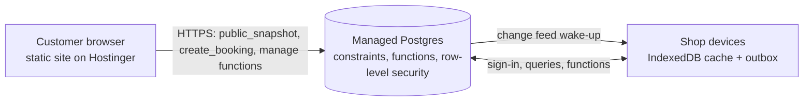

**Where things run.** Browser: the UI and the TypeScript domain rules (§10). Database: constraints, functions, triggers, row-level security and sign-in. Hostinger: static files only. There is no PHP, no Node, no Edge or Cloud Functions and no cron on the hosting account.

**Assumptions to verify on a staging project before committing** (not confirmed by this plan): the Canada region is available; anonymous sign-in and CAPTCHA protection are available on the chosen tier; custom SMTP can be configured (the Hostinger mailbox may work for password-reset emails); the `btree_gist` extension is available and supports the id types used (if not, use text ids for `staff_id`); row-level security is applied to the realtime change feed as documented; connection, request-rate and realtime limits suit the shop's volume; backup retention on the chosen tier.

**Repository layout** (developer tooling only: migrations are applied from a developer machine or CI with the vendor's CLI, never from the browser)

```
supabase/
├─ migrations/   0001_extensions · 0002_tables · 0003_constraints · 0004_rls · 0005_public_functions
│                0006_staff_functions · 0007_triggers · 0008_seed
├─ tests/        SQL tests (for example pgTAP) run in CI against a local database
└─ README.md     applying migrations, bootstrapping the first admin, rotating keys
```

The operations the browser calls are listed in §17.7. Database errors are mapped to `AppError` codes (§17.3) by `services/adapters/remote.ts`, so the contract suite (§17.9) runs unchanged against it.

**Database-authoritative booking (no double booking, any duration).** Every booking stores its day and its start and end in minutes (the same model as §10.2). A Postgres **exclusion constraint** forbids two active bookings for the same barber on the same day whose occupied ranges (service time plus buffer) overlap. It works for bookings of any length, and it holds even if two customers press Confirm at the same instant from different devices.

```sql
create extension if not exists btree_gist;

create table bookings (
  id                uuid primary key,
  ref               text not null unique,
  status            text not null,
  source            text not null,
  staff_id          uuid not null references staff (id),
  customer_id       uuid null references customers (id),
  date_key          date not null,
  start_min         smallint not null check (start_min between 0 and 1439),
  end_min           smallint not null check (end_min > start_min and end_min <= 1440),
  buffer_min        smallint not null default 0 check (buffer_min between 0 and 60),
  manage_token_hash bytea null,                 -- SHA-256 of the customer's manage token
  version           integer not null default 1,
  data              jsonb not null,             -- full Booking record (§16.3)
  created_at        timestamptz not null default now(),
  updated_at        timestamptz not null default now(),

  constraint bookings_no_overlap exclude using gist (
    staff_id with =,
    date_key with =,
    int4range(start_min::int, least(end_min + buffer_min, 1440)::int, '[)') with &&
  ) where (status in ('pending', 'confirmed', 'arrived', 'in_service', 'completed'))
);

create index bookings_by_date   on bookings (date_key);
create index bookings_by_status on bookings (status);
```

`create_booking` runs as one database function (one transaction): validate, insert the customer and the booking, write the audit and notification rows. If the insert raises `exclusion_violation` (SQLSTATE `23P01`), the function returns `SLOT_TAKEN` with the nearest alternatives. Cancelling or marking `no_show` removes a booking from the constraint automatically (it no longer matches the `where` clause); a reschedule is an `update`, which the constraint re-checks atomically. There are no helper "cell" tables to keep in sync.

Other tables follow the same pattern (`id`, `version`, a few promoted query columns and a `data jsonb` copy of the §16 record; money as integer cents): `services`, `staff`, `customers`, `time_off`, `holidays`, `settings`, `bills`, `refunds`, `register_days`, `credit_ledger`, `notifications`, `audit_log`. `jsonb` keeps the browser's record shapes unchanged; promote only the fields that are filtered or joined.

Supporting tables:

```sql
create table change_log (                     -- filled by triggers on every synced table
  seq        bigint generated always as identity primary key,
  entity     text not null,
  entity_id  text not null,
  op         text not null check (op in ('put', 'delete')),
  version    integer not null,
  changed_at timestamptz not null default now()
);

create table profiles (                       -- one row per staff or admin who signs in
  user_id      uuid primary key references auth.users (id) on delete cascade,
  role         text not null default 'pending' check (role in ('pending', 'staff', 'admin', 'disabled')),
  staff_id     uuid null references staff (id),
  display_name text not null,
  created_at   timestamptz not null default now()
);

create table rate_limits (
  bucket       text not null,                 -- e.g. 'book:uid:<id>', 'book:ip:<hash>', 'lookup:ip:<hash>'
  window_start timestamptz not null,
  hits         integer not null default 1,
  primary key (bucket, window_start)
);

create table idempotency_keys (
  key_hash   bytea primary key,
  response   jsonb not null,
  created_at timestamptz not null default now()
);
```

Passwords, sessions and password hashing belong to the vendor's Auth service (the `auth.users` table); the application stores none of them. The on-device `accounts` store of §8.4 is not used in `synced` mode.

**Where rules run.** Slot generation and the friendly rules stay in TypeScript (`domain/`) so the UI is instant. The database re-validates the **hard invariants** inside its functions: the requested interval lies inside shop hours, the barber's working hours and breaks, holidays and leave; not in the past or inside the lead time; the service, duration and price come from the catalogue tables, never from the client's payload; R9 and R10 limits; blocked numbers; and the exclusion constraint above. A trigger enforces the status state machine of §5.7, and finalised bills and refunds cannot be updated or deleted. To prevent the TypeScript and SQL rules drifting apart, the TypeScript test suite **exports golden vectors** (JSON files of inputs and expected results) that a SQL test replays in CI. About 300 lines of PL/pgSQL cover the validation function.

**Sync protocol for shop devices**

| Aspect | Design |
|---|---|
| Pull | A device reads `change_log` rows with `seq` above its cursor (up to 500 per request) and then fetches the changed records. A realtime subscription to `change_log` inserts wakes the device immediately; if the connection drops, the device polls every 15 s while the tab is visible and on focus. Row-level security applies, so a device receives only what its role may read |
| Push | Queued `outbox` rows are replayed in order by calling the same database functions the UI uses (§17.7), each with the row's id as its idempotency key. Rejected rows come back as an `AppError` and are shown to the user |
| Needs the server (online only) | Anything that changes availability: create, reschedule, cancel, delay, reassign, time off, holidays, settings. Offline attempts fail with a clear "Reconnect to change the calendar" message |
| May queue offline | Status transitions (arrived, start, complete), notes, favourites, and **bills and refunds** (append-only, invoice numbers already carry a device code), so the till keeps working during an outage |
| Conflicts | Bookings: server wins, surfaced as `SLOT_TAKEN` or `VERSION_CONFLICT`. Other mutable records: higher `version` wins, ties go to the server. Bills and refunds: never edited, deduplicated by id. Customer counters are recomputed on the server. Deletions are tombstones (`op: delete`) kept for 90 days, then compacted by a scheduled database job |
| Local role | IndexedDB is a cache plus outbox; the UI still reads it through `useRepository` |

**Security and abuse protection**
- **Deny by default.** Row-level security is enabled on every table and anonymous visitors get no direct table access. Public reads and writes go through a few `security definer` functions that validate everything and return only what the caller may see. Function bodies fix their `search_path`, and execute rights are granted per function, never to everyone by default.
- **Keys.** The browser holds only the project URL and the **public anon key**, which is designed to be public and is safe only because of the rule above. The service-role key never enters the repository, the build or any browser.
- **Customer sessions.** Customers use anonymous sign-in protected by CAPTCHA (Cloudflare Turnstile or hCaptcha; add its host to the CSP), which gives each booking attempt a short-lived identity that can be rate-limited.
- **Staff sessions and passwords.** Staff and admins sign in with email and password through the vendor's Auth service (server-side hashing, signed short-lived tokens with refresh rotation, password-reset email through a custom SMTP sender, vendor-side rate limits). This replaces the bypassable on-device accounts and lockout of §9.2. A static site cannot use HttpOnly cookies, so tokens live in browser storage: keep the access-token lifetime short, keep the strict CSP of Appendix B, and load no third-party scripts except the CAPTCHA.
- **Step-up.** Sensitive functions (refund, export, role changes, erase customer) require a recent sign-in: the function checks that the token was issued within the last 10 minutes, and the UI asks for the password again (§9.4).
- **Staff onboarding and first admin.** Sign-up is enabled, but every new account starts as `pending` with no access; an admin approves it and links it to a staff record in the Staff screen. The **first admin** is bootstrapped once by the developer or owner with a single SQL statement in the vendor's dashboard, documented in `supabase/README.md`; nobody can claim an empty project through the app.
- **Public functions** (`public_snapshot`, `create_booking`, `lookup_booking`, `cancel_booking`, `reschedule_booking`): rate limits per anonymous identity, per phone hash and per IP hash in `rate_limits` (use the client-address header set by the vendor's proxy; verify it cannot be spoofed), honeypot field, payload size cap, strict validation, generic error messages and an `idempotency_keys` check.
- **Manage links.** A booking's manage token is 128 random bits; only its SHA-256 is stored; the link is `/manage?t=<token>`. Lookup by reference and last four digits is available to staff and, rate-limited with a generic not-found reply, to customers.
- **Errors and logs.** Functions raise coded errors that `remote.ts` maps to `AppError`; logs contain ids, never names or phone numbers.
- **Privacy.** The public snapshot contains only opening hours, holidays, services, public staff fields and busy intervals, never customer data. Data residency is Canada (see Vendor and cost notes). Customer erase is a database function that anonymises the customer and keeps bills for the retention period the owner's accountant requires.

**Scheduled jobs** run inside the database (`pg_cron`, if available on the chosen tier) and need nothing on Hostinger: purge expired idempotency keys and rate-limit rows (daily); compact `change_log` (weekly). **Backups:** the vendor's daily backups plus an admin **Export server data** button that pages through every table into the §8.7 backup file; the admin banner warns when the last export is older than seven days. Reminder dispatch arrives in V3 (§24.4).

**One-time data migration and cutover**

1. Create a staging project, apply `supabase/migrations`, and run the SQL tests, the golden-vector test and the contract suite (§17.9) against it.
2. On the shop's primary device, export a backup (§8.7).
3. Bootstrap the first admin (one SQL statement). Use the admin **Import backup** screen, which sends the backup in chunks to an admin-only import function, first in **dry-run** mode to review the report (counts, conflicts, rejected rows), then for real. Ids, references and invoice numbers are preserved.
4. On each shop device, switch to `syncMode: "synced"`; the local cache is rebuilt from the server.
5. Run in parallel with Setmore for at least two weeks; compare bookings daily.
6. Meet the go-live gate (§21.5), flip `bookingProvider` to `"native"`, keep the Setmore link available for 30 days, then retire it.

**Rollback:** flip `bookingProvider` to `"setmore"`; switch devices back to `local-only` (their caches still hold current data); export the server's data as a §8.7 backup for the record.

**Code impact**

| Area | Change |
|---|---|
| `services/adapters/remote.ts` | New: typed wrapper over the vendor's client library (lazy-loaded only when `syncMode` is `synced`); maps database error codes to `AppError` |
| `services/container.ts` | Compose `synced` implementations; start the sync engine |
| `storage/` | Add a sync-state record and outbox replay; no schema break |
| `domain/` | Unchanged; export golden vectors from tests |
| `features/`, `components/`, `app/` | Unchanged (offline states already handled by §17 error codes); add a small "Sync status" indicator to the dashboard top bar |
| `supabase/` | New SQL: schema, constraints, functions, policies, triggers and tests (about 1,200 lines). Build-time variables `NEXT_PUBLIC_SUPABASE_URL` and `NEXT_PUBLIC_SUPABASE_ANON_KEY` (both public by design) |

**Main risks and mitigations**

| Risk | Mitigation |
|---|---|
| Slot logic drifts between TypeScript and SQL | Golden vectors in CI; the database enforces only the hard invariants |
| Vendor limits, price changes or an outage | Paid tier; usage and budget alerts; the offline queue keeps the till working; standard Postgres data can be dumped and moved; monthly export drill |
| Shop internet outage during service | Offline queue for status changes and billing; cache remains readable; clear messaging for calendar changes |
| Abuse of the public booking function | CAPTCHA on anonymous sign-in, rate limits, honeypot, optional `requireApproval` mode, admin blocklist, monitoring of `rate_limits` |
| Mis-configured row-level security exposes data | SQL tests assert that an anonymous caller can read no table and that each role sees only its own rows; run in CI on every migration and after every policy change |
| Data loss | Vendor daily backups plus the admin export (§8.7); monthly restore drill on a scratch project |

### 24.3 V2 — Hardening, server-side reporting and operations (managed database)

**Goal:** finish retiring the limits of on-device security (§9.2) and make the database the single home of history and reporting. Sign-in is already server-side from V1.5; V2 adds recovery, stronger admin protection and operations tooling.

| Area | Deliverable |
|---|---|
| Accounts | On-device `accounts` store and lockout removed from the shipped build (kept only for the offline-demo mode); admin can approve, deactivate and reset accounts; forced password change for reset accounts; "sign out everywhere" |
| Password recovery and MFA | Email-based reset through the custom SMTP sender (signed, single-use, short-lived link); optional TOTP two-step verification for admins, offered by the Auth service, and required for step-up when enabled |
| Data lifecycle | Retention job for old notifications, idempotency keys and rate-limit rows; customer data export and erase tools for privacy requests |
| Audit | `audit_log` written by database triggers for every mutation, including the actor and role; the on-device audit becomes a cache |
| Reporting | Database views or materialised views for large date ranges if browser-side computation becomes slow; rollups refreshed by a scheduled database job |
| Backups | Vendor daily backups verified by a quarterly restore into a scratch project; owner-visible "last export" and "last restore test" indicators |
| Cleanup | `local-only` mode kept only as a developer and offline-demo option |

**Exit:** no credential material remains on devices; a full account-recovery rehearsal passes; the restore drill passes.

### 24.4 V3 — Real-time notifications and customer messaging

**Goal:** notifications that work when no staff tab is open, and reminders that reach customers.

| Area | Design |
|---|---|
| Push to staff | Web Push through a push provider's REST API (for example OneSignal, which manages browser subscriptions and accepts a REST call), called from a database trigger using the `pg_net` extension; the provider's API key is kept in the database's secret vault, never in the browser or the repository. Subscriptions are stored per account and device; the service worker from Phase 9 already handles display and click routing. **Needs the owner's approval:** it stores a provider secret with the database vendor and sends staff device identifiers and booking text to a third party |
| Customer reminders | Email first: confirmation, cancellation and reschedule emails (the address stays optional), sent through an email provider's HTTP API from the database. SMS and WhatsApp through a messaging provider (for example Twilio or the WhatsApp Business Cloud API) with explicit opt-in captured on the booking form; templates approved where required; per-message costs and regional rules to be confirmed before choosing |
| Scheduling | `pg_cron` inside the database finds due reminders every few minutes (verify the minimum interval on the chosen tier) and calls the provider; every send is recorded so duplicates are impossible; quiet hours honoured |
| Real-time UI | The realtime change feed from V1.5 already gives instant updates on open dashboards. If it proves unreliable or too costly, fall back to **adaptive short polling** of the `change_log` cursor (5 s while a booking is being edited, 15–30 s otherwise, paused when hidden) |
| Preferences | Notification settings per account (channels, quiet hours); per-customer channel choice |

**Exit:** a staff member receives a push for a new online booking with the app closed; customers receive one reminder per booking; duplicate suppression proven when scheduled runs overlap.

### 24.5 V4 — Payments

**Goal:** take deposits or prepayment online and card payments in the shop, without ever handling card data.

| Area | Design |
|---|---|
| Provider | A hosted provider that supports Canadian merchants (Stripe and Square are the usual candidates; confirm current availability, fees and Interac support before choosing). Hosted checkout or hosted fields keep the shop at the lightest PCI compliance level; **card data never touches this site or database** |
| Deposits and no-show protection | Optional per service: a deposit or card-on-file requirement. The booking is created `pending`, its slot is held, and it is released by a scheduled database job if payment is not completed within a short timeout |
| Confirming online payments | Providers confirm a payment with a webhook to a public URL that must verify a signature, and a static site plus a database cannot host that safely without server code. Options for the owner to choose: (a) hosted payment links with **manual confirmation** by staff (no webhook); (b) accept one small serverless receiver as a deliberate exception to the no-server-code rule, verifying the signature and recording `payments` idempotently by event id (`webhook_events` table). Option (a) is the default until the owner decides |
| Ledger integration | Online payments become `Payment` rows on the bill (§16.4) with `reference` set to the provider id; refunds go through the provider API and are recorded as `Refund`; the register reconciles them with cash |
| In-shop card reader | Optional terminal integration so card payments fill the checkout automatically instead of typing an approval reference |
| Interac e-Transfer | No public API for merchants in most setups; remains a manual method with reference matching |
| Data additions | `payment_intents`, `webhook_events`, provider ids on `payments`; new permission `payment:refund-online` with step-up |

**Exit:** a test deposit flows from booking to bill to register; a refund reconciles; webhook replay is harmless; a failed or abandoned payment releases the slot.

### 24.6 V5 — Loyalty program

**Goal:** reward repeat visits with minimal front-desk effort.

| Area | Design |
|---|---|
| Program types (owner chooses) | Visit-based punch card (for example every Nth cut rewarded), points per dollar, referral credit, birthday offer (requires explicit consent to store a birth date) |
| Ledger | Append-only `loyalty_ledger` (earn, redeem, expire, adjust) per customer, mirroring `credit_ledger` (§16.4); balances are derived, never hand-edited without an audited adjustment |
| Billing integration | Redemption appears on the bill as a reward line or discount with `kind: "reward"`; earning happens when a bill becomes final and reverses on refund |
| Customer view | `/rewards` page. Because a balance is personal data, viewing it requires proof of identity beyond a phone number: one-time code over SMS (available from V3) |
| Admin | Program settings, liability report (outstanding rewards), abuse controls (daily caps, staff overrides audited), enable or disable without losing history |
| Rules engine | Small declarative rules table (`loyalty_rules`) evaluated in `domain/loyalty.ts` so V1's pure-function approach continues |

**Exit:** earn and redeem on real bills; refunds reverse points; liability report matches the ledger.

### 24.7 V6 — AI recommendations

**Goal:** use the accumulated booking history to help customers and the owner, without compromising privacy.

Start with statistics and rules that need no machine-learning infrastructure, then add language-model features only where they clearly help.

| Idea | Approach | Value and risk |
|---|---|---|
| Rebooking nudges | Median gap between a customer's visits; message when they are "due" (opt-in) | High value, low risk |
| Service suggestions | Frequently co-booked services and the customer's history ("You usually add a beard trim") | Medium value, low risk |
| Gap filling | Suggest offering discounted or promoted slots for chairs with low forecast occupancy | Medium value; owner approval required |
| Demand forecast | Weekday and hour seasonality from rollups, for staffing and promotion timing | Medium value, low risk |
| No-show risk | Simple scored model (history, lead time, weekday, source) to choose reminder intensity or a deposit requirement | Medium value; must be explainable and non-discriminatory; never block a customer automatically |
| Owner assistant | Natural-language questions answered from read-only analytics endpoints ("How many haircuts last month?") | Nice to have; needs guardrails |

**Guardrails**
- Model or API keys never reach the browser. Prefer statistics and rules computed in SQL or in the browser with no external model; any call to an external model must originate from a server-side component (a database function calling the provider with a key in the vault, or a serverless function if the owner allows one).
- Minimise personal data sent to any external model: use ids and aggregates, not names or phone numbers.
- Human in the loop for anything customer-facing; every automated message is opt-in and can be switched off.
- Evaluate offline against historical data before turning any feature on; set a monthly cost cap.
- Prerequisite: at least several months of clean V1.5+ data and the rollups in §14.4.

**Exit:** each shipped feature has an off switch, an evaluation report, and a measured effect (for example rebooking rate).

### 24.8 Roadmap summary

| Version | Theme | Key deliverables | Hosting need | Depends on | Effort (AI-assisted days, ±30 %) | Exit criteria |
|---|---|---|---|---|---|---|
| **V1** | Frontend only | Marketing site as static export; booking flow; staff portal; admin and analytics; billing; local notifications; PWA | Static hosting (Hostinger shared) | None | 89–112 (§21.4) | §23.6 launch checklist |
| **V1.5** | Sync Lite | Managed Postgres with sign-in, row-level security and database functions; shared calendar; sync engine; migration and cutover | Managed database account (roughly $25 per month, verify); Hostinger unchanged | Contracts frozen (Phase 6) | 8–12 | Go-live gate (§21.5) |
| **V2** | Hardening and operations | Account recovery, optional TOTP for admins, server audit, server-side reporting, restore drills, privacy tooling | Custom SMTP for reset emails | V1.5 | 10–15 | Recovery and restore drills pass |
| **V3** | Real-time and messaging | Web Push, email, SMS or WhatsApp reminders sent from the database through provider APIs, scheduled dispatch | Push, email and messaging providers (owner approval to store their keys) | V2 | 10–15 | Push with the app closed; one reminder per booking |
| **V4** | Payments | Deposits, online payments, payment confirmation (manual by default, §24.5), reader integration, refunds | Payment provider account | V2 (V3 useful) | 12–18 | Deposit to register reconciles; abandoned payments release slots |
| **V5** | Loyalty | Rewards ledger, rules, customer `/rewards`, liability report | SMS verification (V3) | V3, V4 optional | 10–14 | Earn, redeem and reverse on refunds |
| **V6** | AI recommendations | Rebooking nudges, suggestions, forecasts, risk scoring, optional assistant | Server-side component for any external model (§24.7) | V1.5 data, V3 for outreach | 15–25 (incremental) | Each feature evaluated, switchable and measured |

**Decision checkpoints**

| After | Decide |
|---|---|
| Phase 5 | Is the front-desk beta good enough to start V1.5 in parallel? |
| V1.5 | Stay with the reference vendor or move to another Postgres host, based on measured cost, limits and reliability |
| V2 | Keep offline-first for shop devices or move to fully server-driven screens |
| V3 | Approve storing provider keys in the database, or keep alerts in-app only |
| V4 | Which payment provider, and which services require deposits |
| V5 | Which loyalty mechanic fits the shop's customers |

---

## Appendix A — Proposed service catalog with durations

Prices are the **real printed menu** now in `our-service.tsx` (CAD, before tax). **Durations and buffers are proposals (`ASSUMPTION`)** because the repository does not contain them; the owner and stylists must confirm each row (see the decisions in §1.5) before seeding. Durations and buffers are multiples of 5 minutes so they align with the slot grid and the 5-minute cells of §24.2.

### A.1 Barbershop menu (eligible: Anmol, Hussein; buffer 5 min)

| ID | Name | Price | Duration | Online | Notes |
|---|---|---|---|---|---|
| `haircut` | Haircut | $25 | 30 min | Yes | Popular |
| `zero-fade` | Zero Fade | $30 | 40 min | Yes | |
| `kids-haircut` | Kids Haircut (12 and Under) | $20 | 25 min | Yes | Age confirmed in shop (E-B24) |
| `senior-cut` | Senior Cut (60+) | $20 | 30 min | Yes | Age confirmed in shop (E-B24) |
| `beard-trim` | Beard Trim | $20 | 20 min | Yes | |
| `haircut-beard` | Haircut & Beard | $40 | 50 min | Yes | Featured, popular |
| `hot-towel-shave` | Hot Towel Shave | $20 | 30 min | Yes | |
| `hot-towel-haircut-shave` | Hot Towel, Haircut & Shave | $45 | 60 min | Yes | Featured, "Most Loved" |
| `facial` | Facial | $35 | 30 min | Yes | |
| `haircut-facial` | Haircut & Facial | $50 | 60 min | Yes | |
| `head-massage` | Head Massage (10 min) | $20 | 10 min | Yes | Duration stated on the menu |
| `haircut-head-massage` | Haircut & Head Massage | $40 | 40 min | Yes | |
| `head-shave` | Head Shave | $30 | 30 min | Yes | |
| `head-shave-beard-trim` | Head Shave & Beard Trim | $40 | 45 min | Yes | |
| `premium-service` | Premium Service | $60 | 75 min | Yes | Featured: cut, shave and head massage |
| `addon-head-massage` | Add Head Massage to Any Service (10 min) | $15 | 10 min | Yes | **Add-on**: requires at least one non-add-on barbershop service (E-B5) |

### A.2 Salon menu (eligible: Megan; buffer 10 min)

"From" means the printed menu says the price starts at that amount; the booking shows "from $X" and the final price is set at checkout (`priceFrom: true`).

| ID | Name | Price | Duration | Online | Notes |
|---|---|---|---|---|---|
| `womens-cut-short` | Women's Cut — Short Hair | $39 | 45 min | Yes | |
| `womens-cut-long` | Women's Cut — Long Hair | $49 | 60 min | Yes | |
| `womens-wash-style-short` | Women's Wash & Style — Short Hair | $29 | 30 min | Yes | |
| `womens-wash-style-long` | Women's Wash & Style — Long Hair | $39 | 45 min | Yes | |
| `roots-highlights-style` | Roots + Highlights & Style | from $150 | 150 min | Yes | |
| `roots-highlights-cut-style` | Roots + Highlights, Cut & Style | from $165 | 165 min | Yes | |
| `full-colour-highlights-style` | Full Colour + Highlights & Style | from $165 | 165 min | Yes | |
| `full-colour-highlights-cut-style` | Full Colour + Highlights, Cut & Style | from $180 | 180 min | Yes | |
| `root-touch-up-style` | Root Touch-Up & Style | $100 | 90 min | Yes | |
| `root-touch-up-cut-style` | Root Touch-Up, Cut & Style | $115 | 105 min | Yes | |
| `full-colour-style` | Full Colour & Style | $130 | 120 min | Yes | |
| `full-colour-cut-style` | Full Colour, Cut & Style | $145 | 135 min | Yes | Featured |
| `half-highlights-style` | ½ Highlights & Style | from $135 | 120 min | Yes | |
| `half-highlights-cut-style` | ½ Highlights, Cut & Style | from $150 | 135 min | Yes | |
| `full-highlights-style` | Full Highlights & Style | from $165 | 150 min | Yes | |
| `full-highlights-cut-style` | Full Highlights, Cut & Style | from $180 | 165 min | Yes | |
| `mini-foil-style` | Mini Foil Service & Style | $99 | 90 min | Yes | |
| `face-framing` | Face Framing (up to 10 foils) | ask in shop | 45 min | **No** | Menu shows no price (`priceCents: null`); staff add it at checkout (E-B7) |

### A.3 How the brief's service list maps to this catalog

| Brief | Catalog |
|---|---|
| Haircut | `haircut` and the combos that include it |
| Beard | `beard-trim`, `haircut-beard`, `head-shave-beard-trim` |
| Hair Spa | **Not on the current menu.** The admin can create it as a custom service; it is not seeded |
| Color | Colour Services, Colour & Highlight Packages, Highlight Services (A.2) |
| Facial | `facial`, `haircut-facial` |
| Kids Haircut | `kids-haircut` |
| Custom services | Any service the admin creates in the editor (name, price or "ask in shop", duration, buffer, add-on flag, eligible staff, online visibility) |

### A.4 Catalog rules

- The four cards featured on the marketing page (`haircut-beard`, `hot-towel-haircut-shave`, `full-colour-cut-style`, `premium-service`) carry `featured: true` so the site and the booking flow stay consistent.
- Longest single service is 180 minutes plus a 10 minute buffer, which fits the default `maxBookingMinutes` of 240.
- Category (`Barbershop` or `Salon`) drives the tab in the booking flow and the default staff eligibility (barbers for the first, Megan for the second); the admin can change eligibility per service (D6).
- Renaming or repricing a service never changes past bookings or bills (snapshots, §16.1).
- Prices shown to customers are before tax; tax is applied at checkout (§11.3).

---

## Appendix B — Hostinger deployment notes

V1 needs **static file hosting only**: no Node.js, PHP or database on the server. Verify every item below on a staging subdomain before production; server behaviour and available modules depend on the hosting plan.

### B.1 Build and output

```
npm ci
npm run lint && npm run typecheck && npm run test
npm run build          # next.config.ts: output "export" → ./out
```

- `trailingSlash: true` makes Next write `book/index.html`, `staff/index.html`, and so on, so **every route works on plain Apache-style hosting without rewrite rules**. A `404.html` is generated at the root.
- Search-parameter pages (`/book/?service=haircut`, `/book/confirmed/?ref=...`) are client-rendered; each uses a `Suspense` boundary as required for static export.
- The Booking Code import uses the URL **fragment** (`/staff/import/#OC1...`), which never reaches the server.
- Upload the **contents** of `out/` into `public_html/` (or the staging subdomain's document root), not the `out` folder itself.

### B.2 `.htaccess` (`public/.htaccess`, copied into `out/` by the build)

```apache
# Open Chair static export on Hostinger. Verify each block on staging.
Options -Indexes
DirectoryIndex index.html
ErrorDocument 404 /404.html

# Force HTTPS
<IfModule mod_rewrite.c>
  RewriteEngine On
  RewriteCond %{HTTPS} !=on
  RewriteRule ^ https://%{HTTP_HOST}%{REQUEST_URI} [L,R=301]

  # Mark hashed build assets so they can be cached for a year
  RewriteRule ^_next/static/ - [E=OC_IMMUTABLE:1]
</IfModule>

<IfModule mod_headers.c>
  # Security headers
  Header always set X-Content-Type-Options "nosniff"
  Header always set X-Frame-Options "DENY"
  Header always set Referrer-Policy "strict-origin-when-cross-origin"
  Header always set Permissions-Policy "camera=(), microphone=(), geolocation=(), payment=()"
  # Enable only after HTTPS works on the domain and every subdomain that needs it:
  # Header always set Strict-Transport-Security "max-age=31536000"

  # Start in report-only mode, read violations in the browser console, then switch the header name
  Header always set Content-Security-Policy-Report-Only "default-src 'self'; script-src 'self' 'unsafe-inline'; style-src 'self' 'unsafe-inline'; img-src 'self' data: blob:; font-src 'self' data:; connect-src 'self'; worker-src 'self'; manifest-src 'self'; base-uri 'self'; form-action 'self'"

  # Caching
  Header set Cache-Control "public, max-age=31536000, immutable" env=OC_IMMUTABLE
  <FilesMatch "\.(html)$">
    Header set Cache-Control "no-cache"
  </FilesMatch>
  <Files "sw.js">
    Header set Cache-Control "no-cache"
  </Files>
  <Files "manifest.webmanifest">
    Header set Cache-Control "no-cache"
  </Files>
  <FilesMatch "\.(webp|jpg|jpeg|png|svg|ico|woff2)$">
    Header set Cache-Control "public, max-age=604800" env=!OC_IMMUTABLE
  </FilesMatch>
</IfModule>
```

Notes:
- `script-src 'unsafe-inline'` is needed while Next's static output contains inline bootstrap scripts; tighten with hashes later if practical. Fonts are self-hosted at build time by `next/font`, so no external font host is needed.
- The site makes **no third-party requests at runtime** (the Setmore and WhatsApp links are navigations, not fetches), so `connect-src 'self'` holds. When V1.5 is enabled, add the managed database's HTTPS and WebSocket origins to `connect-src`.
- Clickjacking protection comes from `X-Frame-Options` (the `frame-ancestors` directive is ignored in report-only mode).
- If the plan compresses responses at the server level, nothing more is required; otherwise enable `mod_deflate` for text types and confirm on staging.
- For V1.5, no server-side routing or rewrite rules are needed: the browser calls the managed database directly.

### B.3 Release procedure

1. Build in CI or locally; zip the `out/` folder as `oc-release-YYYYMMDD-HHMM.zip`.
2. Upload to the **staging** subdomain (hPanel File Manager, FTP, or Git deployment if the plan offers it). Run the smoke suite and, for larger releases, the UAT script (§23.4).
3. Back up the current production files (zip `public_html` into a `releases/` folder outside the web root if possible).
4. Upload in this order: `_next/static/**` first, then all other files, then `sw.js` and HTML **last**, so no visitor receives HTML that points to chunks not yet uploaded.
5. Purge any hosting-level cache or CDN if enabled.
6. Keep the previous release's `_next/static` chunks for at least 7 days so tabs opened before the release keep working; then delete them.
7. Verify (B.4). **Rollback** = re-upload the previous release zip and purge the cache.

Vercel builds of the same static export remain useful as per-branch previews; `.htaccess` is ignored there (use `vercel.json` headers only if the previews need the same headers).

### B.4 Post-deploy verification

- [ ] `http://` redirects to `https://` in one hop; no mixed-content warnings.
- [ ] `curl -I` on `/`, `/book/`, `/_next/static/...`, `/sw.js` shows the expected `Cache-Control` and security headers.
- [ ] Direct navigation and refresh work on `/book/`, `/manage/`, `/login/`, `/staff/`, `/admin/` (no 404 from the server).
- [ ] An unknown URL shows the branded 404 page with status 404.
- [ ] `/staff/import/#OC1...` opens the import page and the fragment is not in server logs.
- [ ] Service worker registers at scope `/` and updates on the next release (Phase 9).
- [ ] Lighthouse mobile run meets §23.5; no console errors.
- [ ] `robots.txt` present; `/staff`, `/admin`, `/login`, `/manage`, `/my-bookings` render `noindex` metadata (robots.txt alone does not keep pages out of search results).

### B.5 Operating notes

- **Domains and SSL:** enable the hosting provider's free SSL for the domain and `www`; redirect one to the other.
- **Do not upload** `node_modules`, source maps you do not want public, `.env` files, or backups into the web root.
- **File-count and storage limits** differ by plan; the static export with optimised images is small, but confirm in hPanel.
- **Shop devices** should open the production URL once online after each release so the service worker fetches the update; the dashboard shows an "Update available" prompt.
- **Backups of user data live on shop devices** in V1 (§8.7). Hosting backups do **not** contain bookings or bills until V1.5.

---

## Appendix C — Dependency decisions

Versions are deliberately not pinned here: at implementation time, check each package's current release (`npm view <package> version`), read its changelog, and pin exact versions in `package.json`. Confirm each licence is compatible (MIT, ISC or Apache-2.0 expected).

### C.1 Runtime dependencies to add

| Package | Purpose | Decision | Notes |
|---|---|---|---|
| `zod` | Record schemas, form and DTO validation, inferred types (§16) | **Adopt** | One schema serves validation, types and backup checks |
| `idb` | Promise wrapper for IndexedDB (about 1 KB) | **Adopt** | Keeps `storage/idb.ts` thin |
| `date-fns` and `@date-fns/tz` | Shop-time arithmetic with `TZDate` (§10.2) | **Adopt** | Import only the functions used so tree shaking keeps the bundle small |
| `fflate` | Deflate for Booking Codes (§10.9) | **Adopt, lazy-loaded** | Only loaded when a code is created or read |
| `qrcode` (or a comparably small generator) | QR image for the Booking Code | **Adopt, lazy-loaded** | Only on the confirmation screen |
| `@supabase/supabase-js` | Client for the managed database (V1.5 only) | **Adopt in V1.5, lazy-loaded** | Loaded only when `syncMode` is `synced`; alternative is plain `fetch` calls to the database's REST endpoints |
| `jspdf` | One-click PDF receipts | **Defer** | V1 uses the browser's print dialog ("Save as PDF"). Adopt only if the owner needs a direct download, and load it on click |

### C.2 Development dependencies to add

| Package | Purpose |
|---|---|
| `vitest`, `@vitest/coverage-v8`, `jsdom` | Unit and contract tests, coverage, DOM environment |
| `@testing-library/react`, `@testing-library/user-event`, `@testing-library/jest-dom` | Component tests |
| `fake-indexeddb` | IndexedDB in unit tests |
| `fast-check` | Property-based tests (§23.1) |
| `@playwright/test`, `@axe-core/playwright` | End-to-end and accessibility tests |
| `sharp` | Asset diet script (may already be present through Next; verify) |

### C.3 Deliberately not adopted

| Not adopting | Instead | Reason |
|---|---|---|
| Chart libraries (Recharts, D3, Chart.js) | Small custom SVG components (§7.2.5) | Bundle size, brand control, accessibility (table toggle, patterns). Revisit if the chart catalogue grows beyond about eight types |
| State managers (Redux, Zustand) | In-memory cache with `useSyncExternalStore` (§8.6) | Data flows are read-mostly and already normalised by stores |
| Form libraries (react-hook-form, Formik) | Local state, reducers and zod | Forms are short; fewer dependencies |
| Date-picker libraries | Custom `CalendarPicker` following the ARIA date-picker model | Visual fit and size; keyboard behaviour is specified in §19.3 |
| Workbox and `next-pwa` | Hand-written `sw.js` (about 180 lines) | Small scope; avoids build-tool friction with static export |
| `bcryptjs`, `argon2-browser` | Web Crypto PBKDF2 (§9.2) | No dependency; native speed. Server-side (V1.5) the managed Auth service hashes passwords |
| `uuid` | `crypto.randomUUID()` | Native in supported browsers |
| `axios`, `lodash`, `moment` | `fetch`, native language features, `date-fns` | Smaller and simpler |
| Express, any Node server, PHP, Firebase or Supabase *Functions* (any server code) | — | Excluded by the hosting constraint and the owner's no-PHP decision. A managed database called directly from the browser is the only backend considered (§24.2) |

### C.4 Housekeeping

- In Phase 0, audit the existing dependencies (for example with `npx depcheck`) and remove any that are unused; an unused package costs install time and audit noise even if it never reaches the bundle.
- Run `npm audit` in CI and review advisories weekly during development.
- Every new dependency added later must appear in this appendix with its purpose, its alternatives considered, and its bundle impact.

---

*End of plan.*
